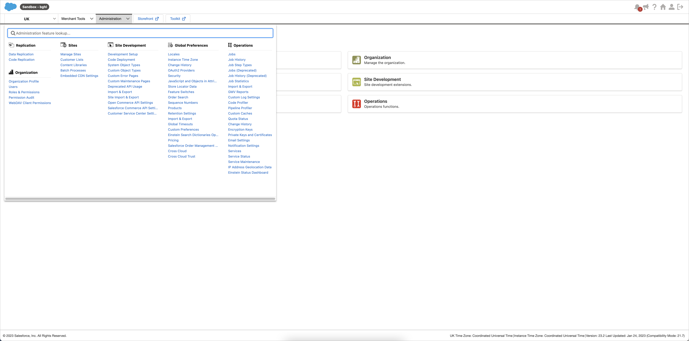
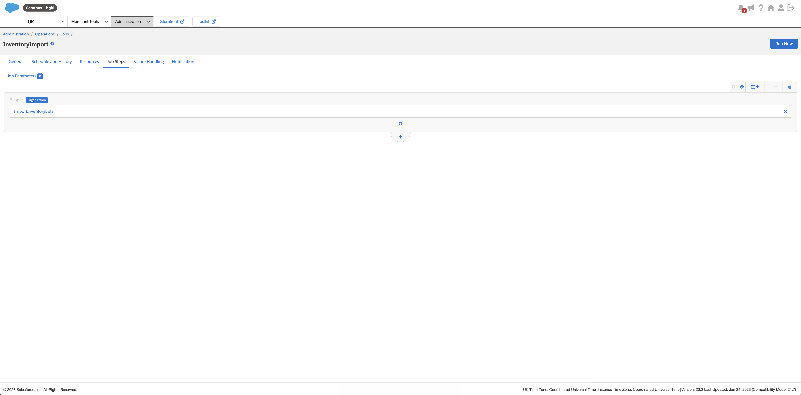
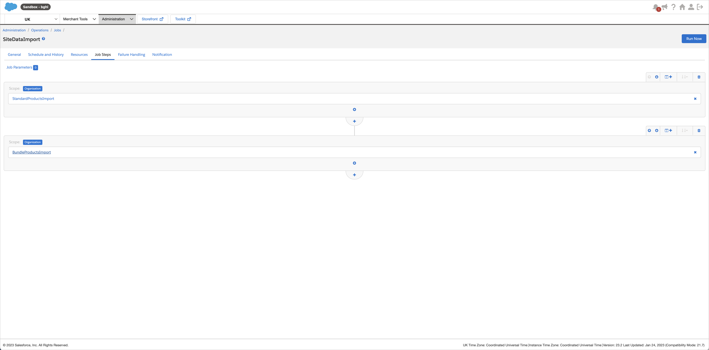
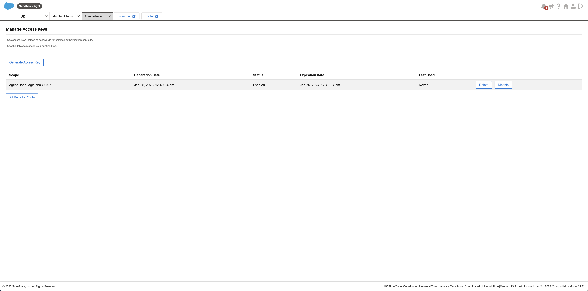

[!!Manage the Salesforce Commerce Cloud connection](./02_ManageSalesforceConnection.md)

# Configure the Salesforce Commerce Cloud Business Manager

Before a Salesforce Commerce Cloud connection can be established, the following two configuration processes must be performed in the *Salesforce Commerce Cloud Business Manager*.  

In Salesforce Commerce Cloud, data are uploaded to Salesforce Commerce Cloud via WebDAV. The data are then imported with a job into the shop. There are two jobs, one for inventory import and one for data import.   
Please note that these two jobs must be configured in your Salesforce Commerce Cloud account in the exact order and using the specified values as described below.


## Create an inventory import job

Create a job to import inventory-related data.

#### Prerequisites

- A Salesforce Commerce Cloud account has been created.
- The user has the required rights.

#### Procedure 

*Salesforce Commerce Cloud Business Manager > Select a site*


1. Click the arrow in the *Administration* tab in the navigation bar at the top of the page.    
    The administration menu window is displayed.

    
   
2. Click the *Jobs* entry in the *Operations* section of the administration menu window.    
    The *Jobs* page is displayed.

    

[comment]: <> (Ist der Screenshot aus dem Video?)

3. Click the [New Job] button in the upper right corner to create the inventory import job.  
    The *New Job* window is displayed under the [New Job] button.

    

4. Enter a name for the inventory import job, for example **InventoryImport**, in the *ID* field and, if desired, a job description in the *Description* field, and click the [Create] button.  
    The new job has been created. The *"Job ID name"* page is displayed. By default, the *General* tab in the header of the *"Job ID name"* page is preselected.

    

    > [Info] Note the ID of the inventory import job, as it must be specified in the *Omni-Channel* module when establishing the connection to Salesforce Commerce Cloud.

5. Click the *Job Steps* tab in the header of the *"Job ID name"* page.   
    By default, an empty flow box has been preconfigured.

    

6. Click the [Configure a step] button in the flow box and select the *ImportInventoryLists* step.  
    The *Select and Configure Step* side bar is displayed on the right side of the page.

    

7. Enter a name for the step, for example **ImportInventoryLists**, in the *ID* field and, if desired, a step description in the *Description* field, and configure the following values in the corresponding fields of the *Select and Configure Step* side bar for the *ImportInventoryLists* step:  

    | Field                   | Value     |
    |-------------------------|-------------------------|
    | WorkingFolder           | import/inventory        |   
    | FileNamePattern         | ac_.*_inventory\\.xml   | 
    | NoFilesFoundHandling    | NO_FILES_FOUND          |
    | ImportMode              | Merge                   |  
    | ImportFailedHandling    | WARN                    |  
 
    > [Info] The values in the *AfterImportFileHandling* and the *ArchiveFolder* fields can be arbitrarily selected.

    

9. Click the [Assign] button in the bottom right corner of the *Select and Configure Step* side bar.    
    The step has been configured and is displayed in the flow box.

    


## Create a data import job

Create a job to import product-related data.

#### Prerequisites

- A Salesforce Commerce Cloud account has been created.
- The user has the required rights.

#### Procedure 

*Salesforce Commerce Cloud Business Manager > Select a site*


1. Click the arrow in the *Administration* tab in the navigation bar at the top of the page.    
    The administration menu window is displayed.

    
   
2. Click the *Jobs* entry in the *Operations* section of the administration menu window.    
    The *Jobs* page is displayed.

    

[comment]: <> (Ist der Screenshot aus dem Video?)

3. Click the [New Job] button in the upper right corner to create the inventory import job.  
    The *New Job* window is displayed under the [New Job] button.

    

4. Enter a name for the data import job, for example **SiteDataImport**, in the *ID* field and, if desired, a job description in the *Description* field, and click the [Create] button.  
    The new job has been created. The *"Job ID name"* page is displayed. By default, the *General* tab in the header of the *"Job ID name"* page is preselected.
  
    

    > [Info] Note the ID of the data import job, as it must be specified in the *Omni-Channel* module when establishing the connection to Salesforce Commerce Cloud.
  
5. Click the *Job Steps* tab in the header of the *"Job ID name"* page.   
    By default, an empty flow box has been preconfigured.
   
   > [Info] The data import job must import different types of data and therefore contains sequential flows. 

    
   
6. Click the [Configure a step] button in the flow box and select the *StandardProductsImport* step.  
    The *Select and Configure Step* side bar is displayed on the right side of the page.
   
    

    > [Info] Make sure that all folders specified within a step have been previously created in WebDAV. Otherwise, the data cannot be imported. For detailed information about WebDAV, see the Salesforce Commerce Cloud documentation, [Using WebDAV](https://documentation.b2c.commercecloud.salesforce.com/DOC1/topic/com.demandware.dochelp/content/b2c_commerce/topics/import_export/b2c_using_web_dav.html).
   
7. Enter a name for the step, for example **ImportInventoryLists**, in the *ID* field and, if desired, a step description in the *Description* field, and configure the following values in the corresponding fields of the *Select and Configure Step* side bar for the *StandardProductsImport* step: 

    | Field                   | Value     |
    |-------------------------|-------------------------|
    | WorkingFolder           | import/catalogs         |   
    | FileNamePattern         | ac_.\*_catalog\_.*\\.xml| 
    | NoFilesFoundHandling    | NO_FILES_FOUND          |
    | ImportMode              | Merge                   |  
    | ImportFailedHandling    | WARN                    |  
    
    > [Info] The values in the *AfterImportFileHandling* and the *ArchiveFolder* fields can be arbitrarily selected.

    

8. Click the [Assign] button in the bottom right corner.    
    The step has been configured and is displayed in the flow box.
  
    

9. Click the  (Add) button below the first flow box.  
    An empty flow box has been added below the first flow box. 

10. Click the [Configure a step] button in the flow box and select the *BundleProductsImport* step.
    The *Select and Configure Step* side bar is displayed on the right side of the page.
   
    

    > [Info] Make sure that all folders specified within a step have been previously created in WebDAV. Otherwise, the data cannot be imported. For detailed information about WebDAV, see the Salesforce Commerce Cloud documentation, [Using WebDAV](https://documentation.b2c.commercecloud.salesforce.com/DOC1/topic/com.demandware.dochelp/content/b2c_commerce/topics/import_export/b2c_using_web_dav.html).
   
11. Enter a name for the step, for example **BundleProductsImport**, in the *ID* field and, if desired, a step description in the *Description* field, and configure the following values in the corresponding fields of the *Select and Configure Step* side bar for the *BundleProductsImport* step: 

    | Field                   | Value     |
    |-------------------------|-------------------------|
    | WorkingFolder           | import/catalogs         |   
    | FileNamePattern         | ac_.\*_bundles\_.*\\.xml| 
    | NoFilesFoundHandling    | NO_FILES_FOUND          |
    | ImportMode              | Merge                   |  
    | ImportFailedHandling    | WARN                    | 

    > [Info] The values in the *AfterImportFileHandling* and the *ArchiveFolder* fields can be arbitrarily selected.

    

12. Click the [Assign] button in the bottom right corner.    
    The step has been configured and is displayed in the flow box.
  
    

13. Click the  (Add) button below the second flow box.
    An empty flow box has been added below the second flow box. 
   
14. Click the [Configure a step] button in the flow box and select the *CategoryAssignmentImport* step.
    The *Select and Configure Step* side bar is displayed on the right side of the page.
  
    

    > [Info] Make sure that all folders specified within a step have been previously created in WebDAV. Otherwise, the data cannot be imported. For detailed information about WebDAV, see the Salesforce Commerce Cloud documentation, [Using WebDAV](https://documentation.b2c.commercecloud.salesforce.com/DOC1/topic/com.demandware.dochelp/content/b2c_commerce/topics/import_export/b2c_using_web_dav.html).
  
15. Enter a name for the step, for example **CategoryAssignmentImport**, in the *ID* field and, if desired, a step description in the *Description* field, and configure the following values in the corresponding fields of the *Select and Configure Step* side bar for the *CategoryAssignmentImport* step:   

    | Field                   | Value     |
    |-------------------------|-------------------------|
    | WorkingFolder           | import/catalogs         |   
    | FileNamePattern         | ac_.\*_assignments\_.*\\.xml| 
    | NoFilesFoundHandling    | NO_FILES_FOUND          |
    | ImportMode              | Merge                   |  
    | ImportFailedHandling    | WARN                    |  

    > [Info] The values in the *AfterImportFileHandling* and the *ArchiveFolder* fields can be arbitrarily selected.

    

16. Click the [Assign] button in the bottom right corner.    
    The step has been configured and is displayed in the flow box.
  
    

17. Click the  (Add) button below the third flow box.
    An empty flow box has been added below the third flow box. 

18. Click the [Configure a step] button in the flow box and select the *PricebookImport* step.
    The *Select and Configure Step* side bar is displayed on the right side of the page.
   
    

    > [Info] Make sure that all folders specified within a step have been previously created in WebDAV. Otherwise, the data cannot be imported. For detailed information about WebDAV, see the Salesforce Commerce Cloud documentation, [Using WebDAV](https://documentation.b2c.commercecloud.salesforce.com/DOC1/topic/com.demandware.dochelp/content/b2c_commerce/topics/import_export/b2c_using_web_dav.html).
   
19. Enter a name for the step, for example **PricebookImport**, in the *ID* field and, if desired, a step description in the *Description* field, and configure the following values in the corresponding fields of the *Select and Configure Step* side bar for the *PricebookImport* step:

    | Field                   | Value     |
    |-------------------------|-------------------------|
    | WorkingFolder           | import/pricebooks       |   
    | FileNamePattern         | ac_.\*\_price_book\\.xml| 
    | NoFilesFoundHandling    | NO_FILES_FOUND          |
    | ImportMode              | Merge                   |  
    | ImportFailedHandling    | WARN                    |  

    > [Info] The values in the *AfterImportFileHandling* and the *ArchiveFolder* fields can be arbitrarily selected.

    

20. Click the [Assign] button in the bottom right corner.    
    The step has been configured and is displayed in the flow box.
  
    

> [Info] All required steps for the data import job has been configured.


## Configure the Open Commerce API Settings

In Salesforce Commerce Cloud, there are two *Open Commerce APIs (OCAPIs)*: 
- The shop API, which is used for the order data  
- The data API, which is used for the product data  
The settings of the OCAPIs must be configured in Salesforce Commerce Cloud as described below.

#### Prerequisites

- A Salesforce Commerce Cloud account has been created.
- The user has the required rights.
- The client ID has been generated in Salesforce Commerce Cloud, see the Salesforce Commerce Cloud documentation, [Generate an API Client ID](https://documentation.b2c.commercecloud.salesforce.com/DOC1/index.jsp?topic=%2Fcom.demandware.dochelp%2Fcontent%2Fb2c_commerce%2Ftopics%2Fanalytics%2Fb2c_generate_api_client_id.html).

#### Procedure

*Salesforce Commerce Cloud Business Manager > Select a site*


1. Click the arrow in the *Administration* tab in the navigation bar at the top of the page.    
    The administration menu window is displayed.

    
   
2. Click the *Open Commerce API Settings* entry in the *Site Development* section of the administration menu window.    
    The *Open Commerce API Settings* page is displayed.

    

3. Click the *Select type* drop-down list and select the **Shop** option.
    The available shop API is displayed in the text area.  


   
4. Click the *Select Context* drop-down list and select the **Global (organization-wide)** option. 

3. Check the text area for the following code. If it is not available, enter the following JSON code:

    ```json
    {
    "client_id": "CLIENTID",
    "resources": [
        {
            "resource_id": "/order_search",
            "methods": [
                "post"
            ],
            "read_attributes": "(**)",
            "write_attributes": "(**)"
        },
        {
            "resource_id": "/orders/*",
            "methods": [
                "get",
                "patch"
            ],
            "read_attributes": "(**)",
            "write_attributes": "(**)"
        }
    ]
    }
    ```

4. Replace the **CLIENTID** description for the *client_id* property in the code with your client ID.

5. Click the [Save] button.  
    All changes to the shop API have been saved.

6. Click the *Select type* drop-down list and select the **Data** option.  
    The available data API is displayed in the text area.  

      

7. Click the *Select Context* drop-down list and select the **Global (organization-wide)** option. 

8. Check the text area for the following code. If it is not available, enter the following JSON code:

    ```json
    {
    "client_id": "CLIENTID",
    "resources": [
        {
            "resource_id": "/jobs/*/executions",
            "methods": [
                "post"
            ],
            "read_attributes": "(**)",
            "write_attributes": "(**)"
        },
        {
            "resource_id": "/jobs/*/executions/*",
            "methods": [
                "get"
            ],
            "read_attributes": "(**)",
            "write_attributes": "(**)"
        },
        {
            "resource_id": "/job_execution_search",
            "methods": [
                "post"
            ],
            "read_attributes": "(**)",
            "write_attributes": "(**)"
        },
        {
            "resource_id": "/locale_info/locales",
            "methods": [
                "get"
            ],
            "read_attributes": "(**)",
            "write_attributes": "(**)"
        },
        {
            "resource_id": "/system_object_definitions/Product/attribute_definitions/*",
            "methods": [
                "get"
            ],
            "read_attributes": "(**)",
            "write_attributes": "(**)"
        },
        {
            "resource_id": "/system_object_definitions/Product/attribute_groups/*",
            "methods": [
                "get"
            ],
            "read_attributes": "(**)",
            "write_attributes": "(**)"
        },
        {
            "resource_id": "/system_object_definitions/ProductInventoryRecord/attribute_definitions/*",
            "methods": [
                "get"
            ],
            "read_attributes": "(**)",
            "write_attributes": "(**)"
        },
        {
            "resource_id": "/system_object_definitions/ProductInventoryRecord/attribute_groups/*",
            "methods": [
                "get"
            ],
            "read_attributes": "(**)",
            "write_attributes": "(**)"
        },
        {
            "resource_id": "/system_object_definitions/ProductInventoryRecord/attribute_definitions",
            "methods": [
                "get"
            ],
            "read_attributes": "(**)",
            "write_attributes": "(**)"
        },
        {
            "resource_id": "/catalogs",
            "methods": [
                "get"
            ],
            "read_attributes": "(**)",
            "write_attributes": "(**)"
        },
        {
            "resource_id": "/catalogs/*/categories",
            "methods": [
                "get"
            ],
            "read_attributes": "(**)",
            "write_attributes": "(**)"
        },
        {
            "resource_id": "/inventory_lists",
            "methods": [
                "get"
            ],
            "read_attributes": "(**)",
            "write_attributes": "(**)"
        },
        {
            "resource_id": "/system_object_definitions/Product/attribute_groups",
            "methods": [
                "get"
            ],
            "read_attributes": "(**)",
            "write_attributes": "(**)"
        },
        {
            "resource_id": "/system_object_definitions/Product/attribute_definitions",
            "methods": [
                "get"
            ],
            "read_attributes": "(**)",
            "write_attributes": "(**)"
        },
        {
            "resource_id": "/sites",
            "methods": [
                "get"
            ],
            "read_attributes": "(**)",
            "write_attributes": "(**)"
        },
        {
            "resource_id": "/inventory_lists/*/product_inventory_records/*",
            "methods": [
                "put", "delete"
            ],
            "read_attributes": "(**)",
            "write_attributes": "(**)"
        },
        {
            "resource_id": "/sites/*/orders/*/export_status",
            "methods": [
                "put"
            ],
            "read_attributes": "(**)",
            "write_attributes": "(**)"
        }
    ]
    }
    ```

9. Replace the **CLIENTID** description for the *client_id* property in the code with your client ID.

10. Click the [Save] button.  
    All changes to the data API have been saved.

    > [Info] For detailed information, see the Salesforce Commerce Cloud documentation, [OCAPI Settings](https://documentation.b2c.commercecloud.salesforce.com/DOC1/topic/com.demandware.dochelp/OCAPI/current/usage/OCAPISettings.html).


## Generate an access key

To connect with Salesforce Commerce Cloud, an access token is required for named authentication in addition to the client ID and the client password. Therefore, an access key must be generated in Salesforce Commerce Cloud to establish the connection in the *Omni-Channel* module.   
Unlike client id and password, the access key can only be used for one instance and not multiple times.

#### Prerequisites

- A Salesforce Commerce Cloud account has been created.
- The user has the required rights.

#### Procedure

*Salesforce Commerce Cloud Business Manager > Select a site*


1. Click the  (Profile) button on the right side of the header.  
    The *My profile* page is displayed.

    

2. Click the [Manage Access Keys] button.  
    The *Manage Access Keys* page is displayed.

3. Click the [Generate Access Key] button.  
    The *Generate Access Key* window is displayed.

    

4. Click the drop-down list and select the *Agent User Login and OCAPI* option as authentication scope.

5. Click the [Generate] button in the bottom right corner of the *Generate Access Key* window.    
    The access key has been generated and is displayed in the *Generate Access Key* window.

    > [Info] The access key is required to establish the connection with Salesforce Commerce Cloud in the *Omni-Channel* module.

    

[comment]: <> (access key verändert)

6. Copy the key to your clipboard or click the [Download] button.    
    The access key has been copied or downloaded as a CSV file.

    > [Caution] Once the *Generate Access Key* window is closed, the access key cannot be accessed anymore. It is therefore highly recommended to keep the access key safe for future use.

7. Click the [Close] button in the bottom right corner of the *Generate Access Key* window.     
    The *Manage Access Keys* page is displayed. The generated access key is displayed in the list of access keys.

    > [Info] As access keys expire after one year, they must be regenerated after this period. 

    
