[!!Manage the connections](../../Channels/Integration/01_ManageConnections.md)
[!!Manage the ETL mappings in DataHub](../../DataHub/Operation/01_ManageETLMappings.md)
[!!User interface Connections](../UserInterface/01_Connections.md)

# Manage the Salesforce Commerce Cloud connection

To establish a connection to a Salesforce shop, there are several particularities to consider. Therefore, the creation and the configuration of the Salesforce Commerce Cloud (Salesforce) connection are described in detail below.

## Configure the Salesforce Commerce Cloud Business Manager

Before a Salesforce connection can be established, the following two configuration processes must be performed in the Salesforce Commerce Cloud Business Manager.  

In Salesforce, data are uploaded via XML files, which are then imported with a job into the shop. There are two jobs, one for inventory import and one for data import.   
Please note that these two jobs must be configured in your Salesforce account in the exact order and using the specified values as described below.


### Create an inventory import job

Create a job to import inventory-related data.

#### Prerequisites

- A Salesforce account has been created.
- The user has the required rights.

#### Procedure 

*Salesforce Commerce Cloud Business Manager > Select a site*


1. Click the arrow in the *Administration* tab in the navigation bar at the top of the page.    
    The administration menu window is displayed.

    
   
2. Click the *Jobs* entry in the *Operations* section of the administration menu window.    
    The *Jobs* page is displayed.

    

[comment]: <> (Ist der Screenshot aus dem Video?)

3. Click the [New Job] button in the upper right corner to create the inventory import job.  
    The *New Job* window is displayed under the [New Job] button.

    

4. Enter a name for the inventory import job, for example **InventoryImport**, in the *ID* field and, if desired, a job description in the *Description* field, and click the [Create] button.  
    The new job has been created. The *"Job ID name"* page is displayed. By default, the *General* tab in the header of the *"Job ID name"* page is preselected.

    

    > [Info] Note the ID of the inventory import job, as it must be specified in the *Omni-Channel* module when establishing the connection to Salesforce.

5. Click the *Job Steps* tab in the header of the *"Job ID name"* page.   
    By default, an empty flow box has been preconfigured.

    

6. Click the [Configure a step] button in the flow box and select the *ImportInventoryLists* step.  
    The *Select and Configure Step* side bar is displayed on the right side of the page.

    

7. Enter a name for the step, for example **ImportInventoryLists**, in the *ID* field and, if desired, a step description in the *Description* field, and configure the following values in the corresponding fields of the *Select and Configure Step* side bar for the *ImportInventoryLists* step:  

    | Field                   | Value     |
    |-------------------------|-------------------------|
    | WorkingFolder           | import/inventory        |   
    | FileNamePattern         | ac_.*_inventory\\.xml   | 
    | NoFilesFoundHandling    | NO_FILES_FOUND          |
    | ImportMode              | Merge                   |  
    | ImportFailedHandling    | WARN                    |  
 
    > [Info] The values in the *AfterImportFileHandling* and the *ArchiveFolder* fields can be arbitrarily selected.

    

9. Click the [Assign] button in the bottom right corner of the *Select and Configure Step* side bar.    
    The step has been configured and is displayed in the flow box.

    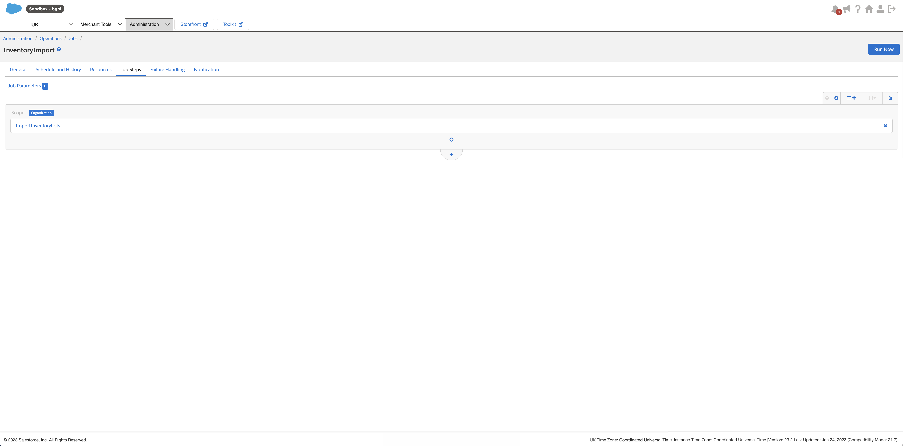


### Create a data import job

Create a job to import product-related data.

#### Prerequisites

- A Salesforce account has been created.
- The user has the required rights.

#### Procedure 

*Salesforce Commerce Cloud Business Manager > Select a site*


1. Click the arrow in the *Administration* tab in the navigation bar at the top of the page.    
    The administration menu window is displayed.

    
   
2. Click the *Jobs* entry in the *Operations* section of the administration menu window.    
    The *Jobs* page is displayed.

    

[comment]: <> (Ist der Screenshot aus dem Video?)

3. Click the [New Job] button in the upper right corner to create the inventory import job.  
    The *New Job* window is displayed under the [New Job] button.

    

4. Enter a name for the data import job, for example **SiteDataImport**, in the *ID* field and, if desired, a job description in the *Description* field, and click the [Create] button.  
    The new job has been created. The *"Job ID name"* page is displayed. By default, the *General* tab in the header of the *"Job ID name"* page is preselected.
  
    

    > [Info] Note the ID of the data import job, as it must be specified in the *Omni-Channel* module when establishing the connection to Salesforce.
  
5. Click the *Job Steps* tab in the header of the *"Job ID name"* page.   
    By default, an empty flow box has been preconfigured.
   
   > [Info] The data import job must import different types of data and therefore contains sequential flows. 

    
   
6. Click the [Configure a step] button in the flow box and select the *StandardProductsImport* step.  
    The *Select and Configure Step* side bar is displayed on the right side of the page.
   
    

    > [Info] Make sure that all folders specified within a step have been previously created in WebDAV. Otherwise, the data cannot be imported. For detailed information about WebDAV, see the Salesforce documentation, [Using WebDAV](https://documentation.b2c.commercecloud.salesforce.com/DOC1/topic/com.demandware.dochelp/content/b2c_commerce/topics/import_export/b2c_using_web_dav.html).
   
7. Enter a name for the step, for example **ImportInventoryLists**, in the *ID* field and, if desired, a step description in the *Description* field, and configure the following values in the corresponding fields of the *Select and Configure Step* side bar for the *StandardProductsImport* step: 

    | Field                   | Value     |
    |-------------------------|-------------------------|
    | WorkingFolder           | import/catalogs         |   
    | FileNamePattern         | ac_.\*_catalog\_.*\\.xml| 
    | NoFilesFoundHandling    | NO_FILES_FOUND          |
    | ImportMode              | Merge                   |  
    | ImportFailedHandling    | WARN                    |  
    
    > [Info] The values in the *AfterImportFileHandling* and the *ArchiveFolder* fields can be arbitrarily selected.

    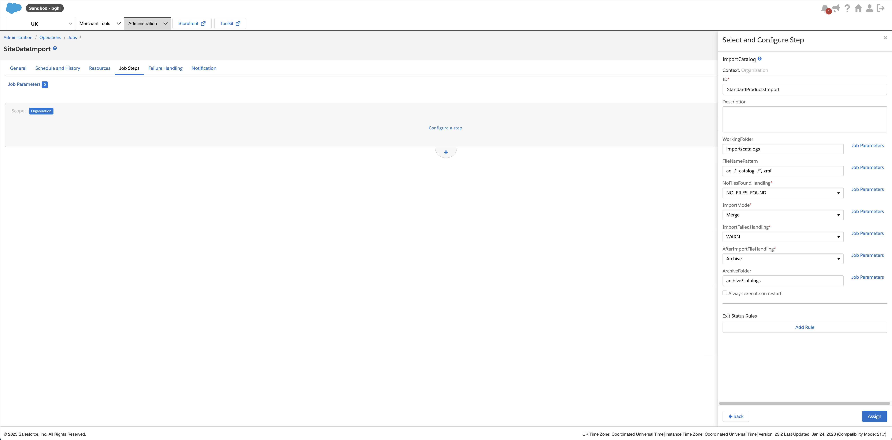

8. Click the [Assign] button in the bottom right corner.    
    The step has been configured and is displayed in the flow box.
  
    

9. Click the  (Add) button below the first flow box.  
    An empty flow box has been added below the first flow box. 

10. Click the [Configure a step] button in the flow box and select the *BundleProductsImport* step.
    The *Select and Configure Step* side bar is displayed on the right side of the page.
   
    

    > [Info] Make sure that all folders specified within a step have been previously created in WebDAV. Otherwise, the data cannot be imported. For detailed information about WebDAV, see the Salesforce documentation, [Using WebDAV](https://documentation.b2c.commercecloud.salesforce.com/DOC1/topic/com.demandware.dochelp/content/b2c_commerce/topics/import_export/b2c_using_web_dav.html).
   
11. Enter a name for the step, for example **BundleProductsImport**, in the *ID* field and, if desired, a step description in the *Description* field, and configure the following values in the corresponding fields of the *Select and Configure Step* side bar for the *BundleProductsImport* step: 

    | Field                   | Value     |
    |-------------------------|-------------------------|
    | WorkingFolder           | import/catalogs         |   
    | FileNamePattern         | ac_.\*_bundles\_.*\\.xml| 
    | NoFilesFoundHandling    | NO_FILES_FOUND          |
    | ImportMode              | Merge                   |  
    | ImportFailedHandling    | WARN                    | 

    > [Info] The values in the *AfterImportFileHandling* and the *ArchiveFolder* fields can be arbitrarily selected.

    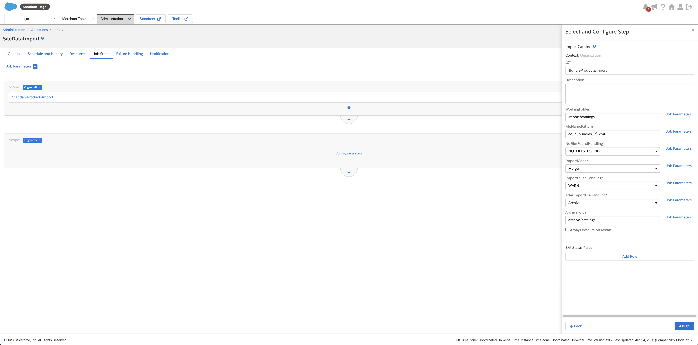

12. Click the [Assign] button in the bottom right corner.    
    The step has been configured and is displayed in the flow box.
  
    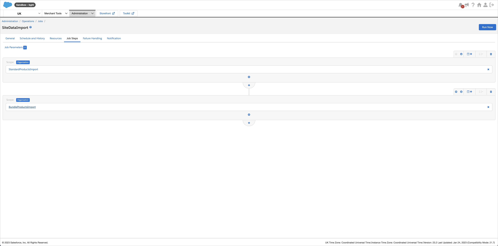

13. Click the  (Add) button below the second flow box.
    An empty flow box has been added below the second flow box. 
   
14. Click the [Configure a step] button in the flow box and select the *CategoryAssignmentImport* step.
    The *Select and Configure Step* side bar is displayed on the right side of the page.
  
    

    > [Info] Make sure that all folders specified within a step have been previously created in WebDAV. Otherwise, the data cannot be imported. For detailed information about WebDAV, see the Salesforce documentation, [Using WebDAV](https://documentation.b2c.commercecloud.salesforce.com/DOC1/topic/com.demandware.dochelp/content/b2c_commerce/topics/import_export/b2c_using_web_dav.html).
  
15. Enter a name for the step, for example **CategoryAssignmentImport**, in the *ID* field and, if desired, a step description in the *Description* field, and configure the following values in the corresponding fields of the *Select and Configure Step* side bar for the *CategoryAssignmentImport* step:   

    | Field                   | Value     |
    |-------------------------|-------------------------|
    | WorkingFolder           | import/catalogs         |   
    | FileNamePattern         | ac_.\*_assignments\_.*\\.xml| 
    | NoFilesFoundHandling    | NO_FILES_FOUND          |
    | ImportMode              | Merge                   |  
    | ImportFailedHandling    | WARN                    |  

    > [Info] The values in the *AfterImportFileHandling* and the *ArchiveFolder* fields can be arbitrarily selected.

    

16. Click the [Assign] button in the bottom right corner.    
    The step has been configured and is displayed in the flow box.
  
    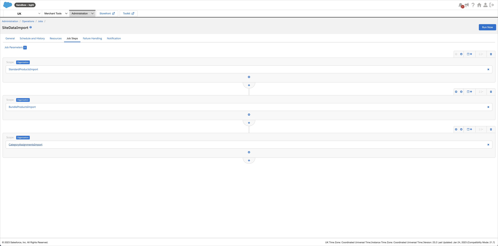

17. Click the  (Add) button below the third flow box.
    An empty flow box has been added below the third flow box. 

18. Click the [Configure a step] button in the flow box and select the *PricebookImport* step.
    The *Select and Configure Step* side bar is displayed on the right side of the page.
   
    

    > [Info] Make sure that all folders specified within a step have been previously created in WebDAV. Otherwise, the data cannot be imported. For detailed information about WebDAV, see the Salesforce documentation, [Using WebDAV](https://documentation.b2c.commercecloud.salesforce.com/DOC1/topic/com.demandware.dochelp/content/b2c_commerce/topics/import_export/b2c_using_web_dav.html).
   
19. Enter a name for the step, for example **PricebookImport**, in the *ID* field and, if desired, a step description in the *Description* field, and configure the following values in the corresponding fields of the *Select and Configure Step* side bar for the *PricebookImport* step:

    | Field                   | Value     |
    |-------------------------|-------------------------|
    | WorkingFolder           | import/pricebooks       |   
    | FileNamePattern         | ac_.\*\_price_book\\.xml| 
    | NoFilesFoundHandling    | NO_FILES_FOUND          |
    | ImportMode              | Merge                   |  
    | ImportFailedHandling    | WARN                    |  

    > [Info] The values in the *AfterImportFileHandling* and the *ArchiveFolder* fields can be arbitrarily selected.

    

20. Click the [Assign] button in the bottom right corner.    
    The step has been configured and is displayed in the flow box.
  
    

> [Info] All required steps for the data import job has been configured.


### Configure the Open Commerce API Settings

In Salesforce, there are two *Open Commerce APIs (OCAPIs)*: 
- The shop API, which is used for the order data  
- The data API, which is used for the product data  
The settings of the OCAPIs must be configured in Salesforce as described below.

#### Prerequisites

- A Salesforce account has been created.
- The user has the required rights.
- The client ID has been generated in Salesforce, see the Salesforce documentation, [Generate an API Client ID](https://documentation.b2c.commercecloud.salesforce.com/DOC1/index.jsp?topic=%2Fcom.demandware.dochelp%2Fcontent%2Fb2c_commerce%2Ftopics%2Fanalytics%2Fb2c_generate_api_client_id.html).


#### Procedure

*Salesforce Commerce Cloud Business Manager > Select a site*


1. Click the arrow in the *Administration* tab in the navigation bar at the top of the page.    
    The administration menu window is displayed.

    
   
2. Click the *Open Commerce API Settings* entry in the *Site Development* section of the administration menu window.    
    The *Open Commerce API Settings* page is displayed.

    

3. Click the *Select type* drop-down list and select the **Shop** option.
    The available shop API is displayed in the text area.  


   
4. Click the *Select Context* drop-down list and select the **Global (organization-wide)** option. 

3. Check the text area for the following code. If it is not available, enter the following JSON code:

    ```json
    {
    "client_id": "CLIENTID",
    "resources": [
        {
            "resource_id": "/order_search",
            "methods": [
                "post"
            ],
            "read_attributes": "(**)",
            "write_attributes": "(**)"
        },
        {
            "resource_id": "/orders/*",
            "methods": [
                "get",
                "patch"
            ],
            "read_attributes": "(**)",
            "write_attributes": "(**)"
        }
    ]
    }
    ```

4. Replace the **CLIENTID** description for the *client_id* property in the code with your client ID.

5. Click the [Save] button.  
    All changes to the shop API have been saved.

6. Click the *Select type* drop-down list and select the **Data** option.  
    The available data API is displayed in the text area.  

    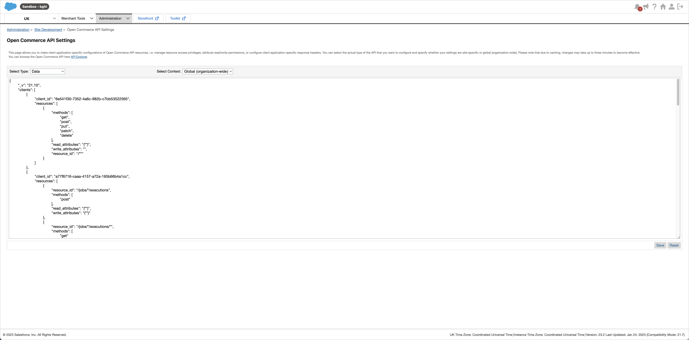  

7. Click the *Select Context* drop-down list and select the **Global (organization-wide)** option. 

8. Check the text area for the following code. If it is not available, enter the following JSON code:

    ```json
    {
    "client_id": "CLIENTID",
    "resources": [
        {
            "resource_id": "/jobs/*/executions",
            "methods": [
                "post"
            ],
            "read_attributes": "(**)",
            "write_attributes": "(**)"
        },
        {
            "resource_id": "/jobs/*/executions/*",
            "methods": [
                "get"
            ],
            "read_attributes": "(**)",
            "write_attributes": "(**)"
        },
        {
            "resource_id": "/job_execution_search",
            "methods": [
                "post"
            ],
            "read_attributes": "(**)",
            "write_attributes": "(**)"
        },
        {
            "resource_id": "/locale_info/locales",
            "methods": [
                "get"
            ],
            "read_attributes": "(**)",
            "write_attributes": "(**)"
        },
        {
            "resource_id": "/system_object_definitions/Product/attribute_definitions/*",
            "methods": [
                "get"
            ],
            "read_attributes": "(**)",
            "write_attributes": "(**)"
        },
        {
            "resource_id": "/system_object_definitions/Product/attribute_groups/*",
            "methods": [
                "get"
            ],
            "read_attributes": "(**)",
            "write_attributes": "(**)"
        },
        {
            "resource_id": "/system_object_definitions/ProductInventoryRecord/attribute_definitions/*",
            "methods": [
                "get"
            ],
            "read_attributes": "(**)",
            "write_attributes": "(**)"
        },
        {
            "resource_id": "/system_object_definitions/ProductInventoryRecord/attribute_groups/*",
            "methods": [
                "get"
            ],
            "read_attributes": "(**)",
            "write_attributes": "(**)"
        },
        {
            "resource_id": "/system_object_definitions/ProductInventoryRecord/attribute_definitions",
            "methods": [
                "get"
            ],
            "read_attributes": "(**)",
            "write_attributes": "(**)"
        },
        {
            "resource_id": "/catalogs",
            "methods": [
                "get"
            ],
            "read_attributes": "(**)",
            "write_attributes": "(**)"
        },
        {
            "resource_id": "/catalogs/*/categories",
            "methods": [
                "get"
            ],
            "read_attributes": "(**)",
            "write_attributes": "(**)"
        },
        {
            "resource_id": "/inventory_lists",
            "methods": [
                "get"
            ],
            "read_attributes": "(**)",
            "write_attributes": "(**)"
        },
        {
            "resource_id": "/system_object_definitions/Product/attribute_groups",
            "methods": [
                "get"
            ],
            "read_attributes": "(**)",
            "write_attributes": "(**)"
        },
        {
            "resource_id": "/system_object_definitions/Product/attribute_definitions",
            "methods": [
                "get"
            ],
            "read_attributes": "(**)",
            "write_attributes": "(**)"
        },
        {
            "resource_id": "/sites",
            "methods": [
                "get"
            ],
            "read_attributes": "(**)",
            "write_attributes": "(**)"
        },
        {
            "resource_id": "/inventory_lists/*/product_inventory_records/*",
            "methods": [
                "put", "delete"
            ],
            "read_attributes": "(**)",
            "write_attributes": "(**)"
        },
        {
            "resource_id": "/sites/*/orders/*/export_status",
            "methods": [
                "put"
            ],
            "read_attributes": "(**)",
            "write_attributes": "(**)"
        }
    ]
    }
    ```

9. Replace the **CLIENTID** description for the *client_id* property in the code with your client ID.

10. Click the [Save] button.  
    All changes to the data API have been saved.

    > [Info] For detailed information, see the Salesforce documentation, [OCAPI Settings](https://documentation.b2c.commercecloud.salesforce.com/DOC1/topic/com.demandware.dochelp/OCAPI/current/usage/OCAPISettings.html).


### Generate an access key

To connect with Salesforce, an access token is required for named authentication in addition to the client ID and the client password. Therefore, an access key must be generated in Salesforce to establish the connection in the *Omni-Channel* module.   
Unlike client id and password, the access key can only be used for one instance and not multiple times.

#### Prerequisites

- A Salesforce account has been created.
- The user has the required rights.

#### Procedure

*Salesforce Commerce Cloud Business Manager > Select a site*


1. Click the  (Profile) button on the right side of the header.  
    The *My profile* page is displayed.

    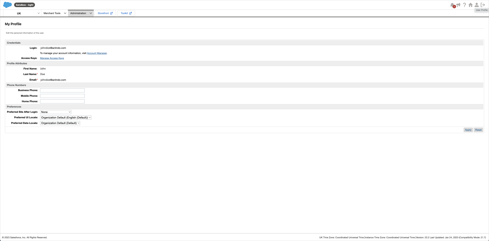

2. Click the [Manage Access Keys] button.  
    The *Manage Access Keys* page is displayed.

3. Click the [Generate Access Key] button.  
    The *Generate Access Key* window is displayed.

    

4. Click the drop-down list and select the *Agent User Login and OCAPI* option as authentication scope.

5. Click the [Generate] button in the bottom right corner of the *Generate Access Key* window.    
    The access key has been generated and is displayed in the *Generate Access Key* window.

    > [Info] The access key is required to establish the connection with Salesforce in the *Omni-Channel* module.

    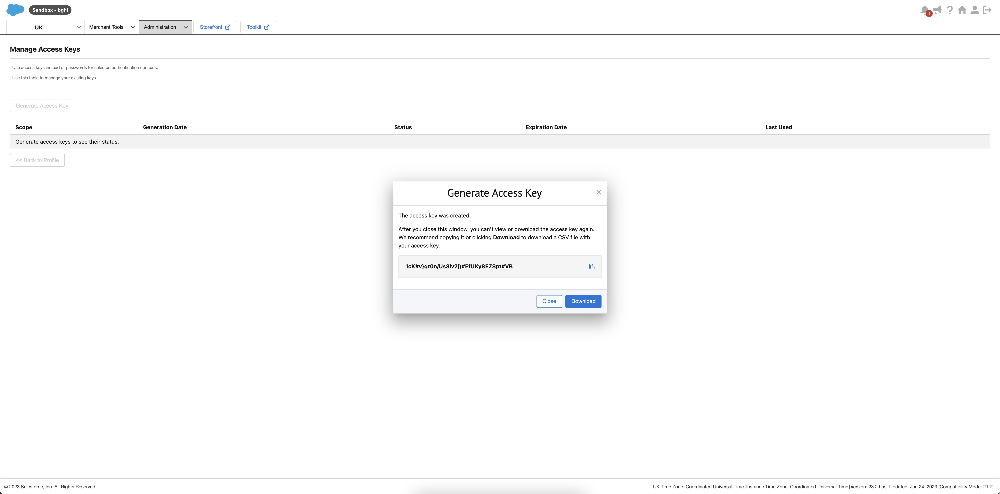

[comment]: <> (access key verändert)

6. Copy the key to your clipboard or click the [Download] button.    
    The access key has been copied or downloaded as a CSV file.

    > [Caution] Once the *Generate Access Key* window is closed, the access key cannot be accessed anymore. It is therefore highly recommended to keep the access key safe for future use.

7. Click the [Close] button in the bottom right corner of the *Generate Access Key* window.     
    The *Manage Access Keys* page is displayed. The generated access key is displayed in the list of access keys.

    > [Info] As access keys expire after one year, they must be regenerated after this period. 

    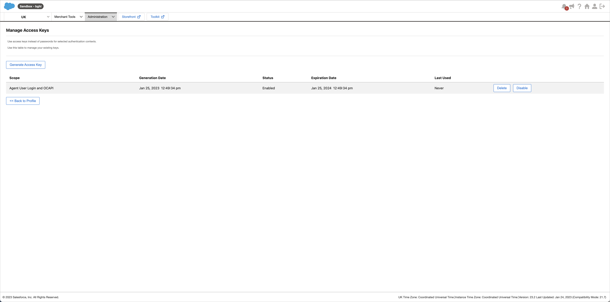


## Create a Salesforce connection

Create the connection to a Salesforce shop using the Salesforce Commerce Cloud driver. Further settings can only be configured after the connection has been established.

#### Prerequisites

- The Salesforce Commerce Cloud Business Manager has been configured, see [Configure the Salesforce Commerce Cloud Business Manager](#configure-the-salesforce-commerce-cloud-business-manager). 
- The *Salesforce Commerce Cloud* plugin has been installed.  

> [Info] For the *Omni-Channel* module version 4.1.0 or higher, the *Salesforce Commerce Cloud* plugin can be used in all versions. It is recommended to use the latest available version.

#### Procedure

*Omni-Channel > Settings > Tab CONNECTIONS*


1. Click the  (Add) button in the bottom right corner.    
    The *Create connection* view is displayed.

    

2. Enter a name for the connection in the *Name* field.

3. Click the *Driver* drop-down list and select the *Salesforce Commerce Cloud* driver.  
    The *Credentials* section is displayed below the drop-down list.

    > [Info] Salesforce offers the possibility to work with two separate environments, a staging environment for customizing and testing purposes and a live environment for production. The connection to the environments must be configured separately. 

    

4. For the staging environment, enter the following credentials:
    + Enter the shop URL of the staging environment in the *URL* field.  
    + Enter the client ID in the *Client ID* field.
    + Enter the client password in the *Client password* field.
        > [Info] The client ID and client password will be provided to you by your Salesforce shop agency.
    + Enter the email address of the user in the *Username* field.
    + Enter the user password in the *User password* field
    + Enter the user API access token in the *Access token* field. 
        > [Info] The username, the user password and the API access token are the so-called *business manager login data* that are needed to work with orders. 

5. For the live environment, enable the *Production mode* toggle and enter the following credentials:  
    + Enter the shop URL of the production environment in the *URL (Production)* field.  
    + Enter the client ID in the *Client ID (Production)* field.
    + Enter the client password in the *Client password (Production)* field.
        > [Info] The client ID and client password will be provided to you by your Salesforce shop agency.
    + Enter the email address of the user in the *Username (Production)* field.
    + Enter the user password in the *User password (Production)* field
    + Enter the user API access token in the *Access token (Production)* field. 
        > [Info] The username, the user password and the API access token are the so-called *business manager login data* that are needed to work with orders. 

    > [Info] As soon as the production mode is enabled, the order import and the stock upload are synchronized with the production environment, whereas the product data are still synchronized with the staging environment.

6. Click the [SAVE] button.  
    The connection has been created. The *CONNECTIONS* tab in the *Settings* menu entry of the *Omni-Channel* module is displayed when the connection has been established. The *Salesforce Commerce Cloud* connection is displayed in the list of connections.

    

7. If necessary, continue to configure the Salesforce connection, see [Configure the Salesforce connection](#configure-the-salesforce-connection).


## Configure the Salesforce connection   

After the connection to a Salesforce shop has been established, further settings can be configured for the connection.

#### Prerequisites

The Salesforce connection has been established, see [Create a Salesforce connection](#create-a-salesforce-connection).

#### Procedure

*Omni-Channel > Settings > Tab CONNECTIONS*


1. Click the Salesforce connection in the list of connections.   
    The *Edit connection* view is displayed. By default, the *Credentials* tab is selected.

    

2. Click the *Settings* tab.   
		The *Settings* tab is displayed. By default, the *Price books* settings are selected. 
    
    

3. Enter the price book ID in the *ID* field and the applicable three letter currency code according to ISO 4217 in the *Currency* field for each price book in Salesforce. To add another price book, click the  (Add) button to the right of the last price book.  

    > [Info] The price books must be set up manually, as they cannot be retrieved via API from Salesforce.

4. Click the *Payment methods* menu entry in the left side bar.  
		The payment methods settings are displayed on the right side.   

    

5. Enter the payment method ID in the *ID* field and a description in the *Name* field for each payment method in Salesforce. To add another payment method, click the  (Add) button to the right of the last payment method.   

6. Click the *Upload mode* menu entry in the left side bar.  
    The upload mode settings are displayed on the right side.

    

7. Click the *Upload mode* drop-down list and select the appropriate mode for the product data upload. The following options are available:  
    - **Immediately**    
        Select this option to upload any changes as soon as they are made.
    - **Delayed**    
        Select this option to upload any changes after a specified period of time. When selected, the *Delay in minutes* field is displayed. Enter the desired delay in minutes in the field. By default, a 10 minutes delay is predefined. 
    - **Cron**    
        Select this option to schedule the upload and perform it periodically at a fixed time, date or interval. When selected, the *Cron line* field is displayed. Enter a valid cron expression to specify the time interval in which product data should be uploaded in the field. For detailed information, see https://crontab.guru/.
    
    Alternatively, you can enable the *Apply from default* toggle to apply the default value. The default value is displayed read-only in the field after activation.

8. Click the *Tax classes* menu entry in the left side bar.  
    The tax classes settings are displayed on the right side.

    

9. Enter the Salesforce ID for the tax class in the *Commerce Cloud Code* field and the corresponding Actindo tax class ID in the *Actindo ID* field. The Actindo tax class IDs are **1** for the standard rate and **2** for the reduced rate. The Salesforce tax class IDs are available in Salesforce: *Merchant Tools > Ordering > Taxation*

    > [Info] Repeat the step **9** for each tax class in Salesforce. Further tax class fields can be added by clicking the  (Add) button right to the last tax class.   

[comment]: <> (Aktuell werden die Actindo Tax Class IDs nicht im Taxes Modul angezeigt. Sobald möglich ergänzen, wo diese zu finden sind.)

10. Click the *Ignored Product Attributes* menu entry in the left side bar.  
    The ignored product attributes settings are displayed on the right side.

    

11. Enter the ID of the attribute that should not be imported to Salesforce in the *SFCC Attribute ID* field. The corresponding attribute IDs are described in the *catalog.xsd* schema, see [catalog.xsd](https://documentation.b2c.commercecloud.salesforce.com/DOC3/index.jsp?topic=%2Fcom.demandware.dochelp%2FDWAPI%2Fxsd%2FSchemas.html).  

    > [Info] Repeat the step **11** for each attribute to be ignored. Further attribute fields can be added by clicking the  (Add) button right to the last attribute. If there are custom attributes that should not be imported to Salesforce, Note to add the prefix **c_**, that is, **c_AttributeName**.

12. Click the *Default language* menu entry in the left side bar.  
    The default language settings are displayed on the right side.

    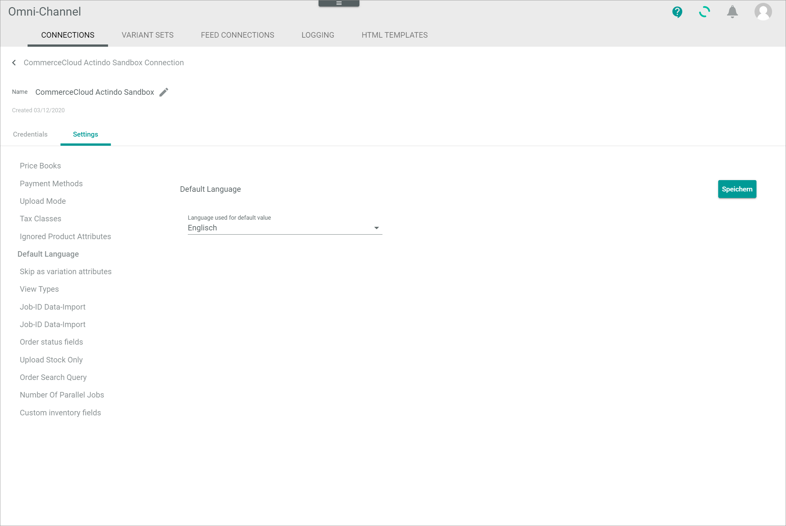

13. Click the *Language used for default value* drop-down list and select the language that should be used if the default language is selected in Salesforce. All available languages are displayed in the list.  

    > [Info] In contrast to Salesforce,  no default language is defined in the *Actindo Core1 Platform*. For this reason, a language must be specified to be used as default value.    

14. Click the *Skip as variation attribute* menu entry in the left side bar.  
    The skip as variation attribute settings are displayed on the right side.

    

15. Enter the Salesforce ID of the variant that should not be imported to Salesforce in the *SFCC Attribute ID* field.   

    > [Info] Repeat the step **15** for each variant to be ignored. Further variant fields can be added by clicking the  (Add) button. 

16. Click the *Job ID data import* menu entry in the left side bar.  
    The job ID data import settings are displayed on the right side.   

    

17. Enter the applicable Salesforce job ID in the *Job ID data import* field. 

    > [Info] The job ID for the data import has been created during the configuration of the Salesforce Commerce Cloud Business Manager, see [Create a data import job](#create-a-data-import-job).

18. Click the *Job ID inventory import* menu entry in the left side bar.  
    The Job ID inventory import settings are displayed on the right side.   

    

19. Enter the applicable Salesforce job ID in the *Job ID inventory import* field.

    > [Info] The job ID for the inventory import has been created during the configuration of the Salesforce Commerce Cloud Business Manager, see [Create a inventory import job](#create-an-inventory-import-job).

20. Click the *Order status fields* menu entry in the left side bar.  
    The order status fields settings are displayed on the right side.

    

21. Enter the custom IDs of the corresponding status fields in the *Order status*, *Payment status* and *Deliver status* fields.   
Alternatively, enable the *Apply from default* toggle to apply the Salesforce default values.  

    > [Info] Note to add the prefix **c_** for any custom field names, that is, **c_StatusID**.

22. Click the *Upload stock only* menu entry in the left side bar.  
    The upload stock only settings are displayed on the right side.

    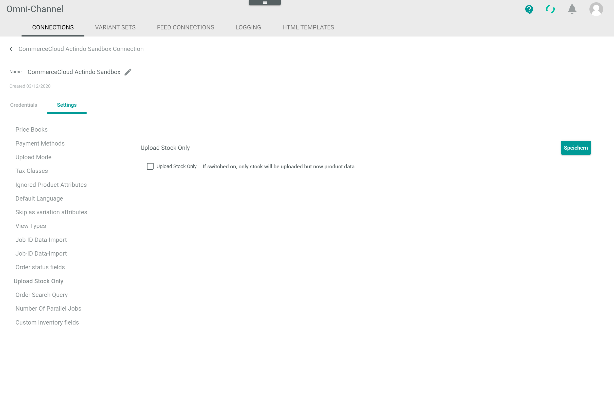

23. Select the *Upload stock only* checkbox if you want to upload only stock but no product data. Leave the checkbox unchecked to upload both stock and product data. By default, the checkbox is unchecked.  

24. Click the *Order search query* menu entry in the left side bar.  
    The order search query settings are displayed on the right side.

    

25. Enter a custom query to search for all new imported orders.    
Alternatively, enable the *Apply from default* toggle to apply the default search query.  
  
    > [Info] As soon as an order has been imported, the order export status in Salesforce is set to **Exported**. The *Export status* field can be checked in Salesforce: *Salesforce Commerce Cloud Business Manager > Select a site > Tab Merchant Tools > Ordering > Orders > Button Find > Select an order*.  

26. Click the *Number of parallel jobs* menu entry in the left side bar.  
    The number of parallel jobs settings are displayed on the right side.

    

27. Enter the number of jobs that may be processed in parallel in the *Number of parallel jobs* field.     
Alternatively, enable the *Apply from default* toggle to apply the default value for the number of parallel jobs.  

    > [Info] Increase the number of parallel jobs to handle a higher order volume. Be aware that a higher number of parallel jobs also requires a higher number of vCores. 

28. Click the *Custom inventory fields* menu entry in the left side bar.  
    The custom inventory fields settings are displayed on the right side.

    

29. Select the *Handle inventory custom fields* checkbox to import the custom inventory fields from Salesforce and also maintain them in Actindo.    
Alternatively, enable the *Apply from default* toggle or leave the checkbox unchecked to ignore any custom inventory fields from Salesforce.

30. Click the [Save] button.  
    All changes have been saved. The *Saving successful* pop-up window is displayed.

    


## Configure the Salesforce ETL mapping

The ETL mapping is important for the correct functionality of the Salesforce connection to adapt to the particularities of this connection.

### Configure the master catalog

The Salesforce master catalog must be mapped in Actindo to specify which catalog is used as master catalog in Salesforce and to determine the available fields in Actindo.   
It is mandatory that the master catalog is set in all ETL mappings to the Salesforce attribute set.  

#### Prerequisites

- A Salesforce connection has been established, see [Create a Salesforce connection](#create-a-salesforce-commerce-cloud-connection).
- At least one attribute set mapping from a PIM attribute set to the Salesforce attribute set has been created. 

#### Procedure

*DataHub > Settings > Tab ETL*


1. Click the attribute set mapping from a PIM attribute set to the Salesforce attribute set in the list of attribute set mappings.   
    The *Mapping from "PIM attribute set name" to "Salesforce attribute set name"* view is displayed.

    

2. Click the row of the *Master catalog (CommerceCloud Actind)* destination attribute on the left side.   
    The *Settings* section for the *Master catalog (CommerceCloud Actind)* attribute mapping is displayed on the right side.

    

3. Click the *Extension* drop-down list in the *Settings* section and select the **Constant value** option. All extensions that are matching the data type of the destination attribute are displayed in the list.      
    The *Configuration* section is displayed below the *Settings* section.

4. Click the *Master catalog (CommerceCloud Actind)* drop-down list in the *Configuration* section and select the applicable master catalog from Salesforce. All available Salesforce catalogs are displayed in the list.

    

5. Click the [SAVE] button in the upper right corner.   
    The changes have been saved. The *Settings* section is hidden. The assigned mapping is displayed in the list of attribute mappings on the left side.

    > [Info] Be aware that you have to rerun the mapping to apply the changes made to the attribute, see [Rerun an ETL mapping](../../DataHub/Operation/01_ManageETLMappings.md#rerun-an-etl-mapping).


### Configure the variants

When mapping the product variants from Actindo to Salesforce, it is important to set the correct settings to avoid any upload problems.

#### Prerequisites

- A Salesforce connection has been established, see [Create a Salesforce connection](#create-a-salesforce-commerce-cloud-connection).
- At least one attribute set mapping from a PIM attribute set to the Salesforce attribute set has been created. 

#### Procedure

*DataHub > Settings > Tab ETL*


1. Click the attribute set mapping from a PIM attribute set to the Salesforce attribute set in the list of attribute set mappings.   
    The *Mapping from "PIM attribute set name" to "Salesforce attribute set name"* view is displayed.

    

2. Click the row of the *Variants (CommerceCloud Actind)* destination attribute on the left side.   
    The *Settings* section for the *Variants (CommerceCloud Actind)* attribute mapping is displayed on the right side.

    

3. Click the *Extension* drop-down list in the *Settings* section and select the **Variant-to-variant** option. All extensions that are matching the data type of the destination attribute are displayed in the list.      
    The *Source attribute* drop-down list is displayed left to the *Extension* drop-down list and the *Configuration* section is displayed below the *Settings* section.

4. Click the *Source attribute* drop-down list and select the **Product variants** option. All attributes with a data type that matches the selected ETL extension are displayed in the list.    

5. Enable the following toggles in the *Configuration* section:
    - *Automatically generate all child entities when main entity is created*
    - *Automatically map variant sets* 
    - *Automatically create variant set if no suiting variant can be found*
    
6. Make sure that the following toggles are disabled:
   - *Automatically add not mapped defining attributes to destination set when creating variant set*
        > [Info] In no case may the *Automatically add not mapped defining attributes to destination set when creating variant set* toggle be activated, as the upload from Actindo to Salesforce will cause problems, see [Fields and attributes](#salesforce-product-data-particularities).
    - *Do not transfer the status of the master offer to the child offer*

  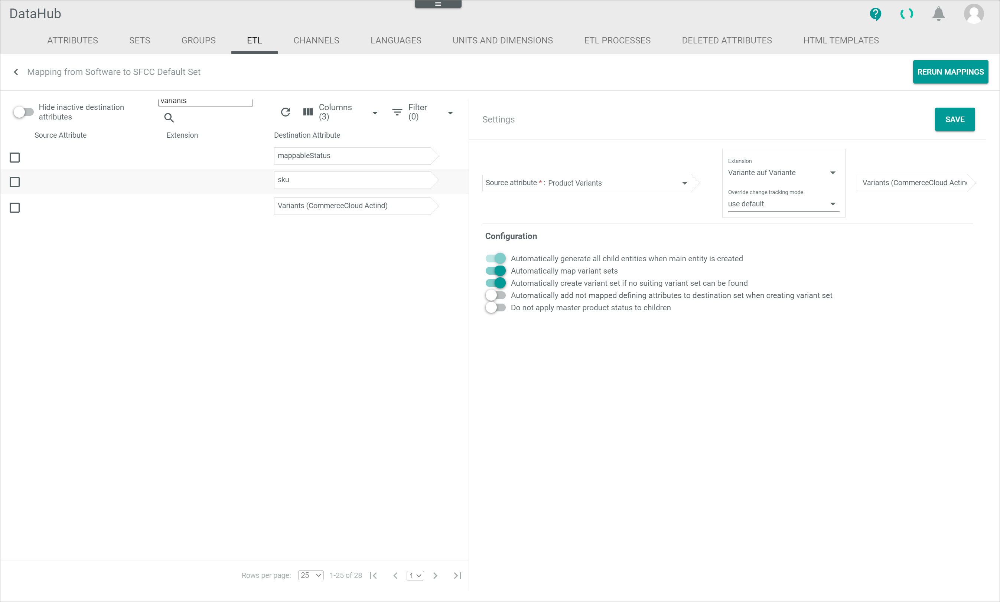

7. Click the [SAVE] button in the upper right corner.   
    The changes have been saved. The *Settings* section is hidden. The assigned mapping is displayed in the list of attribute mappings on the left side.

    > [Info] Be aware that you have to rerun the mapping to apply the changes made to the attribute, see [Rerun an ETL mapping](../../DataHub/Operation/01_ManageETLMappings.md#rerun-an-etl-mapping).


### Configure the translatable variants

In Salesforce, it is possible to create translations to variables. In Actindo, variants are generally not translatable. Nevertheless, it is possible to apply the translations from Salesforce by a special mapping to a PIM tree node attribute. 

#### Prerequisites

- A Salesforce connection has been established, see [Create a Salesforce connection](#create-a-salesforce-commerce-cloud-connection).
- The attribute to be translated has been created as a tree node attribute with the corresponding translations in the *PIM* module, see [Variations](#variations).
- At least one attribute set mapping from a PIM attribute set to the Salesforce attribute set has been created. 

#### Procedure

*DataHub > Settings > Tab ETL*


1. Click the attribute set mapping from a PIM attribute set to the Salesforce attribute set in the list of attribute set mappings.   
    The *Mapping from "PIM attribute set name" to "Salesforce attribute set name"* view is displayed.

    

2. Click the row of the *Product Language (CommerceCloud Actind)* destination attribute on the left side.   
    The *Settings* section for the *Product Language (CommerceCloud Actind)* attribute mapping is displayed on the right side.

    

3. Click the *Extension* drop-down list in the *Settings* section and select the **Tree-To-String defining values (CommerceCloud)** option. All extensions that are matching the data type of the destination attribute are displayed in the drop-down list.      
    The *Source attribute* drop-down list is displayed left to the *Extension* drop-down list and the *Configuration* section is displayed below the *Settings* section.

4. Click the *Source attribute* drop-down list and select the corresponding PIM tree node attribute. All attributes with a data type that matches the selected ETL extension are displayed in the list.

    > [Info] The translation of the attribute will only succeed if the selected PIM tree node attribute contains the translations.

5. Configure the settings in the *Configuration* section as desired.  

    > [Info] The configuration settings have no functional meaning for the mapping.

    

6. Click the [SAVE] button in the upper right corner.   
    The changes have been saved. The *Settings* section is hidden.  The assigned mapping is displayed in the list of attribute mappings on the left side.

    > [Info] Be aware that you have to rerun the mapping to apply the changes made to the attribute, see [Rerun an ETL mapping](../../DataHub/Operation/01_ManageETLMappings.md#rerun-an-etl-mapping).   
    Note that any changes made to the translations in the tree node attribute will not be uploaded automatically, even if rerunning the mapping. You must set the corresponding offer to inactive and set it to active again to synchronize the changes. 


## Salesforce product data particularities

There are several particularities regarding the Salesforce product data that must be taking into account:  


### Master catalog

A catalog is a product tree. You can assign certain nodes from a certain catalog to a product and thus divide it into different categories. The product data are part of the catalog. Every product in Salesforce must belong to a catalog. This catalog, who owns the product, is the master catalog. The product belongs to the master catalog but must not be assign to a category within the master catalog. The master catalog in Salesforce determines which fields are available for a product.   
Regardless of which catalog a product belongs to, the product can be assigned to other catalogs as well.

The master catalog who owns the products must be mapped in the *DataHub* module to the *Master Catalog (CommerceCloud Actind)* destination attribute.
The ETL mapping determines which catalog is used as master catalog in Salesforce.   
It is mandatory that the master catalog is set in all ETL mappings to the Salesforce attribute set, see [Configure the master catalog](#configure-the-master-catalog).

In Actindo, all fields from Salesforce are available, as there exists only one single attribute set for Salesforce.    


### Sites

Salesforce offers the possibility to create different sites for the order import. In Actindo, these sites are created as sub-shops. That means that every single shop is a sub-account, available in the stock withdrawal matrix in the *Warehouse* module.

The different sites are managed in Salesforce: *Administration > Sites > Manage Sites*


### Attributes

In Salesforce, an attribute can either be *Localizable*, *Site-Specific* or neither. Also, an attribute can only be either *Localizable* or *Site-Specific*, not both at the same time. A localizable attribute in Salesforce is equivalent to a multi-language attribute in Actindo. A site-specific attribute in Salesforce is similar but not the same as a multi-channel attribute in Actindo. 

Actindo supports both localizable attributes and site-specific attributes from Salesforce. However, Actindo does not support site-specific boolean attributes from Salesforce because they have a different number of states in Actindo and Salesforce, which would cause problems. 

The localizable attributes from Salesforce are imported to Actindo as multi-language attributes.
The site-specific attributes from Salesforce cannot be imported into Actindo as multi-channel attributes, because the paradigm is not compatible. Therefore,  site-specific attributes from Salesforce are imported into Actindo once as a normal (non-site-specific) attribute and additionally as a further attribute for every available site. This means that the site-specific attribute is expanded in Actindo.    

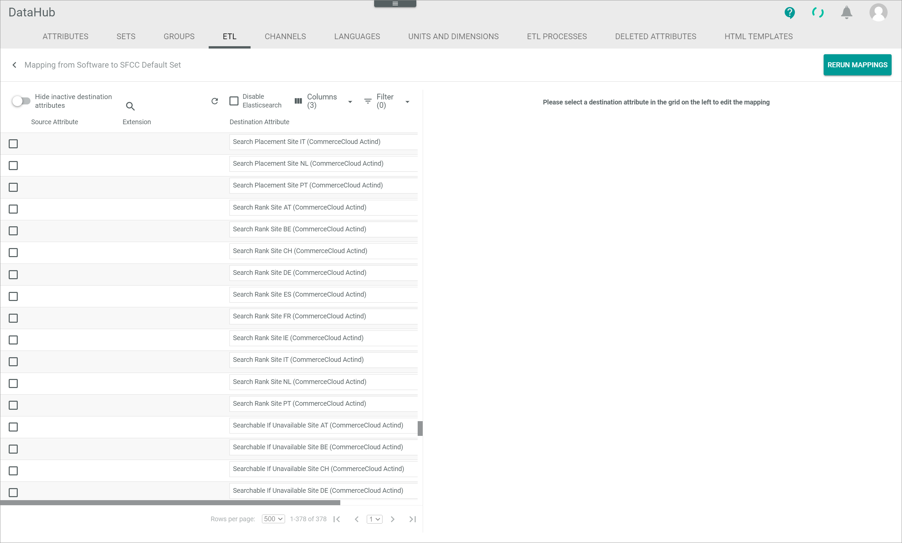

If the site-specific attribute is empty in Actindo (not mapped in the corresponding ETL mapping), no value is uploaded for the attribute, but the site-specific value is deleted. This causes that the *Use Default* checkbox is selected in Salesforce for a site-specific attribute and thus the value is deleted and the default value is automatically used. This means that no empty value is uploaded, but no value is uploaded at all, so that the default value applies.    


When a new site is subsequently created, the corresponding site-specific attribute is automatically created after the connection has been synchronized.

All attributes must be created in Salesforce and cannot be created in Actindo and dynamically be added to Salesforce. The attribute definitions list displays all available attributes in Salesforce:    
*Administration > System Object Types > Product > Tab Attribute Definitions*   
The attributes that are created in the *Omni-Channel* module as available attributes are imported from this attribute definitions list.


### Default language

In Salesforce, a default language is preconfigured and other languages can be added. All languages beside the default language are mapped via their key. Therefore, the language key in Actindo must equal the language key in Salesforce.   
As there exists no default language in Actindo, a language must be specified as default language when configuring the connection settings, see [Configure the Salesforce connection](#configure-the-salesforce-connection). The language defined in the settings will be mapped with the default language in Salesforce as well as with the corresponding language in Salesforce.


### Site-specific status

An offer in Actindo can have one of the following three statuses:      
- **Active**   
    The offer is active. It is displayed in the marketplace, where it can be sold.   
- **Inactive**   
    The offer is inactive.  It is not longer displayed in the marketplace and thus cannot be sold anymore.   
- **Not available**   
    The offer is deleted from the marketplace.

By default, the status of an offer applies to the offer in all sites. As there exists the *Override online (only active products) status for Site "site ID"* site-specific attribute, it is possible to override the *active* status of an offer for the specific site. That means, an active offer can be switched to inactive for the individual sites.   
Note that the site-specific status change is only possible in one direction: If the status of an offer is set to **inactive**, it will be inactive on all sites and cannot be changed to **active** for single sites. 


### Price books

In Salesforce, all prices are saved in so-called *Price Books*. IN contrast to Actindo, the price is not an attribute in Salesforce, but a completely own entity which is largely detached from the product.   
As price books in Salesforce cannot be accessed via API, the IDs of the price books as well as the ISO-code of the corresponding currency must be specified when configuring the connection settings, see [Configure the Salesforce connection](#configure-the-salesforce-connection). The price book IDs are displayed in the *ID* column of the price books list in Salesforce:   
*Merchant Tools > Products and Catalogs > Price books*

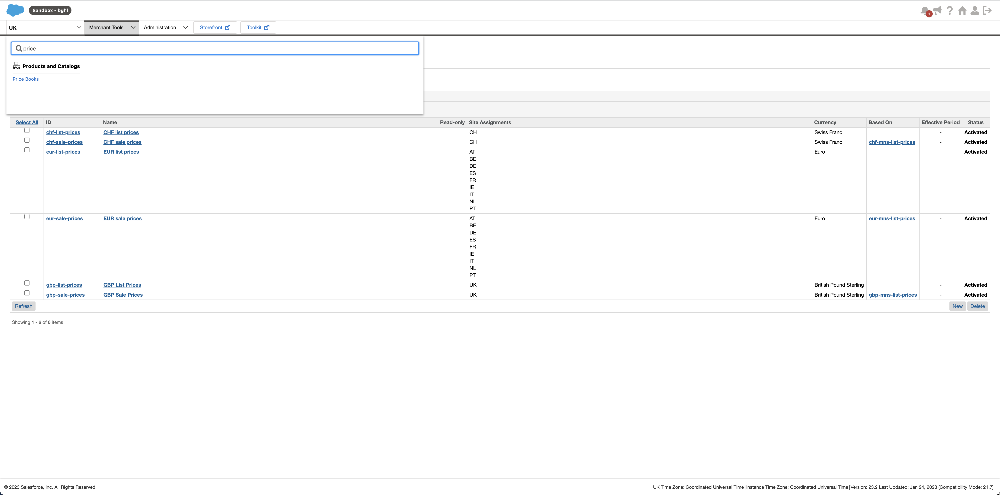


### Variations

Variants in Actindo must not be double, but this is possible in Salesforce. Therefore, it may be necessary to create a further variant level in Actindo so that there are no double variants. However, this variant level should not be displayed in Salesforce. For this purpose, you have to specify the IDs of all attributes that should not be uploaded as defining attributes in Salesforce when configuring the connection settings, see [Configure the Salesforce connection](#configure-the-salesforce-connection). This way the value will be uploaded to Salesforce, but not created as a defining attribute. 
Any information about the Salesforce variants is displayed in the variation products list in Salesforce:    
*Merchant Tools > Products and Catalogs > Products > Select product > Tab Variations*

#### Translatable variants

Basically, variants in Salesforce are always translatable, but they must not be localizable. However, it is possible to specify multiple languages for variants in Salesforce. In Actindo, variants cannot be multi-language. Consequently, Salesforce can specify multilingual values for defining attributes, but Actindo cannot.   
To be able to make the defining attributes translatable in Actindo anyway, you must do the following:
- The corresponding variant attributes must be specified in the *PIM* module as tree node attributes.
- The translations must be specified in the tree node attribute.
- The *Tree-To-String defining values (CommerceCloud)* extension must be selected to map the destination attribute from Salesforce to the PIM source attribute in the corresponding ETL mapping(s), see [Configure the translatable variants](#configure-the-translatable-variants).

    > [Info] As the destination attribute is a variant defining attribute, it is always a single-language attribute with the *String* data type, whereas the source attribute must be a tree node attribute.   

Thereby, The translations can be imported from the tree-node attribute when uploading and the variants can be made translatable.


### Product categories

You can create new product categories in Salesforce as well as in Actindo. When uploading a product category from Actindo to Salesforce, the existing product categories are not overwritten, but merely added to the existing categories in Salesforce. Further, only categories that are created and added by Actindo can also be deleted by Actindo. All categories, that are created or edited by Salesforce, are not touched by Actindo at all. Only the changes made in Actindo that do not affect the Salesforce categories are uploaded.


### Inventory

For the initial product upload, the inventory is imported via a XML file, which is processed by an inventory import job. All changes in inventory of already uploaded products will be processed via the *Open Commerce Cloud API*. Since the inventory update via API runs without generating an inventory import job, no inventory import jobs are displayed even if the inventory is updated.  

In Salesforce, inventories can be created. These inventories are synchronized to Actindo as inventory fields. The fields represent what is contained in the inventories.   
In addition to the normal fields, custom fields can be defined for the inventory in Salesforce. To allow these additional fields, the *Handle Inventory custom fields* checkbox in the connection settings must be selected when configuring the connection settings, see [Configure the Salesforce connection](#configure-the-salesforce-connection). Further the connection must be synchronized to apply all changes. The custom inventory fields for the products are displayed in the list of inventory attributes in Salesforce:   
*Merchant Tools > Products and Catalogs > Products > Select product > Tab Inventory > Button Edit > Sub-tab Attributes*
The fields can be defined in the *Inventory* module in Salesforce:  
*Merchant Tools > Products and Catalogs > Inventory*


### Product options

Product options are options that can be added to a product, for instance, a warranty to a product. There are two different types of product options in Salesforce:
- Local options
- Shared options

Local options are product defined. These options are currently not supported by Actindo.   

Shared options are globally defined and are assigned to a product. These options are supported by Actindo even if they cannot be maintained by Actindo. As shared options are globally defined, they are the same for all products. 

The shared options must be specified in Salesforce:    
*Merchant Tools > Products and Catalogs > Product Options*

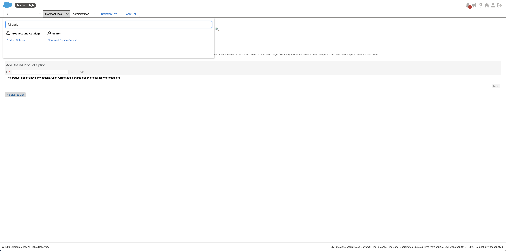

In Actindo, you must map the IDs of the shared options with the *Constant value* extension to the *Shared Options (,-separated)(CommerceCloud Actind)* destination attribute. The IDs of the shared options from Salesforce must be entered comma separated in the corresponding field in the *Configuration* section of the attribute mapping.

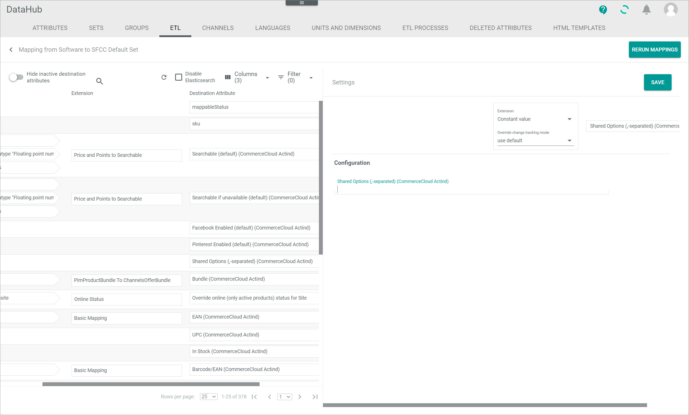


### Product sets

Product sets are currently not supported by Actindo.

*Merchant Tools > Products and Catalogs > Products > Select product > Tab Product Sets*


### Image handling

The image handling is currently not supported by Actindo.


### Order debug endpoint

The following endpoint is used to retrieve all details of a certain order in Salesforce, for instance if any problems with a certain order occur and you have to check the data the order contains:

*/Actindo.Extensions.Actindo.CommerceCloud.OrderDebug.orderDebug?connectionId=x&orderNumber=x&siteId=x*

The *x* in the endpoint above must be replaced by the corresponding parameter information:
- Connection ID of the applicable connection. The connection ID is displayed in the *ID* column of the connections list in Actindo, see [User interface Connections](../UserInterface/07a_Connections.md): *Omni-Channel > Settings > Tab CONNECTIONS*
- Order number of the applicable order. The order number is displayed in the *Number* column of the orders list in Salesforce: *Merchant Tools > Ordering > Orders > Button Find*
- Site ID of the site where the order has been placed. The site ID is displayed in the *ID* column of the storefront sites list in Salesforce: *Administration > Sites > Manage Sites*


### Inventory endpoint

The following endpoint is used to re-trigger the complete inventory upload in Salesforce:

*/Actindo.Extensions.Actindo.CommerceCloud.ReuploadStock.trigger?connectionId=x*

The *x* in the endpoint above must be replaced by the connection ID of the applicable connection. The connection ID is displayed in the *ID* column of the connections list, see [User interface Connections](../UserInterface/07a_Connections.md). Otherwise, you have to know the order number by heart.
 

