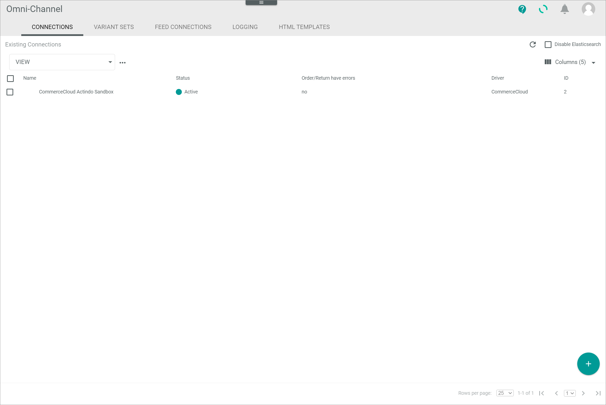
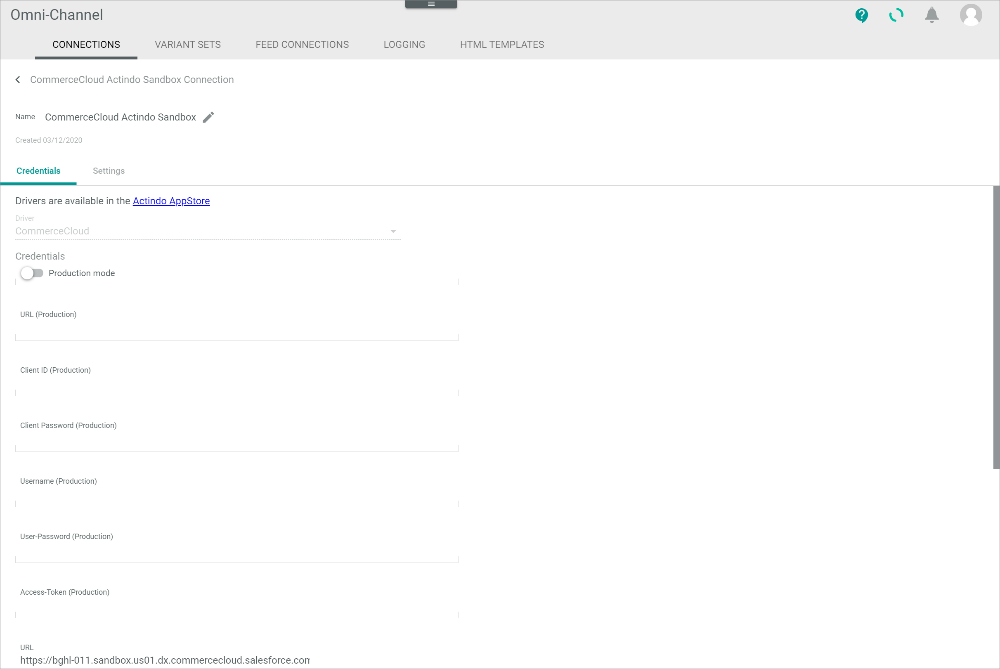
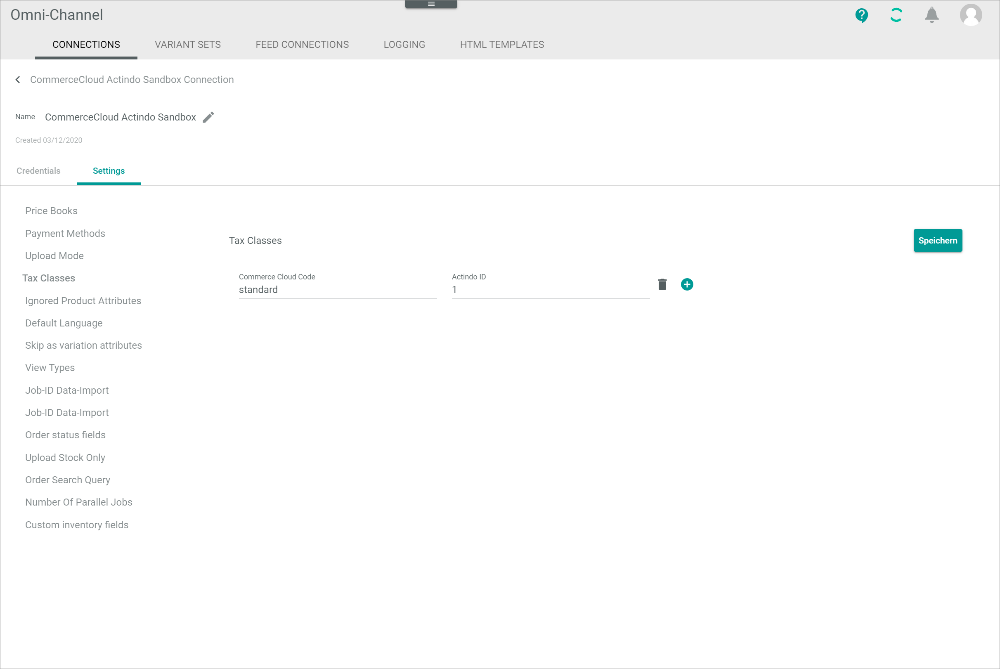
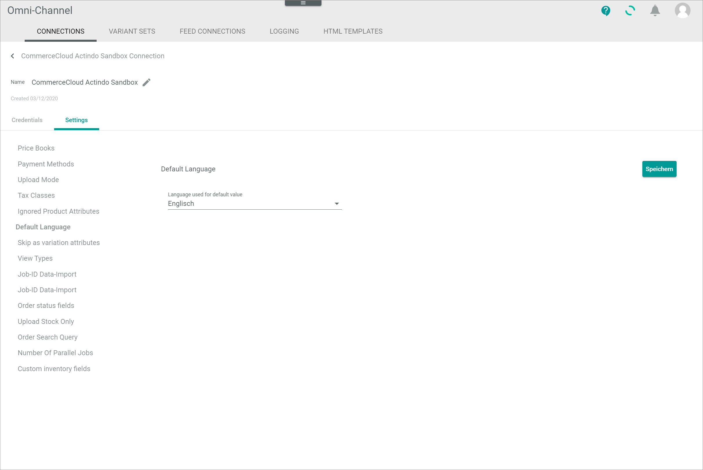
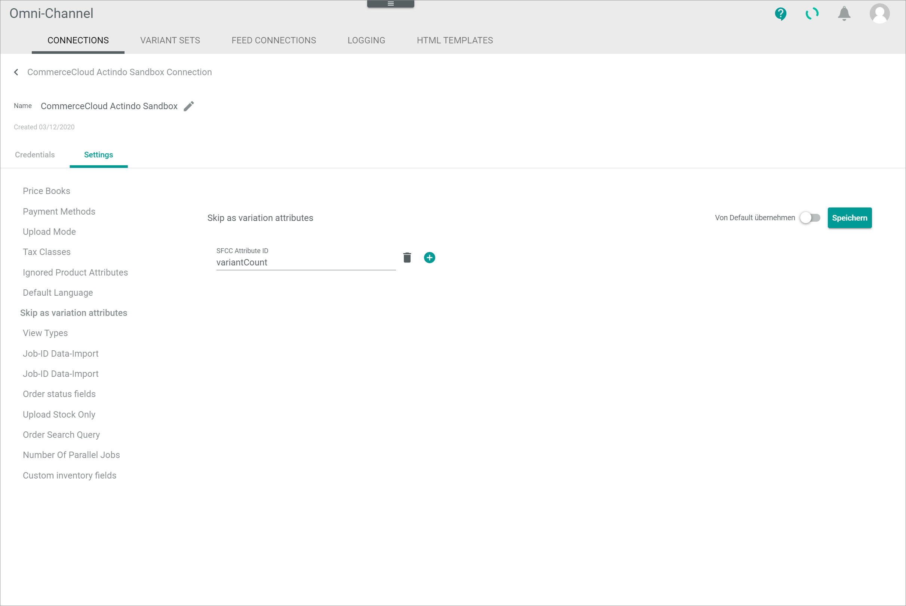
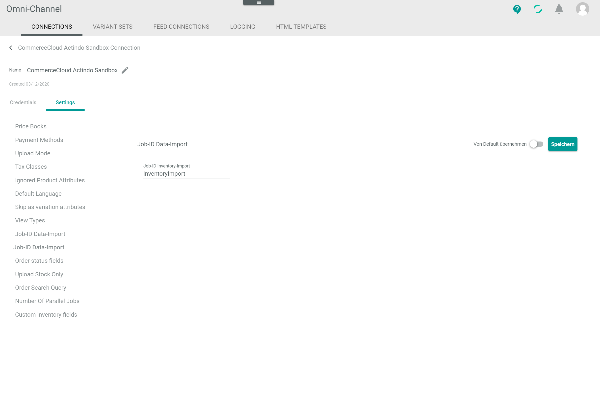
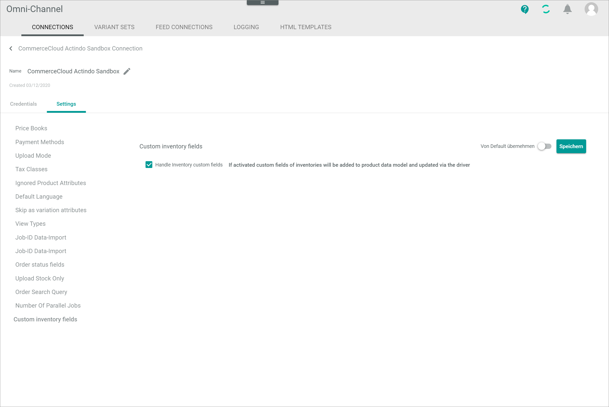

[!!Manage the connections](../../Channels/Integration/01_ManageConnections.md)
[!!Configure the Salesforce Commerce Cloud Business Manager](./01_ConfigureSalesforceCommerceCloud.md)
[!!Salesforce product data particularities](./03_SalesforceParticularities.md)
[!!Manage the ETL mappings in DataHub](../../DataHub/Operation/01_ManageETLMappings.md)
[!!User interface Connections](../UserInterface/01_Connections.md)

# Manage the Salesforce Commerce Cloud connection

To establish a connection to a Salesforce shop, there are several particularities to consider. Therefore, the creation and the configuration of the Salesforce Commerce Cloud (Salesforce) connection are described in detail below.

## Create a Salesforce connection

Create the connection to a Salesforce shop using the Salesforce Commerce Cloud driver. Further settings can only be configured after the connection has been established.

#### Prerequisites

- The Salesforce Commerce Cloud Business Manager has been configured, see [Configure the Salesforce Commerce Cloud Business Manager](./01_ConfigureSalesforceCommerceCloud.md). 
- The *Salesforce Commerce Cloud* plugin has been installed.  

> [Info] For the *Omni-Channel* module version 4.1.0 or higher, the *Salesforce Commerce Cloud* plugin can be used in all versions. It is recommended to use the latest available version.

#### Procedure

*Omni-Channel > Settings > Tab CONNECTIONS*

1. Click the  (Add) button in the bottom right corner.    
    The *Create connection* view is displayed.

    

2. Enter a name for the connection in the *Name* field.

3. Click the *Driver* drop-down list and select the *Salesforce Commerce Cloud* driver.  
    The *Credentials* section is displayed below the drop-down list.

    > [Info] Salesforce offers the possibility to work with two separate environments, a staging environment for customizing and testing purposes and a live environment for production. The connection to the environments must be configured separately. 

    

4. For the staging environment, enter the following credentials:
    + Enter the shop URL of the staging environment in the *URL* field.  
    + Enter the client ID in the *Client ID* field.
    + Enter the client password in the *Client password* field.
        > [Info] The client ID and client password will be provided to you by your Salesforce shop agency.
    + Enter the email address of the user in the *Username* field.
    + Enter the user password in the *User password* field
    + Enter the user API access token in the *Access token* field. 
        > [Info] The username, the user password and the API access token are the so-called *business manager login data* that are needed to work with orders. 

5. For the live environment, enable the *Production mode* toggle and enter the following credentials:  
    + Enter the shop URL of the production environment in the *URL (Production)* field.  
    + Enter the client ID in the *Client ID (Production)* field.
    + Enter the client password in the *Client password (Production)* field.
        > [Info] The client ID and client password will be provided to you by your Salesforce shop agency.
    + Enter the email address of the user in the *Username (Production)* field.
    + Enter the user password in the *User password (Production)* field
    + Enter the user API access token in the *Access token (Production)* field. 
        > [Info] The username, the user password and the API access token are the so-called *business manager login data* that are needed to work with orders. 

    > [Info] As soon as the production mode is enabled, the order import and the stock upload are synchronized with the production environment, whereas the product data are still synchronized with the staging environment.

6. Click the [SAVE] button.  
    The connection has been created. The *CONNECTIONS* tab in the *Settings* menu entry of the *Omni-Channel* module is displayed when the connection has been established. The *Salesforce Commerce Cloud* connection is displayed in the list of connections.

    

7. If necessary, continue to configure the Salesforce connection, see [Configure the Salesforce connection](#configure-the-salesforce-connection).

## Configure the Salesforce connection   

After the connection to a Salesforce shop has been established, further settings can be configured for the connection.

#### Prerequisites

The Salesforce connection has been established, see [Create a Salesforce connection](#create-a-salesforce-connection).

#### Procedure

*Omni-Channel > Settings > Tab CONNECTIONS*

1. Click the Salesforce connection in the list of connections.   
    The *Edit connection* view is displayed. By default, the *Credentials* tab is selected.

    

2. Click the *Settings* tab.   
    The *Settings* tab is displayed. By default, the *Price books* settings are selected. 
    
    

3. Enter the price book ID in the *ID* field and the applicable three letter currency code according to ISO 4217 in the *Currency* field for each price book in Salesforce. To add another price book, click the  (Add) button to the right of the last price book.  

    > [Info] The price books must be set up manually, as they cannot be retrieved via API from Salesforce.

4. Click the *Payment methods* menu entry in the left side bar.  
		The payment methods settings are displayed on the right side.   

    

5. Enter the payment method ID in the *ID* field and a name in the *Name* field for each payment method in Salesforce. To add another payment method, click the  (Add) button to the right of the last payment method.   

6. Click the *Upload mode* menu entry in the left side bar.  
    The upload mode settings are displayed on the right side.

    

7. Click the *Upload mode* drop-down list and select the appropriate mode for the product data upload. The following options are available:  
    - **Immediately**    
        Select this option to upload any changes as soon as they are made.
    - **Delayed**    
        Select this option to upload any changes after a specified period of time. The *Delay in minutes* field is displayed. Enter the desired delay in minutes in the field. By default, a 10 minutes delay is predefined. 
    - **Cron**    
        Select this option to schedule the upload and perform it periodically at a fixed time, date or interval. The *Cron line* field is displayed. Enter a valid cron expression to specify the time interval in which the product data should be uploaded in the field. For detailed information, see https://crontab.guru/.
    
    Alternatively, you can enable the *Apply from default* toggle to apply the default value. The default value is displayed read-only in the field after activation.

8. Click the *Tax classes* menu entry in the left side bar.  
    The tax classes settings are displayed on the right side.

    

9. Enter the Salesforce ID for the tax class in the *Commerce Cloud Code* field and the corresponding Actindo tax class ID in the *Actindo ID* field. The Actindo tax class IDs are **1** for the standard rate and **2** for the reduced rate. The Salesforce tax class IDs are available in Salesforce: *Merchant Tools > Ordering > Taxation*

    > [Info] Repeat the step **9** for each tax class in Salesforce. Further tax class fields can be added by clicking the  (Add) button right to the last tax class.   

[comment]: <> (Aktuell werden die Actindo Tax Class IDs nicht im Taxes Modul angezeigt. Sobald möglich ergänzen, wo diese zu finden sind.)

10. Click the *Ignored Product Attributes* menu entry in the left side bar.  
    The ignored product attributes settings are displayed on the right side.

    

11. Enter the ID of the attribute that should not be imported to Salesforce in the *SFCC Attribute ID* field. The corresponding attribute IDs are described in the *catalog.xsd* schema, see [catalog.xsd](https://documentation.b2c.commercecloud.salesforce.com/DOC3/index.jsp?topic=%2Fcom.demandware.dochelp%2FDWAPI%2Fxsd%2FSchemas.html).  

    > [Info] Repeat the step **11** for each attribute to be ignored. Further attribute fields can be added by clicking the  (Add) button right to the last attribute. If you enter IDs of custom attributes that should not be imported to Salesforce, note to add the prefix **c_**, that is, **c_AttributeName**.

12. Click the *Default language* menu entry in the left side bar.  
    The default language settings are displayed on the right side.

    

13. Click the *Language used for default value* drop-down list and select the language that should be used if the default language is selected in Salesforce. All available languages are displayed in the list.  

    > [Info] In contrast to Salesforce, no default language is defined in the *Actindo Core1 Platform*. For this reason, a language must be specified to be used as default value.    

14. Click the *Skip as variation attribute* menu entry in the left side bar.  
    The skip as variation attribute settings are displayed on the right side.

    

15. Enter the Salesforce ID of the attribute that should not be imported to Salesforce in the *SFCC Attribute ID* field.   

    > [Info] Repeat the step **15** for each variant to be ignored. Further attribute fields can be added by clicking the  (Add) button. If you enter IDs of custom attributes that should not be imported to Salesforce, note to add the prefix **c_**, that is, **c_AttributeName**.

16. Click the *Job ID data import* menu entry in the left side bar.  
    The job ID data import settings are displayed on the right side.   

    

17. Enter the applicable Salesforce job ID in the *Job ID data import* field. 

    > [Info] The job ID for the data import has been created during the configuration of the Salesforce Commerce Cloud Business Manager, see [Create a data import job](./01_ConfigureSalesforceCommerceCloud.md#create-a-data-import-job).

18. Click the *Job ID inventory import* menu entry in the left side bar.  
    The Job ID inventory import settings are displayed on the right side.   

    

19. Enter the applicable Salesforce job ID in the *Job ID inventory import* field.

    > [Info] The job ID for the inventory import has been created during the configuration of the Salesforce Commerce Cloud Business Manager, see [Create a inventory import job](./01_ConfigureSalesforceCommerceCloud.md#create-an-inventory-import-job).

20. Click the *Order status fields* menu entry in the left side bar.  
    The order status fields settings are displayed on the right side.

    

21. Enter the IDs of the corresponding status fields in the *Order status*, *Payment status* and *Deliver status* fields.   
Alternatively, enable the *Apply from default* toggle to apply the Salesforce default values.

    > [Info] Note to add the prefix **c_** if you enter the ID of a custom field, that is, **c_StatusID**.

22. Click the *Upload stock only* menu entry in the left side bar.  
    The upload stock only settings are displayed on the right side.

    

23. Select the *Upload stock only* checkbox if you want to upload only stock but no product data. Leave the checkbox unchecked to upload both stock and product data. By default, the checkbox is unchecked.  

24. Click the *Order search query* menu entry in the left side bar.  
    The order search query settings are displayed on the right side.

    

25. Enter a custom query to search for all new imported orders.    
Alternatively, enable the *Apply from default* toggle to apply the default search query.  
  
    > [Info] As soon as an order has been imported, the order export status in Salesforce is set to **Exported**. The *Export status* field can be checked in Salesforce: *Salesforce Commerce Cloud Business Manager > Select a site > Tab Merchant Tools > Ordering > Orders > Button Find > Select an order*.  

26. Click the *Number of parallel jobs* menu entry in the left side bar.  
    The number of parallel jobs settings are displayed on the right side.

    

27. Enter the number of jobs that may be processed in parallel in the *Number of parallel jobs* field.     
Alternatively, enable the *Apply from default* toggle to apply the default value for the number of parallel jobs.  

    > [Info] Increase the number of parallel jobs to handle a higher order volume. Be aware that a higher number of parallel jobs also requires a higher number of vCores. 

28. Click the *Custom inventory fields* menu entry in the left side bar.  
    The custom inventory fields settings are displayed on the right side.

    

29. Select the *Handle inventory custom fields* checkbox to import the custom inventory fields from Salesforce and also maintain them in Actindo.    
Alternatively, enable the *Apply from default* toggle or leave the checkbox unchecked to ignore any custom inventory fields from Salesforce.

30. Click the [Save] button.  
    All changes have been saved. The *Saving successful* pop-up window is displayed.

    

## Configure the Salesforce ETL mapping

The ETL mapping is important for the correct functionality of the Salesforce connection to adapt to the particularities of this connection.

### Configure the master catalog

The Salesforce master catalog must be mapped in Actindo to specify which catalog is used as master catalog in Salesforce and to determine the available fields in Actindo.   
It is mandatory that the master catalog is set in all ETL mappings to the Salesforce attribute set.  

#### Prerequisites

- A Salesforce connection has been established, see [Create a Salesforce connection](#create-a-salesforce-commerce-cloud-connection).
- At least one attribute set mapping from a PIM attribute set to the Salesforce attribute set has been created. 

#### Procedure

*DataHub > Settings > Tab ETL*

1. Click the attribute set mapping from a PIM attribute set to the Salesforce attribute set in the list of attribute set mappings.   
    The *Mapping from "PIM attribute set name" to "Salesforce attribute set name"* view is displayed.

    

2. Click the row of the *Master catalog (CommerceCloud Actind)* destination attribute on the left side.   
    The *Settings* section for the *Master catalog (CommerceCloud Actind)* attribute mapping is displayed on the right side.

    

3. Click the *Extension* drop-down list in the *Settings* section and select the **Constant value** option. All extensions that are matching the data type of the destination attribute are displayed in the list.      
    The *Configuration* section is displayed below the *Settings* section.

4. Click the *Master catalog (CommerceCloud Actind)* drop-down list in the *Configuration* section and select the applicable master catalog from Salesforce. All available Salesforce catalogs are displayed in the list.

    

5. Click the [SAVE] button in the upper right corner.   
    The changes have been saved. The *Settings* section is hidden. The assigned mapping is displayed in the list of attribute mappings on the left side.

    > [Info] Be aware that you have to rerun the mapping to apply the changes made to the attribute, see [Rerun an ETL mapping](../../DataHub/Operation/01_ManageETLMappings.md#rerun-an-etl-mapping).

### Configure the variants

When mapping the product variants from Actindo to Salesforce, it is important to set the correct settings to avoid any upload problems.

#### Prerequisites

- A Salesforce connection has been established, see [Create a Salesforce connection](#create-a-salesforce-commerce-cloud-connection).
- At least one attribute set mapping from a PIM attribute set to the Salesforce attribute set has been created. 

#### Procedure

*DataHub > Settings > Tab ETL*

1. Click the attribute set mapping from a PIM attribute set to the Salesforce attribute set in the list of attribute set mappings.   
    The *Mapping from "PIM attribute set name" to "Salesforce attribute set name"* view is displayed.

    

2. Click the row of the *Variants (CommerceCloud Actind)* destination attribute on the left side.   
    The *Settings* section for the *Variants (CommerceCloud Actind)* attribute mapping is displayed on the right side.

    

3. Click the *Extension* drop-down list in the *Settings* section and select the **Variant-to-variant** option. All extensions that are matching the data type of the destination attribute are displayed in the list.      
    The *Source attribute* drop-down list is displayed left to the *Extension* drop-down list and the *Configuration* section is displayed below the *Settings* section.

4. Click the *Source attribute* drop-down list and select the **Product variants** option. All attributes with a data type that matches the selected ETL extension are displayed in the list.    

5. Enable the following toggles in the *Configuration* section:
    - *Automatically generate all child entities when main entity is created*
    - *Automatically map variant sets* 
    - *Automatically create variant set if no suiting variant can be found*
    
6. Make sure that the following toggles are disabled:
   - *Automatically add not mapped defining attributes to destination set when creating variant set*
        > [Info] In no case may the *Automatically add not mapped defining attributes to destination set when creating variant set* toggle be activated, as the upload from Actindo to Salesforce will cause problems, see [Attributes](./03_SalesforceParticularities.md#attributes).
    - *Do not transfer the status of the master offer to the child offer*

  

7. Click the [SAVE] button in the upper right corner.   
    The changes have been saved. The *Settings* section is hidden. The assigned mapping is displayed in the list of attribute mappings on the left side.

    > [Info] Be aware that you have to rerun the mapping to apply the changes made to the attribute, see [Rerun an ETL mapping](../../DataHub/Operation/01_ManageETLMappings.md#rerun-an-etl-mapping).

### Configure the translatable variants

In Salesforce, it is possible to create translations to variables. In Actindo, variants are generally not translatable. Nevertheless, it is possible to apply the translations from Salesforce by a special mapping to a PIM tree node attribute. 

#### Prerequisites

- A Salesforce connection has been established, see [Create a Salesforce connection](#create-a-salesforce-commerce-cloud-connection).
- The attribute to be translated has been created as a tree node attribute with the corresponding translations in the *PIM* module, see [Variations](./03_SalesforceParticularities.md#variations).
- At least one attribute set mapping from a PIM attribute set to the Salesforce attribute set has been created. 

#### Procedure

*DataHub > Settings > Tab ETL*

1. Click the attribute set mapping from a PIM attribute set to the Salesforce attribute set in the list of attribute set mappings.   
    The *Mapping from "PIM attribute set name" to "Salesforce attribute set name"* view is displayed.

    

2. Click the row of the *Product Language (CommerceCloud Actind)* destination attribute on the left side.   
    The *Settings* section for the *Product Language (CommerceCloud Actind)* attribute mapping is displayed on the right side.

    

3. Click the *Extension* drop-down list in the *Settings* section and select the **Tree-To-String defining values (CommerceCloud)** option. All extensions that are matching the data type of the destination attribute are displayed in the drop-down list.      
    The *Source attribute* drop-down list is displayed left to the *Extension* drop-down list and the *Configuration* section is displayed below the *Settings* section.

4. Click the *Source attribute* drop-down list and select the corresponding PIM tree node attribute. All attributes with a data type that matches the selected ETL extension are displayed in the list.

    > [Info] The translation of the attribute will only succeed if the selected PIM tree node attribute contains the translations.

5. Configure the settings in the *Configuration* section as desired.  

    > [Info] The configuration settings have no functional meaning for the mapping.

    

6. Click the [SAVE] button in the upper right corner.   
    The changes have been saved. The *Settings* section is hidden.  The assigned mapping is displayed in the list of attribute mappings on the left side.

    > [Info] Be aware that you have to rerun the mapping to apply the changes made to the attribute, see [Rerun an ETL mapping](../../DataHub/Operation/01_ManageETLMappings.md#rerun-an-etl-mapping).   
    Note that any changes made to the translations in the tree node attribute will not be uploaded automatically, even if rerunning the mapping. You must set the corresponding offer to inactive and set it to active again to synchronize the changes. 