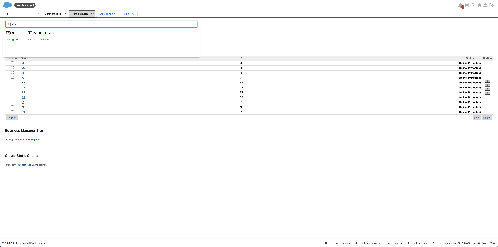
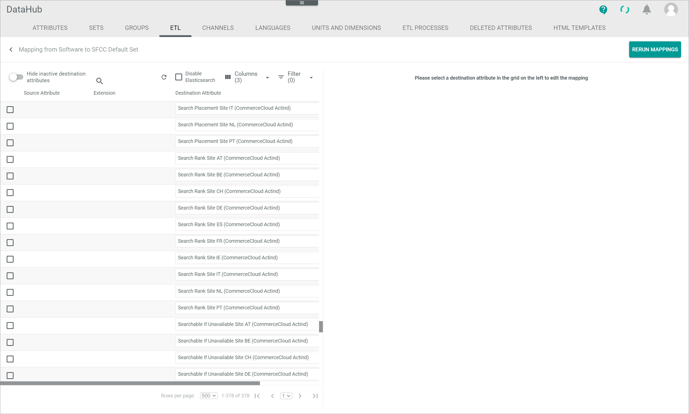
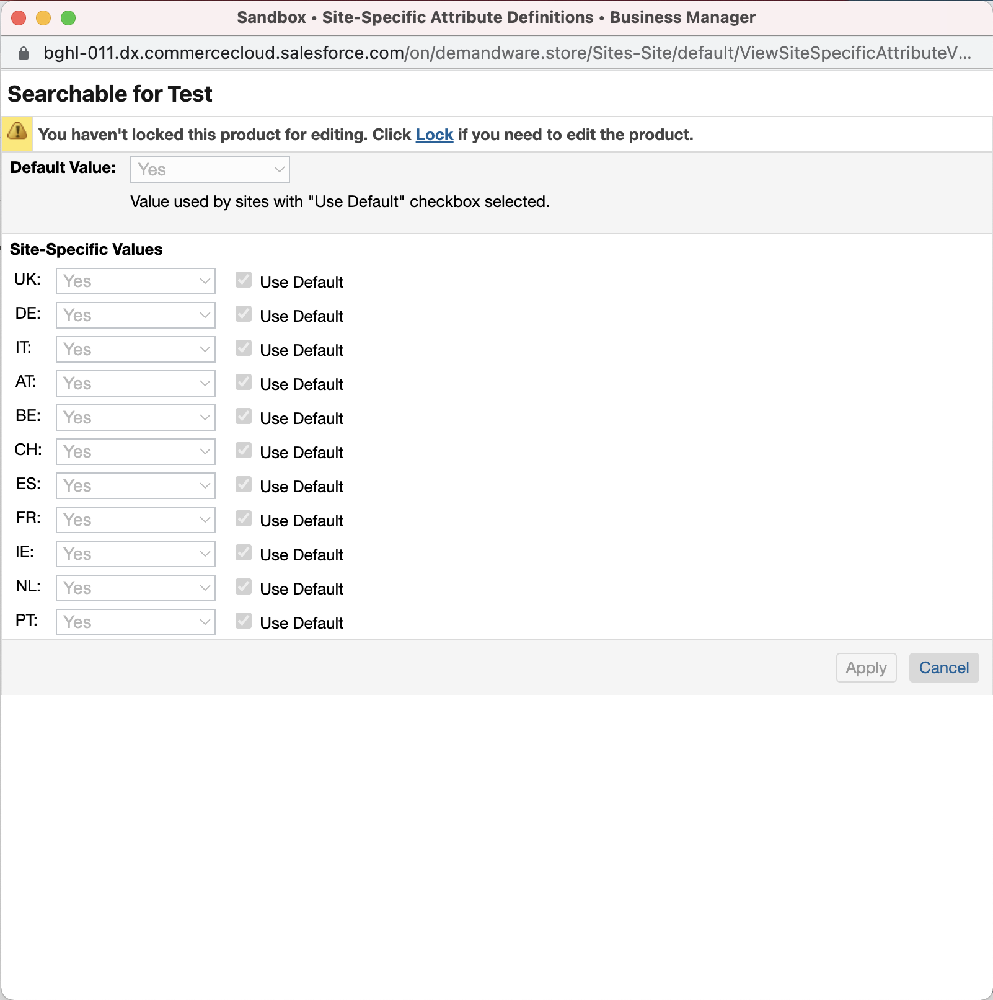
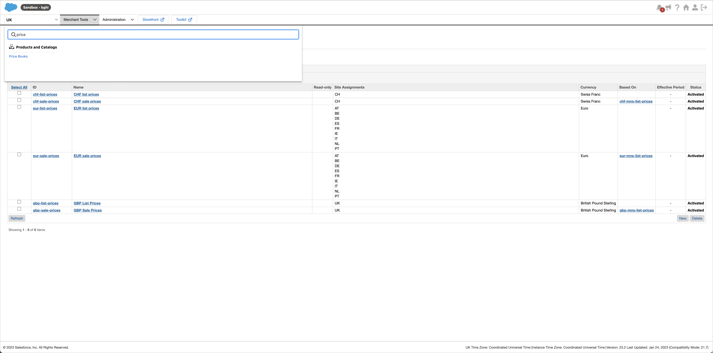
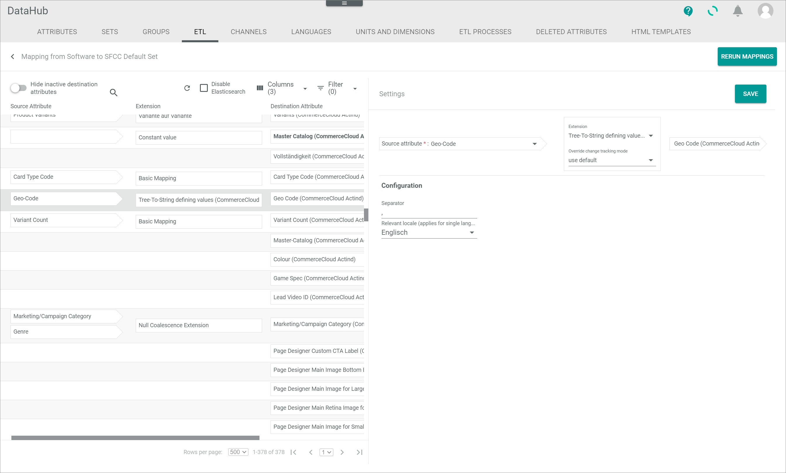
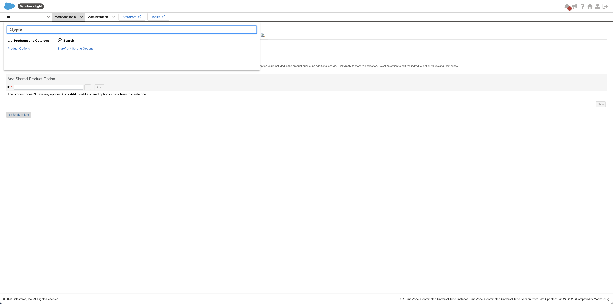
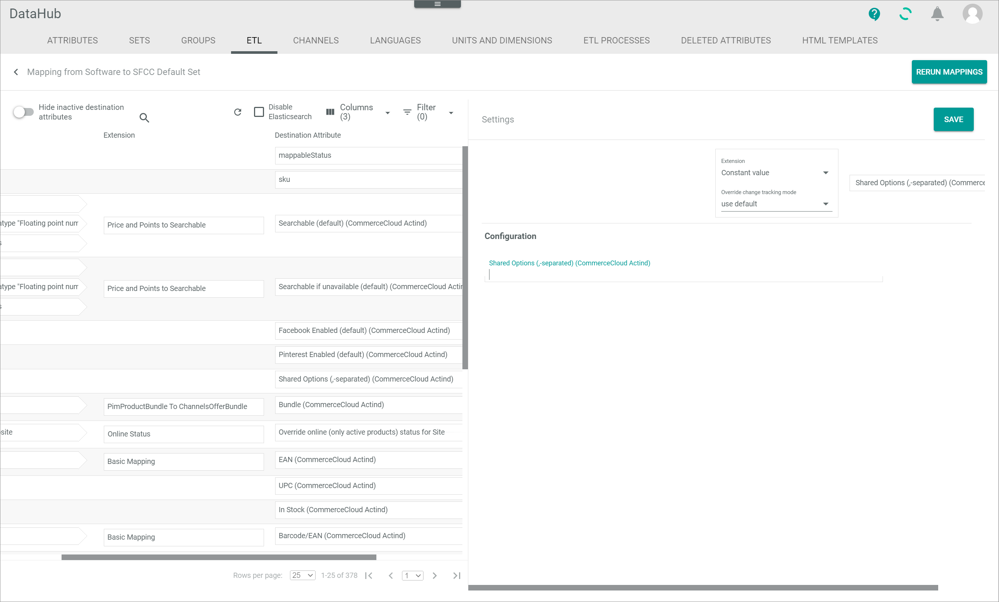

[!!Manage the Salesforce connection](./02_ManageSalesforceConnection.md)
[!!Manage the ETL mappings in DataHub](../../DataHub/Operation/01_ManageETLMappings.md)
[!!User interface Connections](../UserInterface/01_Connections.md)

# Salesforce product data particularities

There are several particularities regarding the Salesforce product data that must be taking into account when establishing and using the Salesforce connection. These particularities are described in detail below.  

## Master catalog

A catalog is a product tree. You can assign certain nodes from a certain catalog to a product and thus divide it into different categories. The product data are part of the catalog. Every product in Salesforce must belong to a catalog. This catalog, who owns the product, is the master catalog. The product belongs to the master catalog but must not be assign to a category within the master catalog. The master catalog in Salesforce determines which fields are available for a product.   
Regardless of which catalog a product belongs to, the product can be assigned to other catalogs as well.

The master catalog who owns the products must be mapped in the *DataHub* module to the *Master Catalog (CommerceCloud Actind)* destination attribute.
The ETL mapping determines which catalog is used as master catalog in Salesforce.   
It is mandatory that the master catalog is set in all ETL mappings to the Salesforce attribute set, see [Configure the master catalog](./02_ManageSalesforceConnection.md#configure-the-master-catalog).

In Actindo, all fields from Salesforce are available, as there exists only one single attribute set for Salesforce.    

## Sites

Salesforce offers the possibility to create different sites for the order import. In Actindo, these sites are created as sub-shops. That means that every single shop is a sub-account, available in the stock withdrawal matrix in the *Warehouse* module.

The different sites are managed in Salesforce: *Administration > Sites > Manage Sites*

## Attributes

In Salesforce, an attribute can either be *Localizable*, *Site-Specific* or neither. Also, an attribute can only be either *Localizable* or *Site-Specific*, not both at the same time. A localizable attribute in Salesforce is equivalent to a multi-language attribute in Actindo. A site-specific attribute in Salesforce is similar but not the same as a multi-channel attribute in Actindo. 

Actindo supports both localizable attributes and site-specific attributes from Salesforce. However, Actindo does not support site-specific boolean attributes from Salesforce because they have a different number of states in Actindo and Salesforce, which would cause problems. 

The localizable attributes from Salesforce are imported to Actindo as multi-language attributes.
The site-specific attributes from Salesforce cannot be imported into Actindo as multi-channel attributes, because the paradigm is not compatible. Therefore,  site-specific attributes from Salesforce are imported into Actindo once as a normal (non-site-specific) attribute and additionally as a further attribute for every available site. This means that the site-specific attribute is expanded in Actindo.    

If the site-specific attribute is empty in Actindo (not mapped in the corresponding ETL mapping), no value is uploaded for the attribute, but the site-specific value is deleted. This causes that the *Use Default* checkbox is selected in Salesforce for a site-specific attribute and thus the value is deleted and the default value is automatically used. This means that no empty value is uploaded, but no value is uploaded at all, so that the default value applies.    

When a new site is subsequently created, the corresponding site-specific attribute is automatically created after the connection has been synchronized.

All attributes must be created in Salesforce and cannot be created in Actindo and dynamically be added to Salesforce. The attribute definitions list displays all available attributes in Salesforce:    
*Administration > System Object Types > Product > Tab Attribute Definitions*   
The attributes that are created in the *Omni-Channel* module as available attributes are imported from this attribute definitions list.

## Default language

In Salesforce, a default language is preconfigured and other languages can be added. All languages beside the default language are mapped via their key. Therefore, the language key in Actindo must equal the language key in Salesforce.   
As there exists no default language in Actindo, a language must be specified as default language when configuring the connection settings, see [Configure the Salesforce connection](./02_ManageSalesforceConnection.md#configure-the-salesforce-connection). The language defined in the settings will be mapped with the default language in Salesforce as well as with the corresponding language in Salesforce.

## Site-specific status

An offer in Actindo can have one of the following three statuses:      
- **Active**   
    The offer is active. It is displayed in the marketplace, where it can be sold.   
- **Inactive**   
    The offer is inactive.  It is not longer displayed in the marketplace and thus cannot be sold anymore.   
- **Not available**   
    The offer is deleted from the marketplace.

By default, the status of an offer applies to the offer in all sites. As there exists the *Override online (only active products) status for Site "site ID"* site-specific attribute, it is possible to override the *active* status of an offer for the specific site. That means, an active offer can be switched to inactive for the individual sites.   
Note that the site-specific status change is only possible in one direction: If the status of an offer is set to **inactive**, it will be inactive on all sites and cannot be changed to **active** for single sites. 

## Price books

In Salesforce, all prices are saved in so-called *Price Books*. IN contrast to Actindo, the price is not an attribute in Salesforce, but a completely own entity which is largely detached from the product.   
As price books in Salesforce cannot be accessed via API, the IDs of the price books as well as the ISO-code of the corresponding currency must be specified when configuring the connection settings, see [Configure the Salesforce connection](./02_ManageSalesforceConnection.md#configure-the-salesforce-connection). The price book IDs are displayed in the *ID* column of the price books list in Salesforce:   
*Merchant Tools > Products and Catalogs > Price books*

## Variations

Variants in Actindo must not be double, but this is possible in Salesforce. Therefore, it may be necessary to create a further variant level in Actindo so that there are no double variants. However, this variant level should not be displayed in Salesforce. For this purpose, you have to specify the IDs of all attributes that should not be uploaded as defining attributes in Salesforce when configuring the connection settings, see [Configure the Salesforce connection](./02_ManageSalesforceConnection.md#configure-the-salesforce-connection). This way the value will be uploaded to Salesforce, but not created as a defining attribute. 
Any information about the Salesforce variants is displayed in the variation products list in Salesforce:    
*Merchant Tools > Products and Catalogs > Products > Select product > Tab Variations*

### Translatable variants

Basically, variants in Salesforce are always translatable, but they must not be localizable. However, it is possible to specify multiple languages for variants in Salesforce. In Actindo, variants cannot be multi-language. Consequently, Salesforce can specify multilingual values for defining attributes, but Actindo cannot.   
To be able to make the defining attributes translatable in Actindo anyway, you must do the following:
- The corresponding variant attributes must be specified in the *PIM* module as tree node attributes.
- The translations must be specified in the tree node attribute.
- The *Tree-To-String defining values (CommerceCloud)* extension must be selected to map the destination attribute from Salesforce to the PIM source attribute in the corresponding ETL mapping(s), see [Configure the translatable variants](02_ManageSalesforceConnection.md#configure-the-translatable-variants).

    > [Info] As the destination attribute is a variant defining attribute, it is always a single-language attribute with the *String* data type, whereas the source attribute must be a tree node attribute.   

Thereby, the translations can be imported from the tree-node attribute when uploading and the variants can be made translatable.

## Product categories

You can create new product categories in Salesforce as well as in Actindo. When uploading a product category from Actindo to Salesforce, the existing product categories are not overwritten, but merely added to the existing categories in Salesforce. Further, only categories that are created and added by Actindo can also be deleted by Actindo. All categories, that are created or edited by Salesforce, are not touched by Actindo at all. Only the changes made in Actindo that do not affect the Salesforce categories are uploaded.

## Inventory

For the initial product upload, the inventory is imported via a XML file, which is processed by an inventory import job. All changes in inventory of already uploaded products will be processed via the *Open Commerce Cloud API*. Since the inventory update via API runs without generating an inventory import job, no inventory import jobs are displayed even if the inventory is updated.  

In Salesforce, inventories can be created. These inventories are synchronized to Actindo as inventory fields. The fields represent what is contained in the inventories.   
In addition to the normal fields, custom fields can be defined for the inventory in Salesforce. To allow these additional fields, the *Handle Inventory custom fields* checkbox in the connection settings must be selected when configuring the connection settings, see [Configure the Salesforce connection](./02_ManageSalesforceConnection.md#configure-the-salesforce-connection). Further the connection must be synchronized to apply all changes. The custom inventory fields for the products are displayed in the list of inventory attributes in Salesforce:   
*Merchant Tools > Products and Catalogs > Products > Select product > Tab Inventory > Button Edit > Sub-tab Attributes*
The fields can be defined in the *Inventory* module in Salesforce:  
*Merchant Tools > Products and Catalogs > Inventory*

## Product options

Product options are options that can be added to a product, for instance, a warranty to a product. There are two different types of product options in Salesforce:
- Local options
- Shared options

Local options are product defined. These options are currently not supported by Actindo.   

Shared options are globally defined and are assigned to a product. These options are supported by Actindo even if they cannot be maintained by Actindo. As shared options are globally defined, they are the same for all products. 

The shared options must be specified in Salesforce:    
*Merchant Tools > Products and Catalogs > Product Options*

In Actindo, you must map the IDs of the shared options with the *Constant value* extension to the *Shared Options (,-separated)(CommerceCloud Actind)* destination attribute. The IDs of the shared options from Salesforce must be entered comma separated in the corresponding field in the *Configuration* section of the attribute mapping.

## Product sets

Product sets are currently not supported by Actindo.

*Merchant Tools > Products and Catalogs > Products > Select product > Tab Product Sets*

## Image handling

The image handling is currently not supported by Actindo.

## Order debug endpoint

The following endpoint is used to retrieve all details of a certain order in Salesforce, for instance if any problems with a certain order occur and you have to check the data the order contains:

*/Actindo.Extensions.Actindo.CommerceCloud.OrderDebug.orderDebug?connectionId=x&orderNumber=x&siteId=x*

The *x* in the endpoint above must be replaced by the corresponding parameter information:
- Connection ID of the applicable connection. The connection ID is displayed in the *ID* column of the connections list in Actindo, see [User interface Connections](../UserInterface/01_Connections.md): *Omni-Channel > Settings > Tab CONNECTIONS*
- Order number of the applicable order. The order number is displayed in the *Number* column of the orders list in Salesforce: *Merchant Tools > Ordering > Orders > Button Find*
- Site ID of the site where the order has been placed. The site ID is displayed in the *ID* column of the storefront sites list in Salesforce: *Administration > Sites > Manage Sites*

## Inventory endpoint

The following endpoint is used to re-trigger the complete inventory upload in Salesforce:

*/Actindo.Extensions.Actindo.CommerceCloud.ReuploadStock.trigger?connectionId=x*

The *x* in the endpoint above must be replaced by the connection ID of the applicable connection. The connection ID is displayed in the *ID* column of the connections list, see [User interface Connections](../UserInterface/01_Connections.md). Otherwise, you have to know the order number by heart.
 

