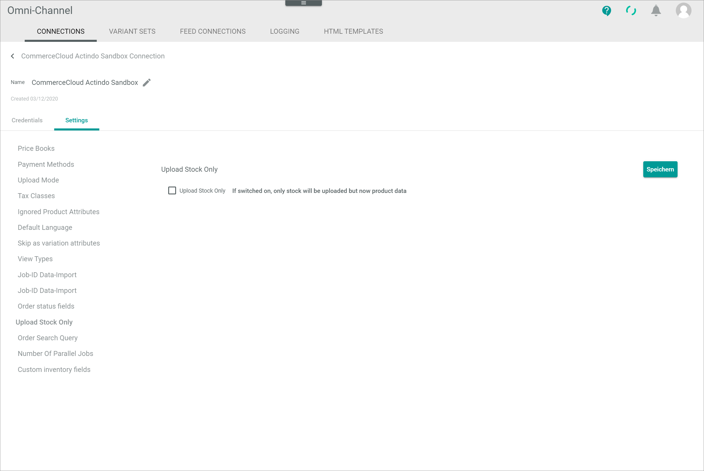
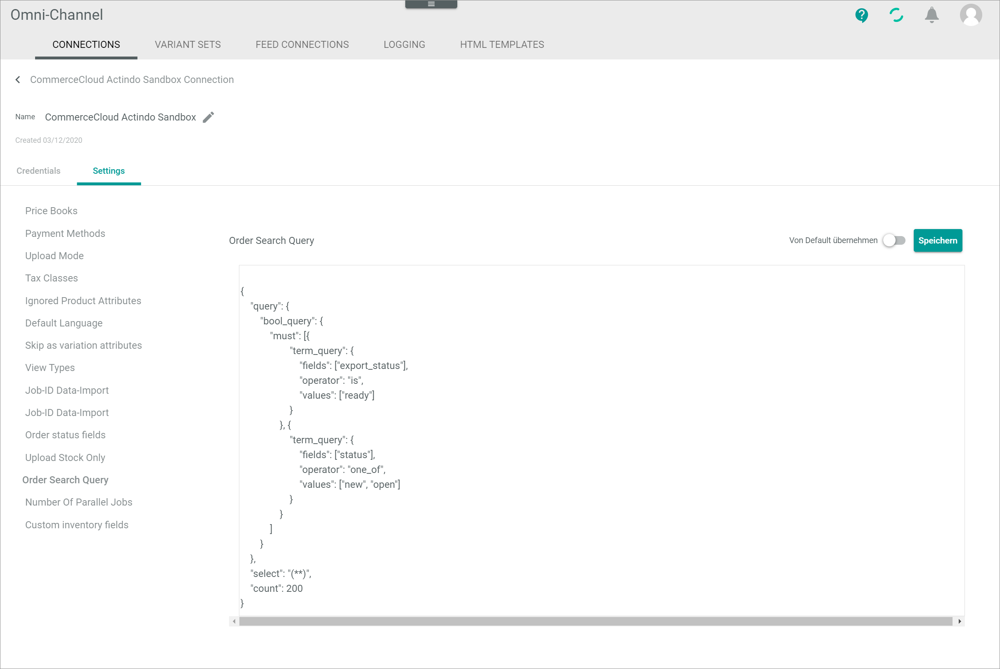

[!!Manage the Salesforce connection](../Integration/01_ManageSalesforceConnection.md)

# Connections

*Omni-Channel > Settings > Tab CONNECTIONS*

**Connections**

-  (Refresh)   
    Click this button to update the list of connections.

- *VIEW*   
    Click the drop-down list to select the view. All created views are displayed in the drop-down list. Click the  (Points) button to the right of the *VIEW* drop-down list to display the context menu and create a view.   

    -  (Points)      
        Click this button to the right of the *VIEW* drop-down list to display the context menu. The following menu entries are available:

        -  create  
            Click this entry to create a view. The *Create view* window is displayed, see [Create view](#create-view).

        -  rename  
            Click this entry to rename the selected view. The *Rename view* window is displayed, see [Rename view](#rename-view). This menu entry is only displayed if a view has been selected.

        -  reset  
            Click this entry to reset all unsaved changes to the settings of the selected view. This menu entry is only displayed if a view has been selected and any changes have been made to the view settings.

        -  publish  
            Click this entry to publish the view. This menu entry is only displayed if a view has been selected and unpublished.

        -  unpublish  
            Click this entry to unpublish the view. This menu entry is only displayed if a view has been selected and published.

        -  save  
            Click this entry to save the current view settings in the selected view. This menu entry is only displayed if a view has been selected.

            > [Info] When the settings of a view have been changed, an asterisk is displayed next to the view name. The asterisk is hidden as soon as the changes have been saved.

        -  delete  
            Click this entry to delete the selected view. A confirmation window to confirm the deletion is displayed. This menu entry is only displayed if a view has been selected.

-  Columns (x)   
    Click this button to display the columns bar and customize the displayed columns and the order of columns in the list. The *x* indicates the number of columns that are currently displayed in the list.

- [x]     
    Select the checkbox to display the editing toolbar. If you click the checkbox in the header, all connections in the list are selected.

- [DELETE]  
    Click this button to delete the selected connection. This button is only displayed if a single checkbox in the list of connections is selected.
    
    > [Info] Deleting a connection is a very complex process and can therefore take a long time. 

- [SYNCHRONIZE]  
    Click this button to synchronize the selected connection. This button is only displayed if a single checkbox in the list of connections is selected. The *Sync triggered* pop-up window is displayed.

    

- [DISABLE]  
    Click this button to disable the selected connection(s). This button is only displayed if the checkbox of at least one active connection is selected.

- [ENABLE]  
    Click this button to enable the selected connection(s). This button is only displayed if the checkbox of at least one inactive connection is selected. 

-  (Edit)  
    Click this button to edit the selected connection. This button is only displayed if a single checkbox in the list of connections is selected. Alternatively, you can click directly a row in the list to edit a connection. The *Edit connection* view is displayed, see [Edit connection](#edit-connection).

The list displays all available connections. Depending on the settings, the displayed columns may vary. All fields are read-only.

- *Name*  
    Connection name.

- *Status*  
    Connection status. The following statuses are available:
    -  **Active**   
        The connection is enabled and data is being synchronized via the connection.
    -  **Inactive**   
        The connection is disabled and no data is being synchronized via the connection.   

- *Order/Return have errors*  
    Indication whether errors have occurred in orders or  returns:. The following options are available:  
    - **Yes**   
        Errors have occurred.   
    - **No**   
        No errors have occurred.

- *Driver*  
    Driver name.

- *ID*  
    Connection identification number. The ID number is automatically assigned by the system.

-  (Add)  
    Click this button to add a connection. The *Create connection* view is displayed, see [Create connection](#create-connection).

## Create view

*Omni-Channel > Settings > Tab CONNECTIONS > Button Points > Menu entry create*

- *Name*   
    Enter a name for the view.

- [CANCEL]   
    Click this button to cancel creating a view. The *Create view* window is closed.

- [SAVE]   
    Click this button to save the new view and display it in the *VIEW* drop-down list. The *Create view* window is closed.

## Rename view

*Omni-Channel > Settings > Tab CONNECTIONS > Button Points > Menu entry rename*

- *Name*   
    Click this field to edit the view name.

- [CANCEL]   
    Click this button to cancel renaming the view. The *Rename view* window is closed.

- [SAVE]   
    Click this button to save the changes and display it in the *VIEW* drop-down list. The *Rename view* window is closed.

## Create Salesforce connection

*Omni-Channel > Settings > Tab CONNECTIONS > Button Add*

-  (Back)   
    Click this button to close the *Create connection* view and return to the connection list. All changes are rejected.

- *Name*   
    Enter a connection name.

-  (Apply)  
    Click this button to apply the entered connection name. This button is only displayed if the connection name has not yet been confirmed. 

-  (Edit)  
    Click this button to edit the connection name. This button is only displayed if the connection name has been confirmed. 

- *Driver*  
    Click the drop-down list and select the *CommerceCloud* driver. All installed drivers are displayed. The *Credentials* section is displayed below the drop-down list.

    > [Info] Drivers are licensed and must be acquired via the app store or the corresponding e-commerce partner platform. The applicable driver credentials to establish the connection are obtained when acquiring the corresponding license.

**Credentials**

-  *Production mode*   
    Enable this toggle to activate the live environment for the Salesforce shop. Disable the toggle to use only the staging environment. In this case, you do not need to enter any credentials in the fields with the *(Production)* addition as they will be ignored anyway. By default, this toggle is disabled.

    > [Info] As soon as the production mode is enabled, the order import and the stock upload are synchronized with the production environment, whereas the product data are still synchronized with the staging environment.

- *URL (Production)*   
    Enter the shop URL of the production environment.

- *Client ID (Production)*   
    Enter the client ID for the production environment.The client ID will be provided to you by your Salesforce shop agency.

- *Client password (Production)*   
    Enter the client password for the production environment. The client password will be provided to you by your Salesforce shop agency.

- *Username (Production)*   
    Enter the email address of the user for the production environment.

- *User password (Production)*   
    Enter the user password for the production environment.

- *Access token (Production)*   
    Enter the user API access token for the production environment.

- *URL*   
    Enter the shop URL of the staging environment.

- *Client ID*   
    Enter the client ID for the staging environment.The client ID will be provided to you by your Salesforce shop agency.

- *Client password*   
    Enter the client password for the staging environment. The client password will be provided to you by your Salesforce shop agency.

- *Username*   
    Enter the email address of the user for the staging environment.

- *User password*   
    Enter the user password for the staging environment.

- *Access token*   
    Enter the user API access token for the staging environment.

- [SAVE]  
    Click this button to save the connection.

## Edit Salesforce connection

*Omni-Channel > Settings > Tab CONNECTIONS > Select Salesforce connection*

-  (Back)   
    Click this button to close the *Edit connection* view and return to the connection list. All changes are rejected.

- *Name*   
    Connection name. Click the button  (Edit) to the right of the name to edit it.

-  (Edit)  
    Click this button to edit the connection name.

-  (Apply)  
    Click this button to apply the changes to the connection name.  This button is only displayed if you are editing the connection name.

- *Created DD/MM/YYYY*  
    Creation date of the connection. This field is read-only.  

## Edit Salesforce connection &ndash; Credentials

*Omni-Channel > Settings > Tab CONNECTIONS > Select Salesforce connection > Tab Credentials*

- *Driver*  
    Driver name. For Salesforce, the *CommerceCloud* driver is displayed. This drop-down list is read-only.

**Credentials** 

-  *Production mode*   
    Enable this toggle to activate the live environment for the Salesforce shop. Disable the toggle to use only the staging environment. In this case, you do not need to enter any credentials in the fields with the *(Production)* addition as they will be ignored anyway. By default, this toggle is disabled.

    > [Info] As soon as the production mode is enabled, the order import and the stock upload are synchronized with the production environment, whereas the product data are still synchronized with the staging environment.

- *URL (Production)*   
    Click the field to edit the shop URL of the production environment.

- *Client ID (Production)*   
    Click the field to edit the client ID for the production environment.The client ID will be provided to you by your Salesforce shop agency.

- *Client password (Production)*   
    Click the field to edit the client password for the production environment. The client password will be provided to you by your Salesforce shop agency.

- *Username (Production)*   
    Click the field to edit the email address of the user for the production environment.

- *User password (Production)*   
    Click the field to edit the user password for the production environment.

- *Access token (Production)*   
    Click the field to edit the user API access token for the production environment.

- *URL*   
    Click the field to edit the shop URL of the staging environment.

- *Client ID*   
    Click the field to edit the client ID for the staging environment.The client ID will be provided to you by your Salesforce shop agency.

- *Client password*   
    Click the field to edit the client password for the staging environment. The client password will be provided to you by your Salesforce shop agency.

- *Username*   
    Enter the email address of the user for the staging environment.

- *User password*   
    Click the field to edit the user password for the staging environment.

- *Access token*   
    Click the field to edit the user API access token for the staging environment.

- [SAVE]  
    Click this button to save any changes made.

## Edit Salesforce connection &ndash; Settings

*Omni-Channel > Settings > Tab CONNECTIONS > Select Salesforce connection > Tab Settings*

The *Settings* tab is composed of the following setting entries:
- [Price books](#price-books)
- [Payment methods](#payment-methods)
- [Upload mode](#upload-mode)
- [Tax classes](#tax-classes)
- [Ignored product attributes](#ignored-product-attributes)
- [Default language](#default-language)
- [Skip as variation attributes](#skip-as-variation-attributes)
- [View types](#view-types)
- [Job ID data import](#job-id-data-import)
- [Job ID inventory import](#job-id-inventory-import)
- [Order status fields](#order-status-fields)
- [Upload stock only](#upload-stock-only)
- [Order search query](#order-search-query)
- [Number of parallel jobs](#number-of-parallel-jobs)
- [Custom inventory fields](#custom-inventory-fields)

### Price books

*Omni-Channel > Settings > Tab CONNECTIONS > Select Salesforce connection > Tab Settings > Menu entry Price books*

**Price books**

- [SAVE]  
    Click this button to save any changes made.

- *ID*    
    Enter the price book ID.

- *Currency*   
    Enter the three letter currency code according to ISO 4217.

-  (Delete)   
    Click this button to delete the corresponding price book.

-  (Add)     
    Click this button to add a new entry line for another price book. You can add an unlimited number of price books.

### Payment methods

*Omni-Channel > Settings > Tab CONNECTIONS > Select Salesforce connection > Tab Settings > Menu entry Payment methods*

**Payment methods**

- [SAVE]  
    Click this button to save any changes made.

- *ID*    
    Enter the payment method ID.

- *Name*   
    Enter a name for the payment method.

-  (Delete)   
    Click this button to delete the corresponding payment method.

-  (Add)   
    Click this button to add a new entry line for another payment method. You can add an unlimited number of payment methods.

### Upload mode

*Omni-Channel > Settings > Tab CONNECTIONS > Select Salesforce connection > Tab Settings > Menu entry Upload mode*

**Upload mode**

-  *Apply from default*   
    Enable this toggle to apply the default value to the upload mode. The default value is displayed read-only in the field after activation. Disable the toggle to unlock the *Upload mode* field. By default, this toggle is disabled.

- [SAVE]  
    Click this button to save any changes made.

- *Upload mode*   
    Click the drop-down list and select the upload mode for the product data upload. The following options are available:
    - **Immediately**    
        Select this option to upload any changes as soon as they are made.
    - **Delayed**    
        Select this option to upload any changes after a specified period of time.   
        The *Delay in minutes* field is displayed. 
    - **Cron**    
        Select this option to schedule the upload and perform it periodically at a fixed time, date or interval.    
        The *Cron line* field is displayed. 

- *Delay in minutes*   
    Enter the desired delay in minutes in the field. By default, a 10 minutes delay is predefined. 

- *Cron line*    
    Enter a valid cron expression to specify the time interval in which the product data should be uploaded in the field. For detailed information, see https://crontab.guru/.

### Tax classes

*Omni-Channel > Settings > Tab CONNECTIONS > Select Salesforce connection > Tab Settings > Menu entry Tax classes*

**Tax classes**

- [SAVE]  
    Click this button to save any changes made.

- *Commerce Cloud ID*    
    Enter the Salesforce ID for the tax class. The Salesforce tax class IDs are available in Salesforce: *Merchant Tools > Ordering > Taxation*

- *Actindo ID*   
    Enter the Actindo tax class ID for the tax class. The Actindo tax class IDs are **1** for the standard rate and **2** for the reduced rate.

[comment]: <> (Aktuell werden die Actindo Tax Class IDs nicht im Taxes Modul angezeigt. Sobald möglich ergänzen, wo diese zu finden sind.)

-  (Delete)   
    Click this button to delete the corresponding tax class.

-  (Add)   
    Click this button to add a new entry line for another tax class. You can add an unlimited number of tax classes. 

### Ignored product attributes

*Omni-Channel > Settings > Tab CONNECTIONS > Select Salesforce connection > Tab Settings > Menu entry Ignored product attributes*

**Ignored product attributes**

-  *Apply from default*    
    Enable this toggle to apply the default value to the product attributes. The default value is displayed read-only in the fields after activation. Disable the toggle to unlock the *SFCC attribute ID* field(s). By default, this toggle is disabled.

- [SAVE]  
    Click this button to save any changes made.

- *SFCC attribute ID*    
    Enter the ID of the attribute that should not be imported to Salesforce. The corresponding attribute IDs are described in the *catalog.xsd* schema, see [catalog.xsd](https://documentation.b2c.commercecloud.salesforce.com/DOC3/index.jsp?topic=%2Fcom.demandware.dochelp%2FDWAPI%2Fxsd%2FSchemas.html).

    > [Info] If you enter the IDs of custom attributes that should not be imported to Salesforce, note to add the prefix **c_**, that is, **c_AttributeName**.

-  (Delete)   
    Click this button to delete the corresponding attribute.

-  (Add)   
    Click this button to add a new entry line for another attribute. You can add an unlimited number of attributes. 

### Default language

*Omni-Channel > Settings > Tab CONNECTIONS > Select Salesforce connection > Tab Settings > Menu entry Default language*

**Default language**

- [SAVE]  
    Click this button to save any changes made.

- *Language used for default value*    
    Click the drop-down list and select the language that should be used if the default language is selected in Salesforce. All available languages are displayed in the list. 

### Skip as variation attributes

*Omni-Channel > Settings > Tab CONNECTIONS > Select Salesforce connection > Tab Settings > Menu entry Skip as variation attributes*

**Skip as variation attributes**

-  *Apply from default*    
    Enable this toggle to apply the default value to the variation attributes. The default value is displayed read-only in the fields after activation. Disable the toggle to unlock the *SFCC attribute ID* field(s). By default, this toggle is disabled.

- [SAVE]  
    Click this button to save any changes made.

- *SFCC attribute ID*    
    Enter the Salesforce ID of the attribute that should not be imported to Salesforce.

    > [Info] If you enter the IDs of custom attributes that should not be imported to Salesforce, note to add the prefix **c_**, that is, **c_AttributeName**.

-  (Delete)   
    Click this button to delete the corresponding attribute.

-  (Add)   
    Click this button to add a new entry line for another attribute. You can add an unlimited number of attributes. 

### View types

*Omni-Channel > Settings > Tab CONNECTIONS > Select Salesforce connection > Tab Settings > Menu entry View types*

**View types**

> [Info] Currently, the image upload is not supported by Actindo. Therefore, the *View types* settings have no relevance.

[comment]: <> (Stimmt das so? Ändern, sobald image upload unterstützt!)

- [SAVE]  
    Click this button to save any changes made.

- *View type*   
    Enter a view type for the image upload.

-  (Delete)   
    Click this button to delete the corresponding view type.

-  (Add)   
    Click this button to add a new entry line for another view type. You can add an unlimited number of view types. 

### Job ID data import

*Omni-Channel > Settings > Tab CONNECTIONS > Select Salesforce connection > Tab Settings > Menu entry Job ID data import*

**Job ID data import**

-  *Apply from default*  
    Enable this toggle to apply the default value to the job ID for the data import. The default value is displayed read-only in the fields after activation. Disable the toggle to unlock the *Job ID data import* field. By default, this toggle is disabled.

- [SAVE]  
    Click this button to save any changes made.

- *Job ID data import*    
    Enter the Salesforce job ID for the data import. The job ID for the data import has been created during the configuration of the Salesforce Commerce Cloud Business Manager, see [Create a data import job](../Integration/01_ConfigureSalesforceCommerceCloud.md#create-a-data-import-job).

### Job ID inventory import

*Omni-Channel > Settings > Tab CONNECTIONS > Select Salesforce connection > Tab Settings > Menu entry Job ID inventory import*

**Job ID inventory import**

-  *Apply from default*  
    Enable this toggle to apply the default value to the job ID for the inventory import. The default value is displayed read-only in the fields after activation. Disable the toggle to unlock the *Job ID inventory import* field. By default, this toggle is disabled.

- [SAVE]  
    Click this button to save any changes made.

- *Job ID inventory import*    
    Enter the Salesforce job ID for the inventory import. The job ID for the inventory import has been created during the configuration of the Salesforce Commerce Cloud Business Manager, see [Create an inventory import job](../Integration/01_ConfigureSalesforceCommerceCloud.md#create-an-inventory-import-job).

### Order status fields

*Omni-Channel > Settings > Tab CONNECTIONS > Select Salesforce connection > Tab Settings > Menu entry Order status fields*

**Order status fields**

-  *Apply from default*  
    Enable this toggle to apply the default value to the order status fields. The default value is displayed read-only in the fields after activation. Disable the toggle to unlock the status fields. By default, this toggle is disabled.

- [SAVE]  
    Click this button to save any changes made.

- *Field for orders status*    
    Enter the ID of the field for the order status.

- *Payment status field*    
    Enter the ID of the field for the payment status.

- *Deliver status field*    
    Enter the ID of the field for the deliver status.

> [Info] Note to add the prefix **c_** if you enter the ID of a custom field, that is, **c_StatusID**.

### Upload stock only

*Omni-Channel > Settings > Tab CONNECTIONS > Select Salesforce connection > Tab Settings > Menu entry Upload stock only*

**Upload stock only**

- [SAVE]  
    Click this button to save any changes made.

- [x] *Upload stock only*   
    Select the checkbox if you want to upload only stock but no product data. Leave the checkbox unchecked to upload both stock and product data. By default, the checkbox is unchecked.

### Order search query

*Omni-Channel > Settings > Tab CONNECTIONS > Select Salesforce connection > Tab Settings > Menu entry Order search query*

**Order search query**

-  *Apply from default*  
    Enable this toggle to apply the default value to the order search query. The default value is displayed read-only in the fields after activation. Disable the toggle to unlock the text area for a custom query. By default, this toggle is disabled.

- [SAVE]  
    Click this button to save any changes made.

- Text area    
    Enter a custom query to search for all new imported orders.

### Number of parallel jobs

*Omni-Channel > Settings > Tab CONNECTIONS > Select Salesforce connection > Tab Settings > Menu entry Number of parallel jobs*

**Number of parallel jobs**

-  *Apply from default*  
    Enable this toggle to apply the default value to the number of parallel jobs. The default value is displayed read-only in the fields after activation. Disable the toggle to unlock the *Number of parallel jobs* field. By default, this toggle is disabled.

- [SAVE]  
    Click this button to save any changes made.

- *Number of parallel jobs*    
    Enter the number of jobs that may be processed in parallel.

    > [Info] Increase the number of parallel jobs to handle a higher order volume. Be aware that a higher number of parallel jobs also requires a higher number of vCores.

### Custom inventory fields

*Omni-Channel > Settings > Tab CONNECTIONS > Select Salesforce connection > Tab Settings > Menu entry Custom inventory fields*

**Custom inventory fields**

-  *Apply from default*  

- [SAVE]  
    Click this button to save any changes made.

- [x] *Handle inventory custom field*   
    Select the checkbox to import the custom inventory fields from Salesforce and also maintain them in Actindo.