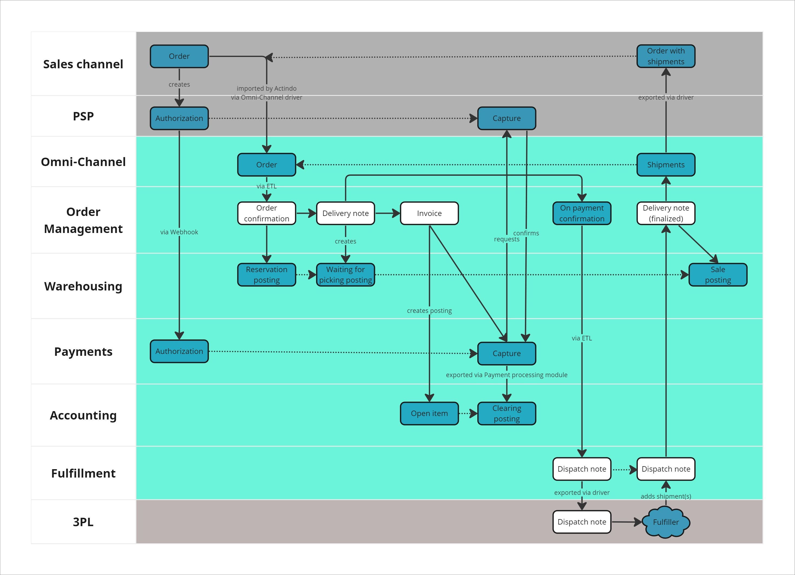
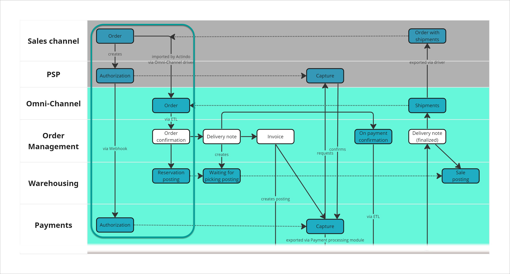
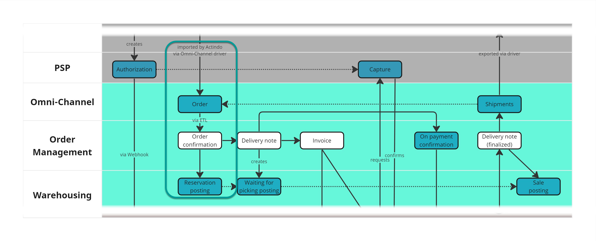
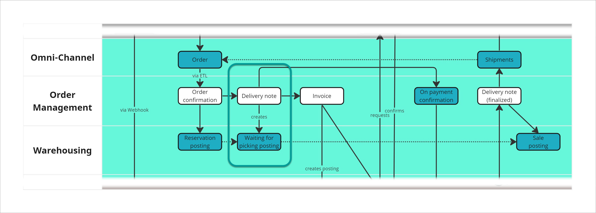
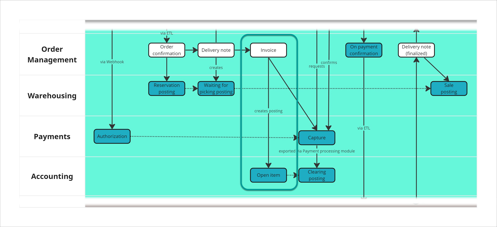
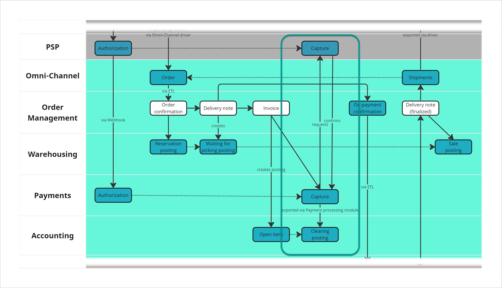
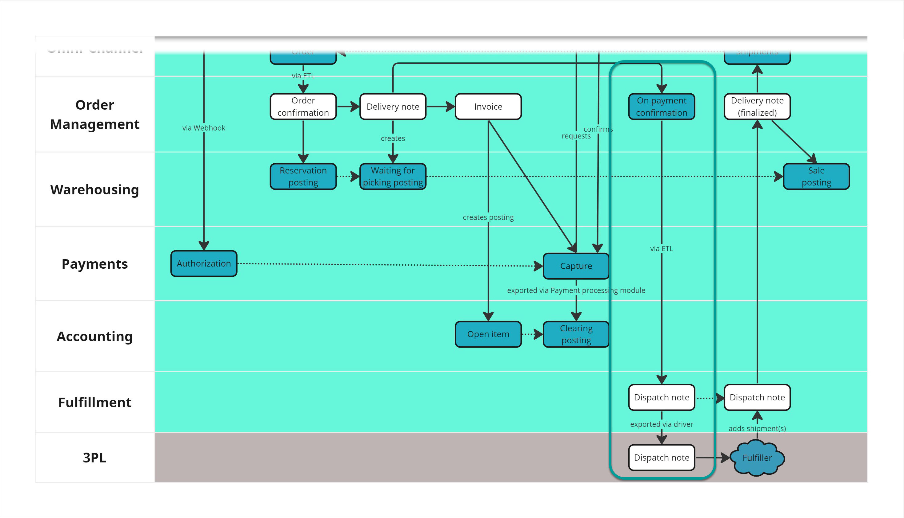
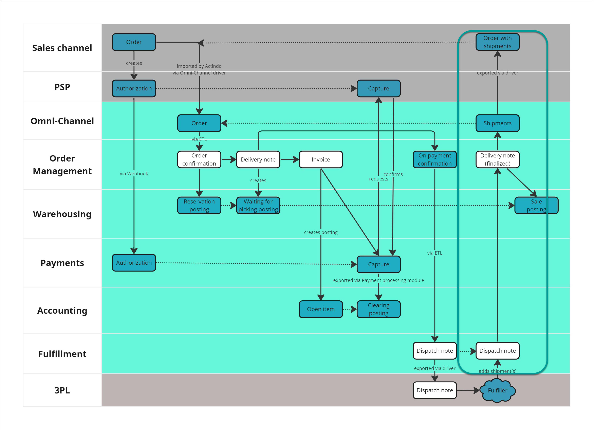

[!!DataHub](../../DataHub/Overview/01_General.md)
[!!Process Orchestration](../../ActindoWorkFlow/Overview/01_General.md)
[!!Payments](../../Payments/Overview/01_General.md)
[!!Taxes](../../Taxes/Overview/01_General.md)

# Basic order management process

The order management process is the core business process in e-commerce. Even if it may slightly differ between companies, the order management process usually involves order and data collection, inventory management, payment processing, and fulfillment. Actindo has designed a basic order management process, which can be flexibly customized by your company to match your specific business needs.

In this section, the basic order management process is explained in detail, from the moment the customer places an order in an online shop up to the product delivery. You can add further steps as necessary, as well as omit any of them if they are not applicable to your business process. 

The order management process is steered through a workflow, which determines exactly what happens at every moment. The *Process Orchestration* module allows you to design and manage the workflow, as well as to monitor the progress of your process in real time, enabling you to detect and solve any potential issues immediately. 
 

## Basic principles

In the following, a few basic principles are briefly explained.

**The document chain**  

A business document is a basic entity containing data on an order. Some of the most important business documents used in the *Actindo Core1 Platform* are the order confirmation, the delivery note, the invoice, and the dispatch note. Most business documents originate in the *Order Management* module, but not all of them. This is the case, for example, of the dispatch note, which is created in the *Fulfillment* module based on the delivery note from *Order Management*. The business documents are provided with logic, which allows them to trigger certain actions in the workflow based on the data they contain.

The different business documents form a document chain, which can be completely customized to reflect your company's business processes. The main entity of the document chain is the head document, which, in the basic order management process, is the order confirmation. The so-called deliver head, on the other hand, creates a reservation posting in the warehouse for all line items detailed in the business document. In the basic order management process, the head document and the deliver head are the same business document, but this is not mandatory and can be configured to suit your needs.

**Data exchange**  

For the data exchange between the different modules and systems, two methods are mainly used: ETL and communication via driver.

ETL stands for extract, transform and load, and is the system responsible for translating the different entities between modules, for instance from a *PIM* product to an *Omni-Channel* offer, or from an *Order Management* delivery note to a *Fulfillment* dispatch note. The different entities in the *Actindo Core1 Platform* contain a predefined set of attributes, which can be customized as necessary. The Actindo ETL function allows you to define your data flow flexibly and fully customize the data exchange. For detailed information, see [DataHub basics](../../DataHub/Overview/04_Basics.md). 

The *Actindo Core1 Platform* and any external third-party system, for example, your online shop, are connected and communicate via driver. This way, order data are imported from an external online shop receiving orders into the *Omni-Channel* module, dispatch requests are transferred from the *Fulfillment* module to the fulfiller external system, or the order shipment information is sent back to the online shop to keep the customer continuously up to date. 

**Workflow**

A workflow is a basic structure that represents a business process. It uses "places" containing data to be transferred and "transitions" defining the actions to be performed. When designing a workflow, you determine exactly when what happens, leaving nothing to chance. Each order is processed following this workflow, which allows you to monitor the process in real time. For detailed information, see [Process Orchestration](../../ActindoWorkFlow/Overview/01_General.md).

## Modules and systems involved

The following Actindo modules and external systems are involved in the Actindo order management process:

- Sales channel (your company's online shop or a third-party retailer, external)
- Actindo *Omni-Channel* module
- Actindo *Order Management* module
- Actindo *Warehousing* module
- Actindo *Fulfillment* module (if you manage your warehouse externally)
- Fulfiller external system
- Actindo *Payments* module (if you use a payment service provider)
- Payment service provider (PSP) external system
- Actindo *Payment processing* module
- Actindo *Accounting* module

> [Info] Other modules and plugins, such as the *Taxes* module and the *UCS Product Sync* plugin, are also involved in the process and must be configured accordingly, although they may run in the background. Besides, the modular structure of the *Actindo Core1 Platform* allows you to replace individual modules with any third-party legacy system you have in use and integrate it in the workflow seamlessly.   

## Basic process structure

The process depicted below is a standard approach that can be completely configured according to your company's needs. None of the process steps are hard-coded and can be left out or supplemented to fit any specific business process.

**Legend**   

| Color    | Meaning     |
|-------|-------------|
| Gray | External systems |  
| Green | Actindo modules |  
| White | Business document |
| Blue | Business process step |

### 1 &ndash; From the shop to the Actindo Core1 Platform

A customer places an order in your company's shop or a third-party online retailer. As soon as the order is placed, the shop creates an authorization, which is sent to the payment service provider. In turn, the payment service provider pushes the authorization, mostly via Webhooks, to the *Payments* module. For detailed information, see [Monitor authorizations](../../Payments/Operation/01_ManageAuthorizations.md).   

The sales channel is connected via driver with the *Actindo Core1 Platform*. Depending on the settings, the sales channel can actively push orders into the *Omni-Channel* module or the *Omni-Channel* module can pull (called "import" in the *Actindo Core1 Platform*) new orders at configurable regular intervals. The order placed in the sales channel is then mapped into an *Omni-Channel* order. 

The order contains, at least, the following basic data:  
- Customer details, such as name, number, billing and delivery address, among others
- Line items:
    - Ordered products, including price, quantity, and ID number (SKU or similar)
    - Applicable discounts and ancillary services, for example, gift wrapping or express delivery 

### 2 &ndash; Order confirmation and stock reservation

The *Omni-Channels* order is a mere "data container" with no internal logic, intended only for transferring order data between the sales channel and the *Order Management* module. The order import status in the *Omni-Channel* module indicates the order data completeness. Orders are often imported incompletely at first and then completed later. In this case, the order status stays as **Imported**. When the order data is complete, the order import status changes to **Complete**. 

The order is then further processed in the *Order Management* module, which generates an order confirmation (business document). As soon as an order confirmation is generated, a reservation posting is created in the *Warehousing* module. The purpose of a reservation is to ensure availability when it comes to picking the material. The available stock is, therefore, reduced by the quantity of the ordered material as specified in the order confirmation. A negative posting is possible at this point in the process. If required, you can configure a redistribution to have the missing ordered material picked from another warehouse.

Since a company may have several warehouses, the stock withdrawal matrix determines the warehouse where the material is taken from based on different criteria, such as geographical location, ordered quantity or available stock, among others. For detailed information, see [Configure the stock withdrawal matrix](../../RetailSuiteWarehousing/Integration/05_ConfigureStockWithdrawalMatrix.md) in the *Warehousing* module documentation.

### 3 &ndash; Initiation of the delivery process

Based on the order confirmation, a delivery note (business document) is created. Depending on the storage location of the ordered material, the system creates one or more delivery notes, which will then be handled independently. One delivery note is created per each warehouse group where the ordered material is stored. A warehouse group is a higher-level classification of storage facilities according to customer-defined criteria, for example location or type of product. Warehouse groups are physically separated from each other and can contain an unlimited number of warehouses. 

In order for a delivery note to be created, the stock level in the applicable storage location must be sufficient. In this case, the delivery note generates a corresponding offsetting posting to the reservation posting, previously generated by the order confirmation (deliver head), and creates a waiting for picking posting in the *Warehousing* module. The waiting for picking posting, also called "reserved for open delivery note", reduces the physical stock in the warehouse, as the ordered material is now assigned to a specific delivery note. 

For detailed information on the different warehouse posting types, see [Posting types](../../RetailSuiteWarehousing/UserInterface/04_PostingTypes.md) in the *Warehousing* module documentation.

### 4 &ndash; Sales transaction posting

Based on the delivery note, an invoice is created and posted in the *Accounting* module. In order for an invoice to be created, the payment must have been previously authorized in the sales channel. 

Once the invoice is created, an open item is posted to the customer account in the *Accounting* module. The system creates a customer account automatically for every customer placing an order. The posting account is identified based on the customer number. 

> [Info] The tax rate to be applied depends on the ship-to country, the tax zone, and the product type. Based on these parameters, a decision matrix automatically determines the tax rate to be applied in the invoice. This decision matrix is configured in the *Taxes* module, see [Manage the decision matrix](../../Taxes/Operation/01_ManageDecisionMatrix.md).

### 5 &ndash; Payment handling

After receiving the authorization from the sales channel, the *Payments* module sends a request to the payment service provider (PSP) to capture the payment. If the payment capture is successful, the PSP sends a confirmation back to the *Payments* module. The payment process is considered as completed by the *Actindo Core1 Platform*.

The payment is then sent to the *Accounting* module via the *Payment processing* module and matched with the open item based on different relevant data, such as amount, customer number, invoice number, or payment reference. If the matching is successful, the open item is cleared. The order is considered as fully paid and its payment status accordingly updated in the *Order Management* module. 

> [Info] The *Payment processing* module serves as link between any available payment source and the *Accounting* module. Other payment methods, such as bank transfer or direct debit, can also be configured, as long as the necessary process steps are defined in a workflow. 

### 6 &ndash; From the warehouse to the customer via fulfiller

If your company outsources the order fulfillment to a third-party logistics provider, the *Fulfillment* module acts as link between the *Actindo Core1 Platform* and the fulfillment partner's external system. Both systems are connected and communicate via driver.

On payment confirmation and based on the delivery note, a dispatch note is generated in the *Fulfillment* module. A dispatch note is a request for the fulfiller to pick, pack, and send the ordered material to the customer. The dispatch note contains, at least, the receiver basic details, a suggested packaging type for the shipment, and the ordered line items, including quantity and SKU.

The fulfiller confirms receival of the dispatch note and begins processing the request. When all ordered line items have been sent to the customer, the fulfiller confirms the goods dispatch with one or, if necessary, several shipments. The dispatch note and the shipment status are updated accordingly in the *Fulfillment* module via driver. Additionally, the fulfiller can send tracking information back to Actindo, which can be then passed on to any desired sales channel, for instance, your online shop or a retailer platform.

> [Info] If your company has an internally managed warehouse, the *Fulfillment* module is not necessary and this process step is omitted altogether. In this case, the *Order Management* module allows you to create pick lists based on the delivery notes. Additionally, you can use the Actindo *IQS* (Intelligent Quick Shipment) module for warehouse management tasks, such as picking and packing, and the printout of labels and relevant business documents, such as the delivery note.    

### 7 &ndash; Final delivery to the customer

When the dispatch note is completed, the delivery note is processed and finalized in the *Order Management* module. At this point, the waiting for picking posting changes to a sale posting in the *Warehousing* module. The sale posting removes the previously reserved material from stock irrevocably, whereby the order process is concluded from the logistics perspective.

To ensure that the customer is always informed about the current status of his/her delivery, regular shipment status updates are sent to the *Omni-Channel* module. These updates are, in turn, exported to your online shop or retailer platform via driver.

 

