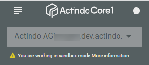

# Main account and sandboxes

Each tenant has one live-system. This is also called a main account. Licenses, vCores and available storage are bound to the main account and have to be shared with all sandboxes. Each instance (main account or sandbox) has a specific host-prefix which determines how the main account/sandbox can be accessed:

- main account: https://[host-prefix].actindo.com

- sandbox: https://[host-prefix].dev.actindo.com

  > [INFO] You can identify by the URL if you are logged in to a sandbox or the main account.   

Each sandbox and main account has its own separated database. This means, that you cannot synchronize data between the main account and the sandbox.

**Sandboxes**   
You can create a sandbox as a copy of the main account with all data, that are currently available in the main account. But, after that a sandbox and the main account is not synchronized.

You can install modules that are not yet released by Actindo, this means you can install it for testing purposes without touching your main account. On a main account, you can install released versions only.

Each sandbox has an owning user. As an owning user, you can access the file system of the sandbox via SSH:

ssh username@login.dev.actindo.com
cd ~/sandboxes/[host-prefix]

The owner of a sandbox must have access to the owning main account, but does not need to own the main account.

vCores and storage are to be assigned to a sandbox. The assigned vCores and storage get subtracted from the budget of the main account. This means, if you expect a lot of processes and database entries in a sandbox, you have to consider, that this computing power is to be shared with the main account.   
The same is valid for licenses, so that you have to sum up all licenses for which you assign rights in the main account and in a sandbox.

**Overview**   

The following overview shows the main differences between a main account and a sandbox:
Topic | Main account | Sandbox   
--- | --- | ---
**URL** | [host-prefix].actindo.com | [host-prefix].dev.actindo.com    
**Licenses** |owned by account | shared with main account  
**Custom code** | NO | YES   
**Unreleased plugins** |NO | YES   
**User creation** | YES |NO 
**Direct DB access** | NO | YES   
**Own database**| YES| YES