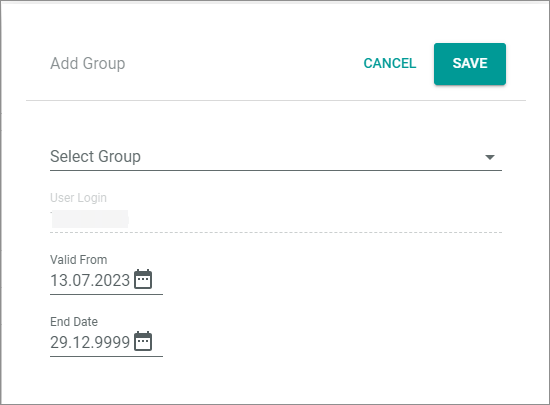
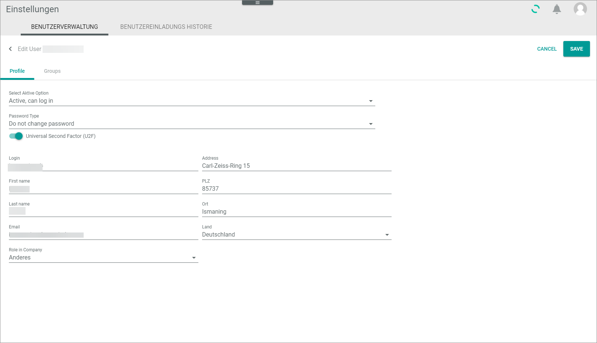

# Manage users

A user is a global *Actindo* entity that is shared between the main account and the sandboxes. If you create a user in the main account, and you invite this user to a sandbox, the user dates are automatically available in this sandbox. If you change user data, the data are synchronized with the sandboxes in which the user is assigned a user group.   
You must create users in the main account. It is not possible to create users in a sandbox.   
> [INFO] As a user without admin rights, you can change some data too. For detailed information, see [Edit profile settings](../UsingCore1/02_EditProfileSettings.md "Edit profile settings"). 

## Create user
Users are created in the main account only.

#### Prerequisites

- You are logged in to a main account
- You have admin rights

#### Procedure

*Settings > Users and groups > Tab User management*

1. Click the  (Add) button in the bottom right corner.   
The screen is grayed out. A small menu is opened in the bottom right corner.

   

2. Click the  (Create user) button.   
The *Create user* window is opened.    
    
    

2. Click the *Select active option* drop-down list to select whether the new user will be able to log in or not. The following options are available: 
    - **Active, can log in**
    - **Inactive, user is locked**

3. Click the *Password type* drop-down list to select how the password is to be created and submitted to the user. The following options are available:
    - **Generate password and send via email**  
      A password is generated automatically and sent to the email address specified below. 
    - **Enter password and send by email**    
      You define an individual password and 
    - **Specify and send password**   
      You define an individual password and 

4. If you have not selected the *Generate password and send via email* option in the *Password type option* drop-down list, define the password in the *Set password* field.

5. Enter the username in the *Login* field. This is the name with which the user must log in.  

6. Enter the name and address of the user. Use the *Address* field to enter street and house number.

7. Enter the email address of the new user.   
After you have saved the new user, it will be used to send the password to the user.

8. If desired, click the *Role in company* drop-down list. The following options are available:
    - Entwicklung (Development)
    - Buchhaltung (Accounting)
    - Logistik (Logistics)
    - Artikelanlage (Creating products)
    - Einkauf (Procurement)
    - Marktplätze (Market places)
    - Anderes (Others)

9. Click the [SAVE] button.   
The new user is created and, if applicable, informed about username and password by email. 

## Assign user to user group
Assigning users to a user group is necessary to activate a user on a current instance. A user that is not assigned any group, is not active in the instance. This means in reverse, you have to remove a user from all groups on an instance to deactivate him or her.

## Prerequisite

- You have admin rights
- The user groups are already created. For detailed information, see [Create user group](../AdministratingCore1/03_ManageGroups.md#create-user-group "Create user group")

## Procedure

*Settings > Users and groups > Tab User management*

1. Click the user you want to assign a group.   
The *Edit user "user name"* view is displayed. By default, the *Profile* tab is preselected. 

2. Click the *Groups* tab.   
The groups the user is assigned are listed.

     

3. Click the  (Add) button in the bottom right corner.   
The *Add Group* window is displayed.

       

4. Click the *Select group* drop-down list and select the desired group.

5. Click the  (Calendar) button and select the validity start date in the *Valid from* field.  

6. Click the  (Calendar) button and select the validity end date in the *End date* field.

7. Click the [SAVE] button.   
The *Profile* tab is displayed. The new assigned group is added to the list of groups.

## Edit user

Users are edited in the main account only. There is one exception: Users are able to change their personal data on a sandbox (see [Edit profile settings](../UsingCore1/02_EditProfileSettings.md "Edit profile settings")).

#### Prerequisites

- You are logged in to a main account
- You have admin rights

#### Procedure

*Settings > Users and groups > Tab User management*

1. Select the user whose data you want to edit.   
The *Settings (Einstellungen)*  view is opened.

   

2. If desired. Click the *Select active option* drop-down list to select whether the user is to be able to log in or not. The following options are available: 
    - **Active, can log in**
    - **Inactive, user is locked**

3. If desired, click the *Password type* drop-down list to select how the password is to be created and submitted to the user. The following options are available:
    - **Generate password and send via email**  
      A password is generated automatically and sent to the email address specified below. 
    - **Enter password and send by email**    
      You define an individual password and 
    - **Specify and send password**   
      You define an individual password and

4. If desired, disable the *Universal Second Factor (U2F)* toggle.
If the *Universal Second Factor (U2F)* is disabled, the user will no longer need to use the *Yubikey* to log in. <!---Julian, geht das so einfach oder gibt es dann Probleme?-->

5. If desired, edit the user's personal data.

6. Click the [SAVE] button.

## Invite user to sandbox

It is necessary to invite a user to a sandbox, because users cannot be created there.
When inviting a user to a sandbox, it is necessary to assign the user to a user group. Only then the user is listed in this instance and can access the sandbox. <!---Julian, ist das richtig oder habe ich etwas falsch verstanden? Ist User denn schon in Sandbox, ober prüft system in main account auf Plausibility?-->

#### Prerequisites

- You are logged in to a sandbox.
- You are granted to invite users.
- The user is assigned a group. Only then the user is listed in this account and can access the sandbox.

#### Procedure
*Settings > Users and groups > Tab User management*

1. Click the  (Add) button in the bottom right corner.    

    The *Workspace* is grayed out. You can cancel the action by clicking the  (Cancel) button.   

    

2. Click the  (Invite user) button in the bottom right corner.   
 The *Invite user* window is opened.

     

3. Enter the "Login name" of the user.

4. In the "Assigned groups" section, select a group from the "Select group" drop-down list, and select a user group to which you want assign the user.   

5. If necessary, click the  (Add another group) button to assign further groups.

6. Click the [SAVE] button.   
Depending on the settings, the user gets an email that informs him or her about the invitation. The email contains a button, with which the user can open the sandbox.
 

## Inactivate user in main account

The deletion of users in a main account is not possible. By inactivating a user, 

## Inactivate user in sandbox
If you want to remove a user from a sandbox, you need to remove the user from all groups. For detailed information, see [Remove user from a group](../AdministratingCore1/03_ManageGroups.md#remove-user-from-a-group "Remove ser from a group").
