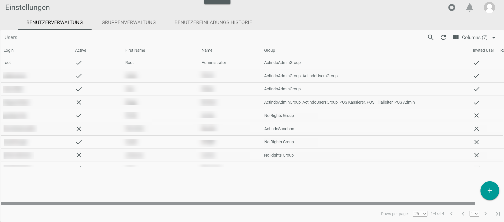
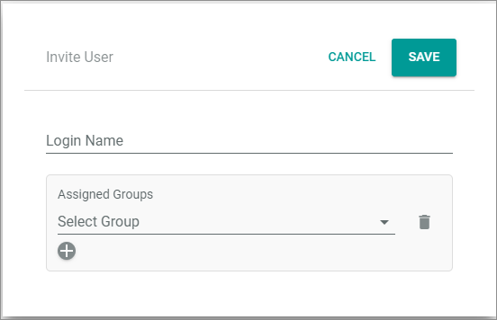

# Manage users

A user is a global *Actindo* entity that is shared between the main account and the sandboxes. If you create a user in the main account, and you invite this user to a sandbox, the user dates are automatically available in this sandbox. If you change user data, the data are automatically synchronized with the sandboxes in which the user is assigned a user group.
You must create a user in the main account. It is not possible to create a user in a sandbox.   
> [INFO] As a user, you can change some data in a sandbox too. For detailed information, see [Edit profile settings](../UsingCore1/02_EditProfileSettings.md "Edit profile settings"). 

## Create user
Users are created in the main account only.

#### Prerequisites

- You are logged in to a main account

#### Procedure

*Settings > Users and groups > Tab User management*

1. Click the  (Add) button in the bottom right corner.    
    

## Assign user to group

## Invite user to a sandbox

When inviting a user to a sandbox, it is necessary to assign the user to a user group. Only then the user is listed in this account and can access the sandbox.

#### Prerequisites

- You are logged in to a sandbox.
- You are granted to invite users.

#### Procedure
*Settings > Users and groups > Tab User management*

1. Click the  (Add) button in the bottom right corner.    

    The *Workspace* is grayed out. You can cancel the action by clicking the  (Cancel) button.   

    

2. Click the  (Invite user) button.   
 The "Invite user" window is opened.

     (Invite user)

3. Enter the "Login name" of the user.

4. In the "Assigned groups" section, select a group from the "Select group" drop-down list, and select a user group to which you want assign the user.   

5. If necessary, click the  (Add another group) button to assign a further group.

6. Select further groups until you have assigned all required groups.

7. Click the [SAVE] button.   
Depending on the system settings, the user gets an email that informs him or her about the invitation. The email contains a button, with which the user can open the sandbox.
 

## Remove user from the main account

## Remove user from a sandbox
If you want to remove a user from a sandbox, you need to remove the user from all groups. For detailed information, see [Remove a user from a user group](../UsingCore1/02_EditProfileSettings.md "Remove a user from a user group").
