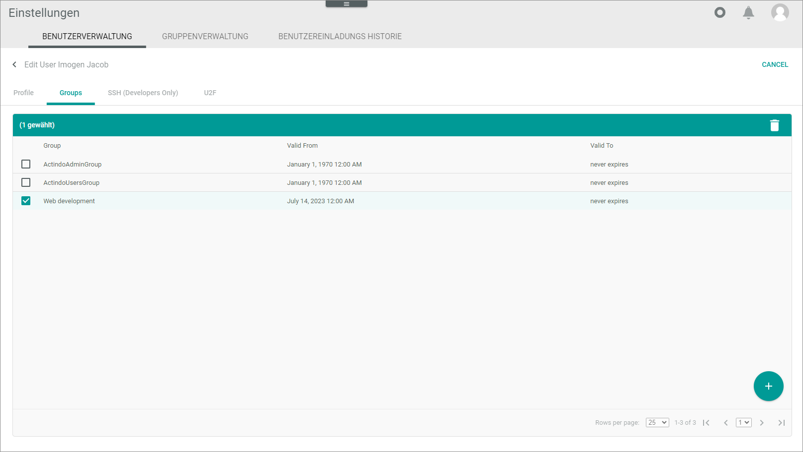

[!!Profile settings](../UserInterface/01d_U2F.md) [!!Set up U2F from the administrator side](../../MFA/Integration/02_AdminSetupActindo.md)

# Manage users

A user on the *Core1 Platform* is a global entity as users can be invited to any account that exist on platform.

Any available *Core1 Platform* user can be invited to any account. The owner of the user will receive an email and actively decide whether s/he wants to join.

## Create user

Users are created in the main account only.

#### Prerequisites

- You are logged in to a main account.
- You have permission to create users.

#### Procedure

*Settings > Users and groups > Tab USER MANAGEMENT*

1. Click the  (Add) button in the bottom right corner.   
  The screen is grayed out. A small menu is opened in the bottom right corner.

   

2. Click the  (Create user) button.   
  The *Create user* window is opened.    
    
   

3. Click the *Select active option* drop-down list to select whether the new user will be able to log in or not. The following options are available: 
    - **Active, can log in**
    - **Inactive, user is locked**

4. Click the *Password type* drop-down list to select how the password is to be created and submitted to the user. The following options are available:      
    - **Generate password and send via email**  
      A password is generated automatically, and it is sent by *Actindo* to the email address specified below. 
    - **Enter password and send by email**    
      You define an individual password, and it is sent by *Actindo* to the email address specified below. 
    - **Specify and save password**   
      You define an individual password and save it. It is not sent via email.  
    - **Do not change password**   
      Use this option if you want to change the user's data, but you do not want to edit the password. 

5. If you have not selected the *Generate password and send via email* option in the *Password type option* drop-down list, define the password in the *Set password* field.

6. Enter the username in the *Login* field. This is the name with which the user must log in.  

7. Enter the name and address of the user. Use the *Address* field to enter street and house number.

8. Enter the email address of the user. After you have saved the user, it will be used to send the password to the him/her.

9. If desired, click the *Role in company* drop-down list. The following options are available:
    - Entwicklung (Development)
    - Buchhaltung (Accounting)
    - Logistik (Logistics)
    - Artikelanlage (Product creation)
    - Einkauf (Procurement)
    - Marktplätze (Market places)
    - Anderes (Others)

10. Click the [SAVE] button.   
  The new user is created and, if applicable, informed about username and password by email. 
  

## Assign user to user group

Assigning users to a user group is necessary to activate a user on a current instance. A user who is not assigned to any group is not active in the instance. This means in reverse, you must remove a user from all groups on an instance to remove him/her from an account. Groups are used to manage rights.

#### Prerequisite

- You have permission to assign users to groups.
- The user has been created, see [Create user](../AdministratingCore1/02_ManageUsers.md#create-user).
- If possible, all required user groups are already created. For detailed information, see [Create user group](../AdministratingCore1/03_ManageGroups.md#create-user-group).

#### Procedure

*Settings > Users and groups > Tab USER MANAGEMENT*

1. Click the user you want to assign a group.   
  The *Edit user "username"* view is displayed. By default, the *Profile* tab is preselected. 

2. Click the *Groups* tab.   
  The groups to which the user is assigned are listed.

     

3. Click the  (Add) button in the bottom right corner.   
  The *Add group* window is displayed.

       

4. Click the *Select group* drop-down list and select the desired group.

5. Click the  (Calendar) button and select the validity start date in the *Valid from* field.  

6. Click the  (Calendar) button and select the validity end date in the *End date* field.   
   > [Info] It is not possible to change the validity period later. If you want to delimit the validity period, you must remove the group assignment and assign the user again with a different validity period.

7. Click the [SAVE] button.   
  The *Profile* tab is displayed. The new assigned group is added to the list of groups.

## Edit user

Users can only be edited in the main account they have been created. Users can change their own personal information in any account, see [Edit profile settings](../UsingCore1/02_EditProfileSettings.md).

#### Prerequisites

- You are logged in to a main account.
- A user has been created, see [Create user](../AdministratingCore1/02_ManageUsers.md#create-user).
- You have permission to edit users.

#### Procedure

*Settings > Users and groups > Tab USER MANAGEMENT*

1. Select the user whose data you want to edit.   
  The *Edit user "username"* view is opened. By default, the *Profile* tab is preselected. 

   

2. If desired, click the *Select active option* drop-down list to select whether the user can log in or not. The following options are available: 
    - **Active, can log in**
    - **Inactive, user is locked**

3. If desired, click the *Password type* drop-down list to select how the password is to be created and submitted to the user. This password is valid for the main account and its sandboxes. The following options are available:
    - **Generate password and send via email**  
       A password is generated automatically, and it is sent by *Actindo* to the email address specified below. 
    - **Enter password and send by email**    
       You define an individual password, and it is sent by *Actindo* to the email address specified below. 
    - **Specify and save password**   
       You define an individual password and save it. It is not sent via email.   
    - **Do not change password**   
       Use this option if you want to change the user's data, but you do not want to change the password respectively the password to be sent. 

4. If desired, disable the *Universal Second Factor (U2F)* toggle.
  If the *Universal Second Factor (U2F)* is disabled, the user will no longer need to use the *Yubikey* to log in. 

5. If desired, edit the user's personal data.

6. Click the [SAVE] button.  
  The user has been saved.   

7. If desired, change the group assignment of the user. For detailed information, see [Assign user to user group](#assign-user-to-user-group).

## Remove user from a group

When editing a user, you can remove a user from a group to which s/he is assigned.  
Alternatively, you can remove a user from a group during editing the groups, see [Remove users from a group via the group management](../AdministratingCore1/03_ManageGroups.md#remove-user-from-a-group-via-the-group-management).

#### Prerequisites

- You are logged in to a main account or a sandbox.
- You have permission to remover users from groups.

#### Procedure

*Settings > Users and groups > Tab USER MANAGEMENT*

1. Click the user you want to remove from a group.   
  The *Edit user "username"* view is displayed. By default, the *Profile* tab is preselected. 

2. Click the *Groups* tab.   
  The groups to which the user is assigned are listed.

     

3. Select the group from which you want to remove the user.   
  The toolbar is displayed.

   

4. Click the  (Delete) button.   
  The user is removed from the selected group.

## Invite user to sandbox

It is necessary to invite a user to a sandbox because users cannot be created there.
When inviting a user to a sandbox, it is necessary to assign the user to a user group. Only then will the user be listed in this instance and can access the sandbox. 

#### Prerequisites

- You are logged in to a sandbox.
- You have permission to invite users.

#### Procedure

*Settings > Users and groups > Tab USER MANAGEMENT*

1. Click the  (Add) button in the bottom right corner.     
    The *Workspace* is grayed out. 

    

2. Click the  (Invite user) button in the bottom right corner.   
  The *Invite user* window is opened.

     

3. Enter the "Login name" of the user.

4. In the "Assigned groups" section, select a group from the "Select group" drop-down list to which you want to assign the user.   

5. If necessary, click the  (Add another group) button to assign further groups.

6. Click the [SAVE] button.   
  Depending on the settings, the user gets an email that informs him or her about the invitation. The email contains a button with which the user can open the sandbox.
 

## Remove user in sandbox

If you want to remove a user from a sandbox, you need to remove the user from all groups. For detailed information, see [Remove user from a group](#remove-user-from-a-group).

There is the following limitation: You cannot remove a user from the *Actindo Admingroup* in a sandbox of which s/he is the owner. 
 

## Delete user 

Delete a user, if s/he works no longer in your company, for example. You can delete a user in the main account only.

#### Prerequisites

- You are logged in to the main account.
- You have permission to delete users.

#### Procedure

*Settings > Users and groups > Tab USER MANAGEMENT*

1. Select the user you want to delete.   
  The *Edit user "username"* view is opened. By default, the *Profile* tab is preselected. 

   

2. Click the [DELETE] button down right and confirm the confirmation pop-up window.  
  The user is deleted.