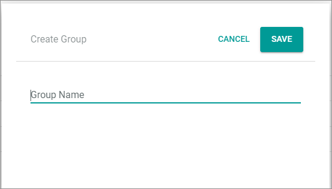
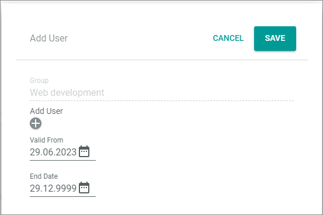

# Manage user groups

User groups define the individual permissions that a user assigned to this group has in the *Actindo Core1 Platform*. In opposite to the users are user groups not global. Group rights are valid for the current instance only. This means that they are not shared between the main account and the sandboxes.   
If you add a user to a group, the user is automatically listed for this sandbox. If you want to remove a user from a sandbox, you need to remove him&frasl;her from all groups.

**Manage user rights**   
User rights are defined by assigning the user to a (user) group. Groups define specific roles that a user has when working on the *Actindo Core1 Platform*.   
For example, a bookkeeper needs access to specific functions of the *Accounting* module in addition to general rights for accessing the *Actindo Core1 Platform*. Additionally, rights to access other modules might be required. For this reason, you can create a specific group for the bookkeeper's role in which you can collect all rights the bookkeepers need. 

> [INFO] The standard role "ActindoUsersGroup" is available to grant general accessing rights for the *Actindo Core1 Platform* needed by all users.<!---Stimmt das?--> 

The user rights are individually managed for the main account and each sandbox, in which the users do their daily work. In the *Settings* module, you assign the user rights for all modules and plugins installed on the *Actindo Core1 Platform*.  You can create, edit, and delete user groups, add specific users to a group, remove users from a group, and assign rights.   

> [INFO] For assigning the rights, it is very important to know that sandboxes share the licenses with the main account. This means, for example, if you have five licenses for the *Accounting* module, and two bookkeepers who work in the main account, you have three licenses left for the sandboxes. This is relevant especially when using the Actindo admin group, see below.

**Actindo admin group**   
A special group is the "ActindoAdminGroup". This group has automatically all rights for everything, and you cannot maintain specific rights for it.   
Regarding the licenses, keep in mind, that each Administrator has automatically access to all modules, which means that a license for each module and admin user is counted.

**Actindo users**   
Users of the *Actindo AG* do not consume licenses, they are not counted.

## Create user group

Create a user group based on a user role to subsequently assign them a specific set of user rights.

#### Prerequisites

- You are granted to edit, save, and list groups.

#### Procedure

*Settings > Users and groups > Tab GROUP MANAGEMENT*

1. Click the  (Add) button in the bottom right corner.    
    The *Create group* window is displayed.

    

2. Enter a name for the group in the *Group name* field.

3. Click the [SAVE] button.   
    The *Group saved* pop-up window is displayed.
    
    

    The newly created group is displayed in the list of groups.

    
 

## Add user to user group

Add any number of users to a user group to assign them rights subsequently.

#### Prerequisites

- A user group has been created, see [Create a user group](#create-a-user-group).

#### Procedure

*Settings > Users and groups > Tab GROUP MANAGEMENT*

1. Select the checkbox of the user group for which you want to add or remove users.   
    The editing toolbar is displayed.

2. Click the  (Edit) button in the editing toolbar.       
    The *Edit group "group name"* view is displayed. By default, the *Users* tab is preselected.

    > [Info] If no users have been added yet, the *No users added. Use + button to add one to group* notice is displayed. Otherwise, the details of the user(s) included in the group are displayed.   
    
     

3. Click the  (Add) button in the bottom right corner.    
    The *Add user* window is displayed.

    

4. Click the *Add user* drop-down list and select the desired user.   
    The selected user has been added to the group. Per default, the validity period is set from today to the system end date. 

    

     1. Click the  (Calendar) button and select the validity start date in the *Valid from* field.  

     2. Click the  (Calendar) button and select the validity end date in the *End date* field.    
        > [INFO] It is not possible to change the validity period later. If you want to delimit the validity period, you must remove the group assignment and assign the user again with a different validity period.

5. To add further users, click the  (Add) button below the *Add user* drop-down list.   
    A further drop-down list is displayed. Repeat steps **4** and **5** to add as many users as necessary.

6. Click the [SAVE] button in the upper right corner of the *Add user* window.  
    The users have been saved to the group and are displayed in the list of users.

7. Click the [SAVE] button in the upper right corner of the *Edit group* window.   
    The *Group saved* pop-up window is displayed. The changes to the group have been saved.

    

## Remove user from a group via the group management

A user is active in an account as long as the user is assigned a user group.    
If you want to remove a user from a sandbox, you must remove the user from all groups to which he&frasl;she is assigned. There are the following limitations:
- You cannot remove a user from the ActindoAdmingroup in a sandbox of which he or she is the owner. <!--- Kann man den owner ändern? -->
- You cannot remove a user from all groups in an account in which the user has been created. In this case, you have to inactivate him&frasl;her, see [Edit user](./02_ManageUsers.md#edit-user).   

Note that it is not possible to remove a group assignment by delimiting the validity end date to a specific date. If you want to change the validity period, you must remove the group assignment and create a new one with a limited validity end date.

#### Prerequisites

- You are granted to remove the user assignment from a group.

#### Procedure

*Settings > Users and groups > Tab GROUP MANAGEMENT*

1. Select the group, from which you want to remove a user.   
    The editing toolbar is displayed.

   

2. Click the  (Edit) button.
    The *Edit group "Group name"* view is opened. By default, the *Users* tab is displayed. 

   

3. Select a user.   
    The editing toolbar is displayed.

   

4. Click the  (Delete) button.   
    The selected user is removed from the list.

5. Click the [SAVE] button.   
    The *GROUP MANAGEMENT* view is displayed again.

## Remove user group

If a user group is no longer needed, you can remove it. Note, groups are removed regardless of whether users are still assigned.

#### Prerequisites

- You are granted to delete groups.

#### Procedure

*Settings > Users and groups > Tab GROUP MANAGEMENT*

1. Check whether users are assigned the group. To do this, select the checkbox of the user group you want to remove.   
    The editing toolbar is displayed.

    

2. Click the  (Edit) button.
    The *Edit group "Group name"* window is opened.  

    

3. Check whether users are assigned the group. If necessary, remove the assignment, see [Remove a user from a group](#remove-a-user-from-a-user-group).

4. Return to the *GROUP MANAGEMENT* tab by clicking the (Back) button.

5. Select the checkbox of the user group you want to remove.   
    The editing toolbar is displayed.

   

2. Click the  (Delete) button.  
    The *Group was deleted* pop-up window is displayed. 

