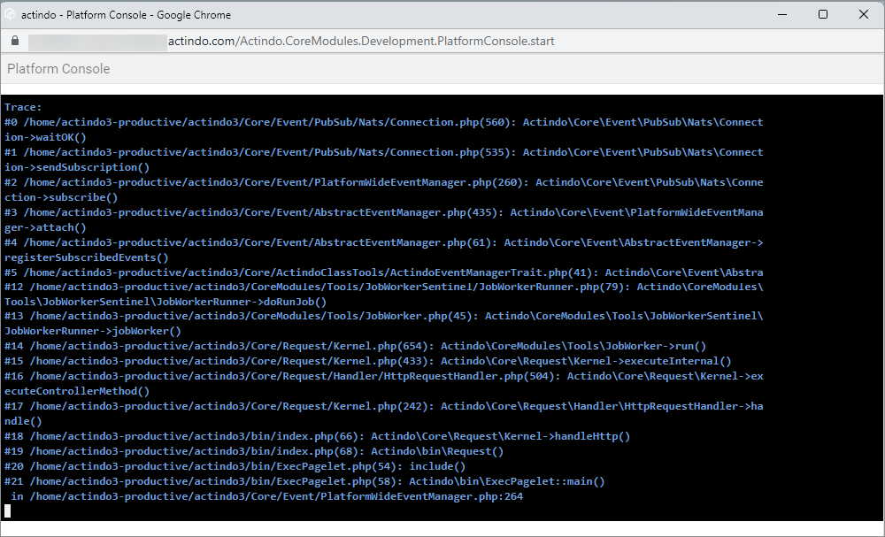

# Engine room

The engine room contains some dashlets with information on vCore utilization, database storage utilization, request and error statistics, and jobs currently running.

## Open and close the engine room
Access to the engine room is available in any workspace you have opened in the *Core1 Platform*.

#### Prerequisites

- You have administrator rights for the current instance.

#### Procedure
*Actindo Core1 Platform > Any workspace*

1. Click the  (Engine room) button center top.  
The engine room is opened with the current workspace overlapped. It contains four dashlets.

   

2. Click the  (Engine room) button again to close it.
The workspace is visible again.

## Clear tenant cache
Clearing the tenant cache removes all entries that are currently in the cache of the instance. It is used if there is a general issue in processing, and if changes are made directly through the database rather than through system logic. It is recommended to use this function only if it is really necessary. Clearing the cache will slow down the instance considerably. 

#### Prerequisites

- - You have administrator rights for the current instance.

#### Procedure
  
*Actindo Core1 Platform > Any workspace*

1. Click the  (Engine room) button center top.  
The engine room is opened. The current workspace is overlapped.

   

2. Click the [CLEAR TENANT CACHE] button top right.   
The following warning message is displayed:   

   

3. Click the [ABBRECHEN] (Cancel) button if you want to cancel the action. 

4. If desired, click the [FORTFAHREN] (Continue) button to clear the cache.   
The cache is cleared. Afterwards, it will be rebuilt again. The processes on the instance are significantly slowed down.

## Check warnings and notices
The platform console provides instance-relevant notices and warning. In opposite to the notifications (see [Check notifications](../UsingCore1/03_GeneralUIFunctions.md#check-notifications "Check notifications")), these notices and warnings are targeted for developers.

#### Procedure

*Actindo Core1 Platform > Any workspace*

1. Click the  (Engine room) button center top.  
The engine room is opened. The current workspace is overlapped.

   

2. Click the [PLATTFORM-KONSOLE] (Platform console) button.   
The *Platform Console* window is opened.

   

3. Check the messages.

## Check vCores

Your company has purchased a certain number of vCores assigned the main account. vCores (CPU core voltage) define the computing power of an instance for the execution of parallel processes as well as database queries. Idle times, such as calls waiting for a response from external service providers, are not considered.   
If an instance has not enough vCore capacity, the processor then starts to run the processes and database queries one after the other instead of running them in parallel. This means that the processing speed is slowed down significantly if the number of vCores assigned is unsufficiently.  

> [INFO] The vCores define the power for running parallel processes. They do not define the power for running a single process. Assigning more vCores will not speed up single processes!    

If a sandbox is created, it is assigned a number of vCores from the main account. This reduces the number of vCores available there. The transfer of vCores from the main account to a sandbox may take some time (about 5 minutes).  
Actindo has an eye on the capacity utilization of your vCores. Isolated overruns will have no other effect than slowing down the speed of your processes. But if your vCore capacity is permanently over the limit, Actindo will contact you.   

The engine room allows you to monitor the required vCores of the current instance. With the vCore dashlet, you can monitor the needs of the last two hours.  
The vCores are analyzed as average over several seconds. The dashlet displays the totals per every 30 seconds in a curve diagram. 
 > [INFO] Since Actindo displays an average value every 30 seconds, it may happen that the limit is exceeded for a brief time but is not displayed in the dashlet. This leads to a temporary slowdown of the processing speed.

<!---hallo Julian, gibt es auch eine Standard-Statistik über einen längeren Zeitraum?-->

#### Prerequisites

- You have administrator rights for the current instance.

#### Procedure

*Actindo Core1 Platform > Any workspace*

1. Click the  (Engine room) button center top.  
The engine room is opened. The current workspace is overlapped. 

   

2. Focus your attention to the dashlet at the first position from the left.  
The vCore utilization is displayed in a curve diagram.

3. Check the limit of vCores assigned to the current instance. To do this, move the mouse pointer on the white line.   
The limit of vCores for this instance is displayed in a callout shape.   
    <!---Hallo Marina, hallo Julian, wisst Ihr, wie die Dinger heißen?-->   
 
    

4. Check the vCores for any deviations. If desired, move the mouse on a peak of the curve.   
The number of vCores is displayed in a callout shape. Used vCores are shown in green, required vCores above the limit for a given time are shown in red.

    

## Check database utilization

Your company has purchased a certain amount of data storage space assigned the main account. If a sandbox is created, it is assigned an amount of storage space from the main account. This reduces the number of storage space available there.   
Actindo has an eye on the data storage utilization. Isolated overruns will have no effect. But if your data storage utilization is permanently over the limit, Actindo will contact you.   

#### Prerequisites

- You have administrator rights for the current instance.

#### Procedure

Actindo Core1 Platform > Any workspace*

1. Click the  (Engine room) button center top.  
The engine room is opened. The current workspace is overlapped. 

    

3. Focus your attention to the dashlet at the second position from the left.  
The data storage utilization is displayed in a circle diagram.
In the middle of the circle, the current utilization is displayed in percent as well as in gigabyte.

    

4. If desired, refresh the current dashlet by clicking the [REFRESH] button.

5. Move your mouse pointer over the circle diagram.   
The current data storage utilization is displayed in a callout shape.
    

## Check request statistics

 The request statistics dashlet displays what's going on the current instance. It shows the number of internal requests (jobs) and requests executed from a browser. Additionally, it shows the number of errors occurred during the request processing.   
 The statistic is evaluated per each hour, displayed on a time axis from 00-07 o'clock. Depending on the screen size of your device, the displayed period may vary.
 

#### Prerequisites

- You have administrator rights for the current instance.

#### Procedure

*Actindo Core1 Platform > Any workspace*

1. Click the  (Engine room) button center top.  
The engine room is opened. The current workspace is overlapped. 

   

3. Focus your attention to the dashlet at the third position from the left.  
The diagram has two y-axes. The left y-axis defines the number of requests, the right defines the number of errors. The x-axis defines the time from 0-7 o'clock.   
The number of requests is presented in a green curve diagram, the number of errors is presented in a red line diagram.

    

4. Move your mouse pointer over the green curve diagram.   
The number of requests is displayed per hour on the x-axis.

    

5. Move your mouse pointer over the red line diagram.   
The number of errors is displayed per hour on the x-axis.

   

## View current jobs
In the job dashlet, all asynchronous jobs are displayed that are currently running.

#### Prerequisites

- You have administrator rights for the current instance.

#### Procedure

*Actindo Core1 Platform > Any workspace*

1. Click the  (Engine room) button center top.  
The engine room is opened. The current workspace is overlapped. 

   

3. Focus your attention to the dashlet at the fourth position from the left.

4. Click the *Jobs* tab.   
The currently running asynchronous jobs as well as the jobs waiting are displayed. On top, the number of jobs is output as well as the percentage ratio of finished jobs. If no jobs are running, the text *No running jobs* is displayed.

   

<!--- Beim Drücken von Cron jobs passiert nichts, darum besser weggelassen-->