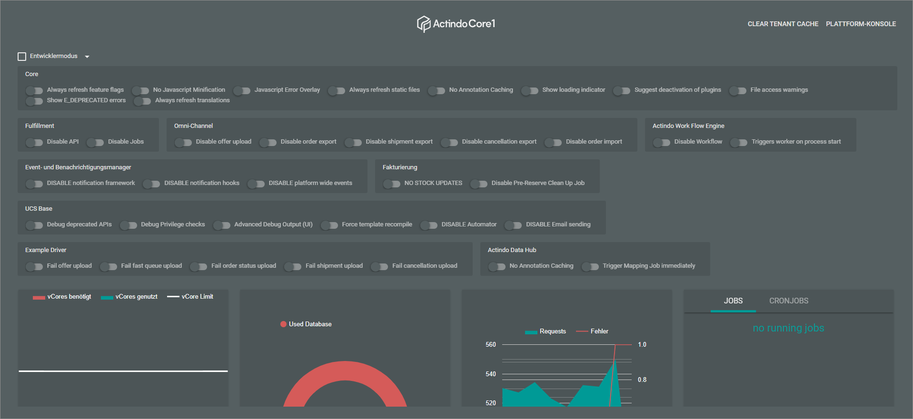
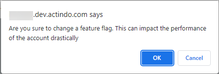
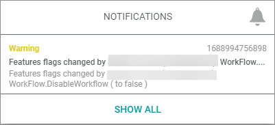
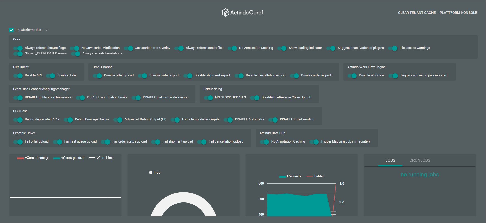
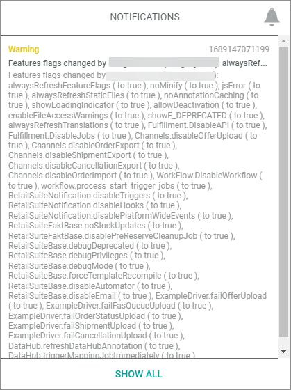

# Expert knowledge

This section contains procedures that you only should use, if you really know the consequences of your actions well.

## Switch on and switch off single feature flags

The Entwicklermodus (Development mode) of the engine room allows to switch on/off specific system behavior fundamentally.   
For example, you can enable special caching functions of the *Core1 Platform*. Additionally, you can disable module-specific features such as the import of orders and event manager features.   
You can use the development mode for testing purposes or, for example, to temporarily switch off a connection, because you are informed about a downtime of a third-party application. Each action in the development mode is logged.

> [WARNING] Switching off module features can lead to data loss. If you are not really sure about the consequences of switching off a feature, you should not use it. <!---Julian, stimmt das, oder arbeitet das System alles nach, wenn Funktion wieder eingeschaltet?-->

The development mode contains core features as well as engine-, module-, and driver-specific feature flags. For example, if you switch off the workflow, the following will happen:
- The workflow is stopped.
- All current processes do no longer import and 
output data. 
<!---Julian, gibt es noch ein anderes, drastisches Beispiel?-->

#### Prerequisites

- You have administrator rights for the current instance.
- You know the consequences of switching on/off a feature.

#### Procedure

*Actindo Core1 Platform > Any workspace*

1. Click the  (Engine room) button center top.  
The engine room is opened. The current workspace is overlapped.

   

2. Click the *Entwicklermodus (Development mode)* drop down top right.   
The list of feature flags is expanded. Each feature flag is listed in a feature chip with a toggle. The list of feature chips with toggles contains general feature flags of the *Core1 Platform* as well as engine-, module-, and driver-specific feature flags.

   

3. Switch on/off the desired feature by enabling the corresponding feature chip toggle.   
The following warning message is displayed.

    
<!---Hallo Julian, ist die Meldung nicht ein bisschen schwach?-->
4. If desired, click the [OK] button.  
The processing of the related feature is changed as described, for example, the order export of the *Omni-channel* module is disabled. The following notification is output (see [Check notifications](../UsingCore1/03_GeneralUIFunctions.md#check-notifications)).

   

5. Disable the feature flag again by clicking the corresponding feature chip toggle later.   
The instance works as designed again. This action is logged as well.

## Switch on and switch off all feature flags at once

The Entwicklermodus (Development mode) of the engine room allows to switch on/off all feature flags at once (see also [Switch on and switch off single feature flags](#switch-on-and-switch-off-single-feature-flags)).   
For example, you can enable special caching functions of the *Core1 Platform*. Additionally, you can disable module-specific features such as the import of orders and event manager features.
You can use this function for testing purposes.

> [WARNING] Switching off features can lead to data loss. If you are not really sure about the consequences of switching off all features, you should not use it. 

#### Prerequisites

- You have administrator rights for the current instance.
- You know the consequences of switching on/off features.

#### Procedure

*Actindo Core1 Platform > Any workspace*

1. Click the  (Engine room) button center top.  
The engine room is opened. The current workspace is overlapped.

   

2. Click the *Entwicklermodus (Development mode)* drop down top right.   
The list of feature flags is expanded. The list of feature chips with toggles contains general features of the *Core1 Platform* as well as engine-, module-, and driver-specific feature flags.

   

2. Click the checkbox at the *Entwicklermodus (Development mode)* drop down top right.   
 The following warning message is displayed.

    

4. If desired, click the [OK] button.  
All feature flag toggles in the feature flag list are enabled. 

   

   The following notification is output in the notifications (see [Check notifications](../UsingCore1/03_GeneralUIFunctions.md#check-notifications)).

   

5. Disable all feature flag toggles again by clicking the *Entwicklermodus (Develpment mode)* checkbox again.  
The instance works as designed again. This action is logged as well.