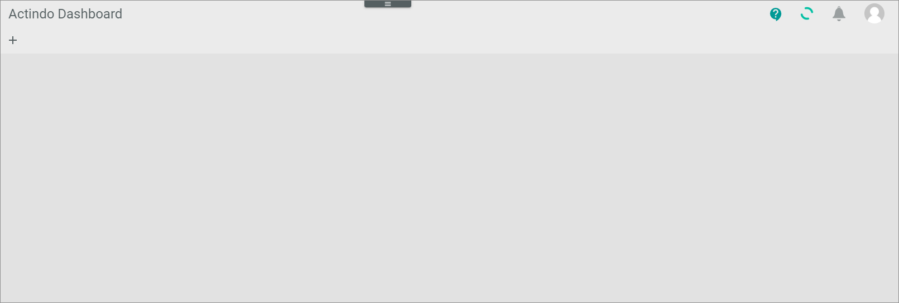

# Expert knowledge

This section contains procedures that you only should use, if you really know the consequences resulting from these.

## Switch on&frasl;off single feature flags

The *Development Mode* of the engine room allows you to turn certain system behaviors on and off in a fundamental way.     
For example, you can enable special caching functions of the *Core1 Platform*. Additionally, you can disable module-specific features such as the import of orders and event manager features.   
You can use the development mode for testing purposes or, for example, to temporarily switch off a connection, because you are informed about a third-party application downtime. Each action in the development mode is logged.

> [Caution] Switching off module features may result in data not being transferred to third-party applications, and in this which may result in data loss. If you are not really sure about the consequences of switching off a feature, you should not use it. 

The development mode contains core features as well as engine, module, and driver-specific feature flags. For example, if you switch off the workflow, the workflow is stopped and order processing will not be performed.

#### Prerequisites

- You have administrator rights for the current instance.
- You know the consequences of switching on/off a feature.

#### Procedure

*Actindo Core1 Platform > Any workspace*

1. Click the  (Engine room) button in the upper center.  
   The engine room is opened. The current workspace is overlapped.

   

2. Click the *Development mode* expand button in the upper left corner.   
   The list of feature flags is expanded. Each feature flag has a toggle to switch on/off and is listed in a feature container. The list of feature containers includes general feature flags of the *Core1 Platform* as well as engine, module, and driver-specific feature flags.

   

3. Switch on/off the desired feature by enabling the corresponding feature flag toggle.   
   The following warning message is displayed.

    
<!---Hallo Julian, ist die Meldung nicht ein bisschen schwach?-->
4. If desired, click the [OK] button.  
   The processing of the related feature is changed as described, for example, the order export of the *Omni-Channel* module is disabled. The following notification is output (see [Check notifications](../UsingCore1/03_GeneralUIFunctions.md#check-notifications)).

   

5. Switch off the feature flag again by clicking the corresponding feature flag toggle later.   
   The instance works as designed again. This action is logged as well.

## Switch on&frasl;off all feature flags at once

The development mode of the engine room allows to switch on/off all feature flags at once (see also [Switch on/off single feature flags](#switch-on⁄off-single-feature-flags)).   
For example, you can enable special caching functions of the *Core1 Platform*. Additionally, you can disable module-specific features such as the import of orders and event manager features.   
This procedure allows you to quickly switch on/off all feature flags, for example, if you previously locked an account with multiple feature flags.

> [Caution] Switching off module features can result in data not being transferred to third party applications, and in this case it can lead to data loss. If you are not really sure about the consequences of switching off all features, you should not use it. 

#### Prerequisites

- You have administrator rights for the current instance.
- You know the consequences of switching on/off features.

#### Procedure

*Actindo Core1 Platform > Any workspace*

1. Click the  (Engine room) button in the upper center.  
   The engine room is opened. The current workspace is overlapped.

   

2. Click the *Development mode* expand button in the upper left corner.   
   The list of feature flags is expanded. Each feature flag has a toggle to switch on/off and is listed in a feature container. The list of feature containers includes general feature flags of the *Core1 Platform* as well as engine, module, and driver-specific feature flags.

   

2. Click the *Development mode* checkbox in the upper left corner.   
   The following warning message is displayed.

    

4. If desired, click the [OK] button.  
   All feature flag toggles in the feature flag list are switched on. 

   

   The following notification is output in the notifications (see [Check notifications](../UsingCore1/03_GeneralUIFunctions.md#check-notifications)).

   

5. Switch off all feature flag toggles again by clicking the *Development mode* checkbox again.  
   The instance works as designed again. This action is logged as well.