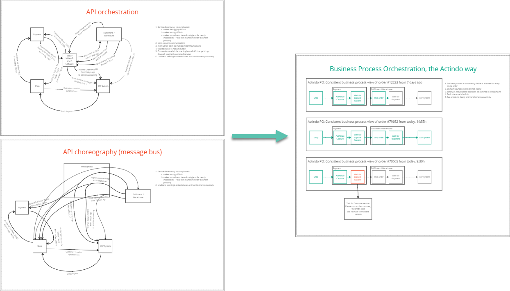

# Core capabilities

The *Actindo Core1 Platform* provides you with the following:

## Omni-Channel integration

There are a lot of ways to do digital commerce, including not only your own online store but also numerous marketplaces. However, managing products separately in each channel requires huge effort.   
The *Actindo Core1 Platform* enables unified commerce by treating comparably digital and traditional stationary commerce. For example, you can treat a stationary store like a web shop. And a web shop order like a sale process in the POS (point of sale) system.   
With the *Omni-Channel* module, you can connect your web store and all relevant marketplaces as well as payment service providers directly to the platform and manage them centrally. You can integrate various store systems, such as Shopify or Magento 2.

## Process integration 

The data model of the *DataHub* module with ETL system (extract, transform, load) allows maximum flexibility. It defines how data flows through your system. It enables complex and varying data to be mapped, transformed, and transferred. The transfer is done by external services to other modules as well as external systems such as legacy ERP systems, marketplaces, payment and fulfillment providers, etc.    
You can easily integrate external custom APIs or other non-standard interfaces. In order to connect non-flexible external systems, you can add your API endpoints to the digital operations platform without having to deploy code.
You can customize your individual data fields and sources for each process and "translate" them individually for their receivers. You can easily extend data fields and use custom and complex field types.  

## Process orchestration

The Actindo process orchestration allows you to design, control, map, and monitor your business processes. Based on your special and individual business rules, your company's processes and data can be mapped and made available however and whenever you want. You can use the Actindo *Workflows* module to easily adapt and automate your processes in a graphical way and almost without any code needed.  
You can model any kind of complex processes and visualize them where they are executed. By doing this, you know the past, future, and present of any entity.
You can automate and parallelize the business for high volumes.

**Away from API orchestration to business process orchestration**

   

## Monitoring and reporting

Keeping track of all business areas is difficult when different systems and IT solutions are in use. As an overarching digital operations platform, the *Actindo Core1 Platform* integrates all important processes of online commerce. The *DB and reporting* module enables you to provide an overview of various KPIs and statistics from all modules in one place.   
It is a powerful tool to quickly access, retrieve, and manage all data contained in your system. You can individually configure the data output in different formats. You will no longer need to collect data coming from different data silos.    
Optionally, you can use a dashboard enabled by a Grafana&trade; integration. At a glance, it gives system administrators an overview on the system health, alerts, or the number of error messages. By visualization of time series data, it shows a sales representative the top sellers, the number of orders, or incoming orders after marketing activities.

<!----Hier vielleicht ein Bild von grafana einfügen?-->

