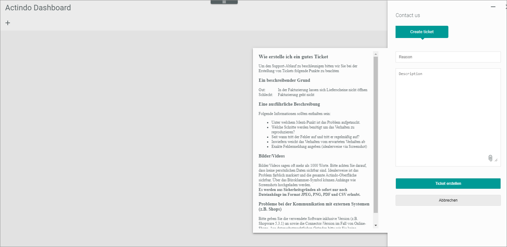

# Create ticket

The creation of a ticket is necessary, if something happens in your *Actindo Core1 Platform* that you think may be a bug in the Actindo software. In this case, the Actindo team has the chance to solve the bug and can provide an error correction to you and all other customers.   
For example, one of the following situations may be a reason to create a ticket:   
- A workflow is failing
- The main account is not reachable
- Products show incorrect information on the frontend   

 >[INFO] If you are a customer with an MPS (Managed Professional Services) contract, you might have to use the Jira&trade; Software for ticket creation. In this case, refer to the individual agreements that your company has made with Actindo.

To speed up the support process we ask you to consider the instructions below when creating tickets.

#### Prerequisites

- You have the permission to create tickets.

#### Procedure

*Actindo Core1 Platform > Any workspace*

   

1. Click the  (Support) button.
The *Contact us* window is displayed.

      

2. Enter e descriptive reason in the *Reason* field. The reason should be as precise as possible, for example "Delivery bills cannot be opened in the invoicing system".  An imprecise/bad example for the same fact would be "Invoicing does not work". 

3. Enter a detailed description of the issue. Include the following information:
     - Under which menu item did the issue occur?
     - What steps are needed to reproduce the behavior?
     - Since when does the issue occur and does it occur regularly?
    - How does the behavior deviate from the expected behavior?    

4. Enter a detailed description of the issue in the *Description* section. If the *Actindo Core1 platform* has output an error message, enter the exact wording of the error message. You can extend the description section by dropping the  (Extend) button downwards.   
If there are issues with the communication with external systems such as shops, specify the software used including version (for example, Shopware 5.3.1) as well as the version of the connector in case of online shops.  
For data protection reasons, do not write any unsolicited access data in the ticket.

5. If possible, take a screenshot of the error message or the screen on which the issue occurs.    
Ideally, the issue is color-coded and the entire Actindo interface is visible. Make sure that no personal data is visible for data protection reasons.

5. If applicable, click the  (Attachment) button to upload the screenshot or other documents. For security reasons, only file attachments in JPEG, PNG, PDF, and CSV format are allowed.   
The file explorer of your device is opened. Select the file and upload it.

6. Click the [Create ticket] button.   
The ticket is transferred to the Actindo support team. Thank you!
