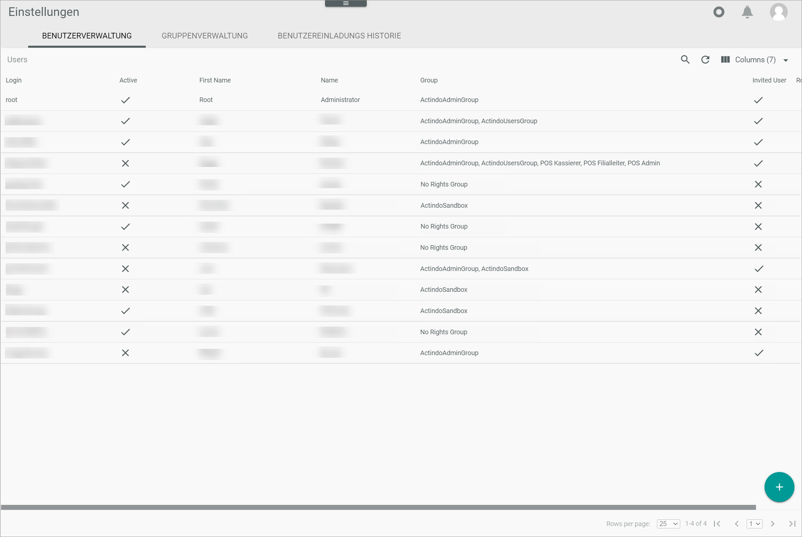
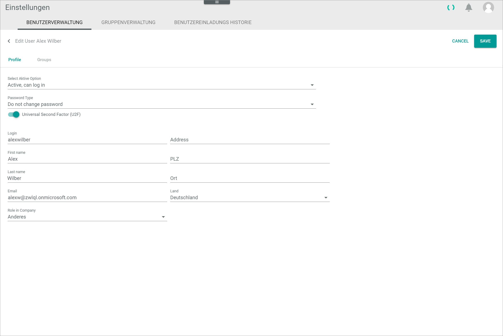

[!!Set up U2F from the user side](./01_UserSetupActindo.md)

# Set up U2F from the administrator side

For the U2F setup of an Actindo account, a user-side setup as well as an administrator-side setup is necessary. The Actindo administrator needs to activate U2F as an authorization method for the corresponding user to complete the *U2F* setup.

#### Prerequisites

- You have the required admin rights in the Actindo Core1 Platform.
- You are logged in to a live account of the Core1 Platform with the corresponding user.

#### Procedure

*Settings > Users and groups > Tab User management*

> [Info] For the admin-side setup, you must log in to an Actindo live account with the corresponding user.

1. Click the user for whom you want to activate U2F in the users list.     
  The *Edit user* view is displayed. By default, the *Profile* tab is displayed.

  

2. Enable the *Universal Second Factor (U2F)* toggle.

3. Click the [SAVE] button in the upper right corner.     
  U2F is activated as authorization method for the selected user.

  

> [Info] You can repeat this procedure for all users for whom you want to activate U2F. Note that the U2F login needs also to be setup by the corresponding user to be used for the Actindo U2F login.
