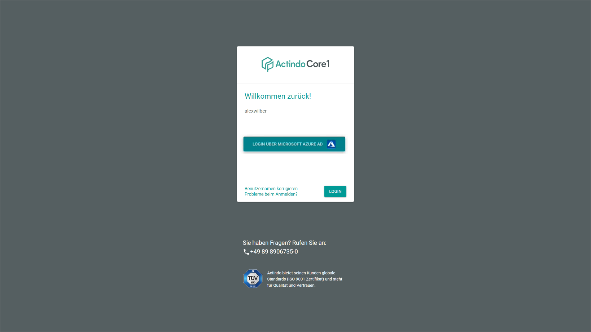
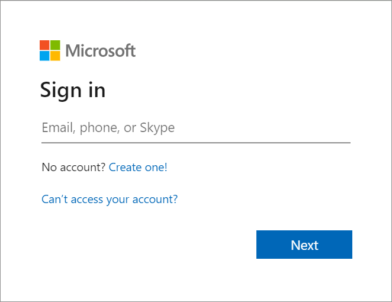
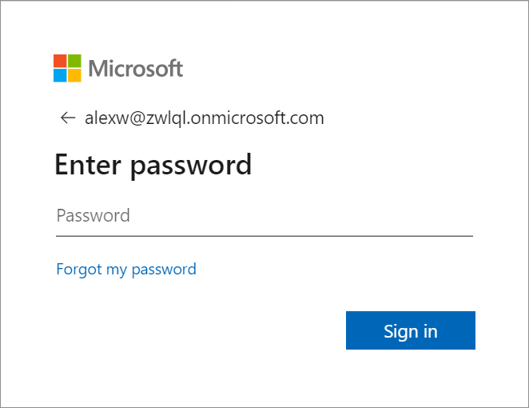
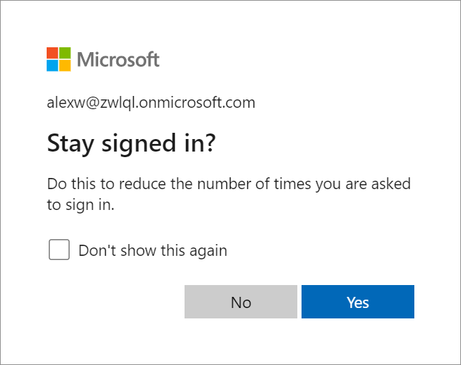

[!!Core1 Platform](../../../Core1Platform/Overview/01_General.md)
[!!Set up U2F from the user side](../../MFA/Integration/01_UserSetupActindo.md)
[!!Set up U2F from the administrator side](../../MFA/Integration/02_AdminSetupActindo.md)

# Log in via SSO

After SSO has been enabled for your Actindo account, you will use SSO from your next login to your Actindo account on.

#### Prerequisites

- SSO has been configured and enabled for your account, see [Set up SSO in Azure AD](../../SSO/Integration/01_AzureADSetup.md), [Provide user data for SSO](../../SSO/Integration/02_ProvideUserData.md) and [Transfer data to Actindo](../../SSO/Integration/03_TransferData.md).
- You are not yet logged in to another application using SSO.

#### Procedure

*Login Actindo*

1. Enter your user name in the *User name* field and click the [LOGIN] button.   
  The [LOGIN VIA MICROSOFT AZURE AD] button is displayed under the username.

  

2. Click the [LOGIN VIA MICROSOFT AZURE AD] button.   
  The Microsoft *Sign in* box is displayed in a new window.

  

3. Enter your Azure email address in the *Email, phone, or Skype* field in the *Sign in* box and click the [Next] button.   
  The *Enter password* box is displayed.

  

4. Enter your Azure password in the *Password* field and click the [Sign in] button.    

  > [Info] Depending on your Microsoft account settings, a two-factor authentication may be configured, and you must verify your identity by an additional code. Follow the instructions in the Microsoft box to complete the login process.

  The *Stay signed in?* box is displayed.

  

4. Click the [Yes] button to reduce the number of times you are asked to sign in.   
  The login via Azure AD is completed. The browser window with the Microsoft login box is automatically closed. You are logged in to your Actindo account after a few moments.

> [Info] If U2F is configured for Actindo, you are not directly logged in to you account but the Actindo login box is displayed again, and you must continue the login via U2F authorization. For detailed information about the login via U2F, see [Log in via U2F](../../MFA/Operation/01_U2FLogin.md).
