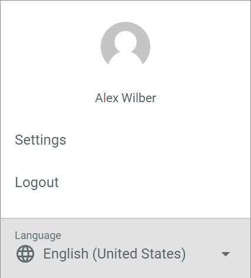
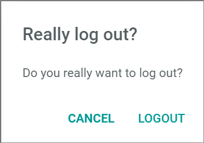

# Profile menu

*Avatar Icon*

- *Settings*   
    Click this menu entry to display the profile settings tabs in the workspace.    

- *Logout*   
    Click this menu entry to logout from the account. The *Really log out?* window is displayed.

- *Language*   
    Click the drop-down list and select the system language. The languages *English (United States)* and *Deutsch (Deutschland)* are available in the drop-down list.

## Really log out

*Avatar icon > Menu entry Logout*

- [CANCEL]   
    Click this button to cancel the logout procedure. The *Really log out?* window is closed and the workspace is displayed again.

- [LOGOUT]   
    Click this button to confirm the logout procedure. You are logged out from the account. The *Really log out?* window is closed and the Actindo login box is displayed again.

## Profile settings

*Avatar icon > Menu entry Settings*

The profile *Settings* menu entry is used to manage the profile settings of the user.

The *Settings* User Interface is composed of the following tabs:
- [PROFILE](./01a_Profile.md)
- [PASSWORD](./01b_Password.md)
- [SSH KEYS (DEVELOPERS ONLY)](./01c_SSHKeys.md)
- [U2F](./01d_U2F.md)
