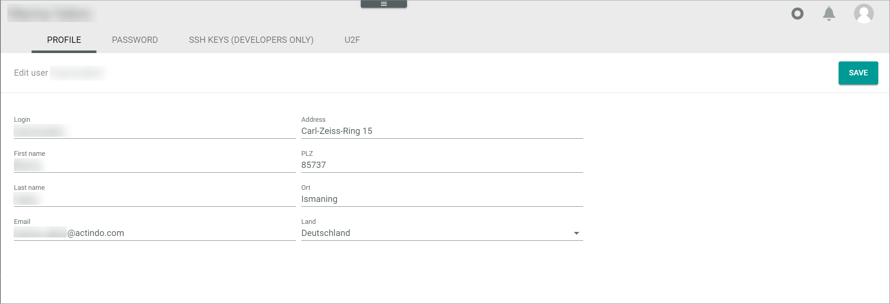

[!!Edit profile settings](../UsingCore1/02_EditProfileSettings.md)

# Profile

*Any workspace > Avator icon > Menu entry Settings > Tab PROFILE*

**Edit user**

- [SAVE]   
    Click this button to save any changes. The notice *Submitting data...* is displayed. When the changes are saved, the *User saved* pop-up window is displayed.

    

- *Login*   
    Enter the user name.

- *First name*   
    Enter the first name of the user.

- *Last name*   
    Enter the last name of the user.

- *Email*   
    Enter the email address of the user.

- *Address*   
    Enter the street and house number of the user's address.

- *ZIP*   
    Enter the ZIP code of the user's address.

- *City*   
    Enter the city name of the user's address.

- *Country*   
    Click the drop-down list and select the country of the user's address. All countries are displayed in alphabetical order in the list.
