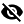

# Password

*Avator icon > Menu entry Settings > Tab PASSWORD*

**Change password**

- [SAVE]   
    Click this button to save the new password. The notice *Submitting data..* is displayed. If the entered password is not fulfilling the requirements for a valid password, an error message is displayed and you must edit the password.

    > [Info] A new password must fulfill certain requirements to be accepted. As a rule of thumb, use a password with at least 10 characters length and a combination of numbers, symbols (special characters), lowercase letters, and uppercase alphabetic characters. Further, you cannot use a password that you have used before.

    If the entered password is valid, it is saved and the *Password saved* pop-up window is displayed.

    

- *Current password*   
    Enter your current password.

- *New password*   
    Enter the new password. The password strength is displayed by a bar below the *New password* field. The password strength is displayed by both, the length of the bar and its color.

- *Confirm password*   
    Enter the new password again to confirm it.

-  (Visibility off)      
    Click this button to display all characters you enter in the corresponding field. The button changes to the  (Visibility) button.

-  (Visibility)      
    Click this button to display all the characters you enter in the corresponding field as dots only. The button changes to the  (Visibility off) button.
