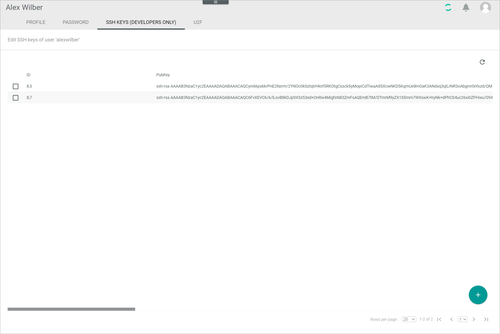
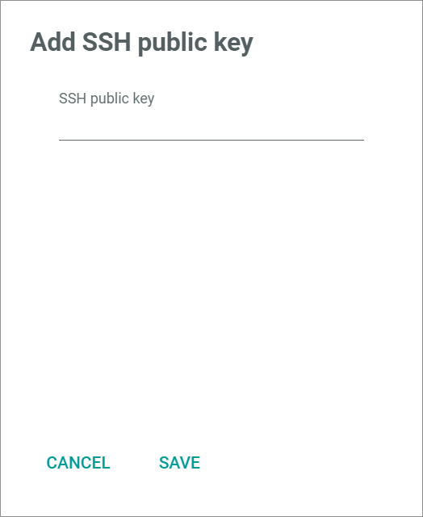

# SSH Keys (Developers only)

*Avator icon > Menu entry Settings > Tab SSH KEYS (DEVELOPERS ONLY)*

**Edit SSH keys of user**

> [Info] This tab is for developers only. If you are not a developer, do not make any changes.

-  (Refresh)   
    Click this button to update the list of SSH keys.

- [x]     
    Select the checkbox to display the editing toolbar. You cannot select multiple checkboxes at once.

-  (Delete)      
    Click this button to delete the selected SSH key. This button is only displayed, when the checkbox of a SSH key is selected.       

The list displays all SSH keys. All fields are read-only.

- *ID*   
    SSH key identification number. The ID number is automatically assigned by the system.

- *PubKey*   
    Public key of the SSH key.

-  (Add)      
    Click this button to add a SSH key. The *Add SSH public key* window is displayed.   

## Add SSH public key

*Avator icon > Menu entry Settings > Tab SSH KEYS (DEVELOPERS ONLY) > Button Add*

- *SSH public key*   
    Enter the public key of your SSH key.

- [CANCEL]   
    Click this button to cancel adding a SSH key and close the *Add SSH public key* window.

- [SAVE]   
    Click this button to save the new SSH key and close the *Add SSH public key* window.
