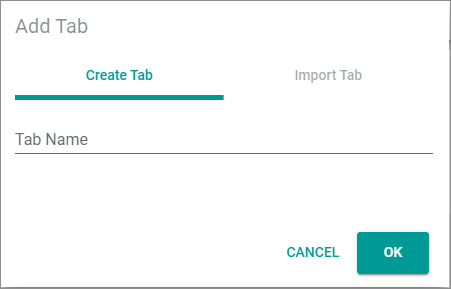

[!!Manage dashboards](../UsingCore1/05_ManageDashboard.md)

# Dashboards

*Actindo Dashboard*

In the *Actindo Dashboard*, the custom tabs with composable dashlets are displayed. By default no tab is created.

-  (Add)   
    Click this button to add a new tab to display different dashlets. The *Add a new tab* window is displayed.

-  (Delete)   
    Click this button to delete the selected tab. The *Confirm tab deletion* window is displayed. This button is displayed to the right of the tab name.

## Add tab

*Actindo dashboard > Button Add*

**Create tab**

- *Tab Name*   
    Enter a name for the new tab.

- [CANCEL]   
    Click this button to cancel creating a tab. The *Add a new tab* window is closed.

- [SAVE]   
    Click this button to save the tab with the entered name. The *Add a new tab* window is closed. The new tab is created.

**Import existing tab**

The *Import existing tab* tab is locked. It is only available in the *Actindo Dashboard*.

[comment]: <> (Link zu Actindo dashboard einfügen sobald beschrieben)

## Confirm tab deletion

*DataHub > Overview > Tab DASHBOARDS > Button Delete*

- [CANCEL]   
    Click this button to cancel deleting the selected tab. The *Confirm tab deletion* window is closed.

- [ACCEPT]   
    Click this button to delete the selected tab. The *Confirm tab deletion* window is closed. The tab and its dashlets are deleted.

## Tab

*Actindo Dashboard > Select tab*   
*Actindo Dashboard > Button Add > Button Save*   

  (Settings)   
Click this button to edit the tab. The *Edit tab* view is displayed.  

### Edit tab

*Actindo Dashboard > Select tab > Button Settings*   
*Actindo Dashboard > Button Add > Button Save > Button Settings*  

- *Select Viewport*   
    Click the drop-down list to select the view to be applied to the tab. A different view can be selected for each tab. The drop-down list is only displayed in the *Edit tab* view. The following options are available:    
    - **Automatic**   
        The system automatically chooses the dashboard that has a suitable size for the current device.
    - **Mobile**   
        The dashboard size is optimized for a mobile device.  
    - **Tablet**   
        The dashboard size is optimized for a tablet device.
    - **Laptop**   
        The dashboard size is optimized for a laptop device. 
    - **Desktop**   
        The dashboard size is optimized for a desktop device.   

- [ADD ELEMENT]   
    Click the button to add a dashlet to the selected tab. The *Dashlet picker* window is displayed.

- [SAVE]   
    Click this button to save any changes. The changes are applied. The *Edit tab* view is closed.

-  (Cancel)   
    Click this button to cancel editing the tab. Any changes are rejected. The *Edit tab* view is closed.

- Dashlet   
    Hover over a dashlet until the cursor icon changes to the cross arrows cursor. Then move the dashlet on the predefined grid using drag and drop.    
    To remove a dashlet from the tab, click the  (Remove) button in the upper right corner of the dashlet.  

### Dashlet picker

*Actindo Dashboard > Select tab > Button Settings > Button ADD ELEMENT*   
*Actindo Dasboard > Button Add > Button Save > Button Settings > Button ADD ELEMENT*  

- [x]    
    Select a checkbox to add the selected dashlet to the tab. You can select multiple checkboxes. If you click the checkbox in the header, all dashlets in the list are selected. A toolbar indicating the number of selected dashlets is displayed above the list when you have selected at least one checkbox.   
    By default, the following dashlets are available:
    > [INFO] For some statistic dashlets, you can influence the data to be evaluated. These dashlets are indicated with an  (Edit dashlet) button in the upper right corner. Click the button to define the period or the data set to be evaluated.  
    Additionally, the *Force cash refresh* toggle is available for some dashlets. If you enable the toggle, the data is newly evalatuated. Note that this might take some time.

    **Actindo Workflow engine**    <!---Hallo Julian, diese hier habe ich aus bestehender doku, alle außer OMS,die habe ich geraten..-->   
    - *Current failure count*   
            Displays the number of workflows that have currently an *Error* status.	
    - *Workflow count*   
            Displays the number of workflows in the *Workflows* module.
    - *Waiting processes*      
          Displays the number of processes not yet started.   

    **Omni-Channel**  <!---Hallo Julian, diese hier habe ich aus bestehender doku--> 
    - *Channels Status*	   
            Displays the status of each connection. The dashlet displays the period since the last update. You can refresh the data evaluation. With the "more.." references you are able to directly open the related Omni-Channel views.
    - *Statistics by Channel*   
            Displays the statistics of each connection.
    - *Connector Summary*   
            Displays a summary of each connection.
    - *Statistics over Time*   
            Displays the statistics of each connection over time.
    - *Connection Status*   
            Displays the status of each connection. You can display all active or inactive connections.
            
    **Actindo DataHub**   <!---Hallo Julian, diese hier habe ich aus bestehender doku-->
    - *Attribute Count*   
            Displays the number of attributes in the *DataHub* module.
    - *Language Count*   
            Displays the number of languages in the *DataHub* module.
    -	*Set Count*   
            Displays the number of attribute sets in the *DataHub* module.
    -	*Entity Type Count*   
            Displays the number of entity types in the *DataHub* module.
    -	*Group Count*   
            Displays the number of groups in the *DataHub* module.
    -	*Channel Count*   
            Displays the number of channels in the *DataHub* module.
    -	*Entity Values by Entity Type*   
            Displays a ring chart with the distribution of entity values by entity type in the *DataHub* module.
    -	*Mapping Errors*   
            Displays a chart with the number of mapping errors in the *DataHub* module.
    -	*New and Changed Values*   
            Displays a line chart with the number of new and changed values within a certain period of time in the *DataHub* module.
    -	*Modified Values by Set for Today*   
            Displays a chart with the number of today's modified values within an attribute set in the *DataHub* module.
    -	*Current Mapping Statistics*   
            Displays a bar chart with the average and current number of mappings. These numbers are displayed for the waiting, the successful and all mappings in the *DataHub* module.
    -	*ETL Mapping History*   
            Displays a chart with the history of mapping number for the waiting, the successful and all mappings in the *DataHub* module.
    -	*DataHub Flow*   
            Displays a flow chart with connection of mappings between the different entities. By enabling the *Show Disconnected Nodes* toggle, also those entities without any mapping connection are displayed in the flow chart.   

    **Fakturierung (Order Management System (OMS))** <!---Hallo Julian, diese hier habe ich mir zusammengereimt--> 
    - *Orders*  
            Displays the number of orders for the specified time interval. In addition, it shows the ratio in percent compared to the previous month.
    - *Dispatched Orders (via AIQS)*   
            ?   
    - *New customers*   
            Displays the number of new customers for the specified time interval. In addition, it shows the ratio in percent compared to the previous month.  
    - *Average order size (EUR)*   
            Displays the average order size in Euro for the specified time interval. In addition, it shows the ratio in percent compared to the previous month. 
    - *Revenue (EUR)*   
            Displays the total revenue for the specified time interval. In addition, it shows the ratio in percent compared to the previous month. 
    - *Return rate*   
            Displays the ratio of returns in relation to shipments in percent for the specified time interval. In addition, it shows the ratio in percent compared to the previous month.   
    - *Revenue (EUR) Graph*   
            Displays a chart of the total incomes and expenses for the specified time interval. 
    - *Sales*   
            Displays a chart of the total sales for the specified time interval. 
    - *Top Products (past 90 days)*   
            Displays a list of top-sellers of the last 90 days.  
    - *Revenue by channel*   
            Displays a list of total revenues per channel.   
    - *Revenue by Payment Method*   
            Displays a list of total revenues per payment method.

- [CANCEL]   
    Click this button to cancel adding dashlets. The *Dashlet picker* window is closed.

- [ACCEPT]   
    Click this button to add the selected dashlets to the tab. The *Dashlet picker* window is closed. The dashlets are displayed in the tab.
