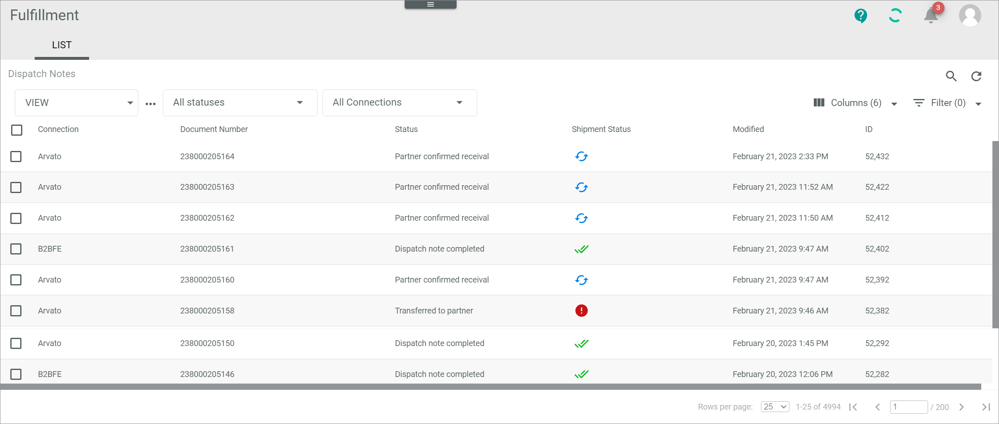

[!!Work with lists](../UsingCore1/04_WorkWithLists.md)

# LIST views

*Any module with a LIST*

Click the drop-down list to select the view. All created views are displayed in the drop-down list. Click the  (Points) button to the right of the *VIEW* drop-down list to display the context menu and create a view.   

-  (Points)      
    Click this button to the right of the *View* drop-down list to display the context menu. The following menu entries are available:

-  create  
    Click this entry to create a view. The *Create view* window is displayed, see [Create view](#create-view).

-  rename  
    Click this entry to rename the selected view. The *Rename view* window is displayed, see [Rename view](#rename-view). This menu entry is only displayed if a view has been selected.

-  reset  
    Click this entry to reset all unsaved changes to the settings of the selected view. This menu entry is only displayed if a view has been selected and any changes have been made to the view settings.

-  publish  
    Click this entry to publish the view. This menu entry is only displayed if a view has been selected and unpublished.

-  unpublish  
    Click this entry to unpublish the view. This menu entry is only displayed if a view has been selected and published.

-  save  
    Click this entry to save the current view settings in the selected view. This menu entry is only displayed if a view has been selected.

    > [Info] When the settings of a view have been changed, an asterisk is displayed next to the view name. The asterisk is hidden as soon as the changes have been saved.

## Create view

*Any module > Tab LIST > Button Points > Menu entry create*

- *Name*   
    Enter a name for the view.

- [CANCEL]   
    Click this button to cancel creating a view. The *Create view* window is closed.

- [SAVE]   
    Click this button to save the new view and display it in the *VIEW* drop-down list. The *Create view* window is closed.

    ## Rename view

*Any module > Tab LIST > Button Points > Menu entry rename*

- *Name*   
    Click this field to edit the view name.

- [CANCEL]   
    Click this button to cancel renaming the view. The  *Rename view* window is closed.

- [SAVE]   
    Click this button to save the changes and display it in the *VIEW* drop-down list. The *Rename view* window is closed.