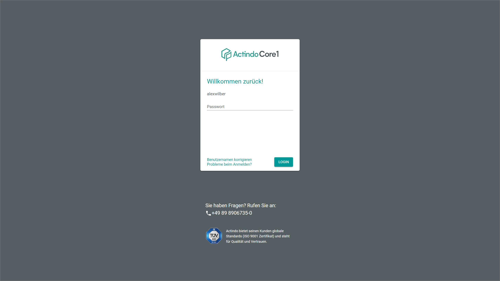
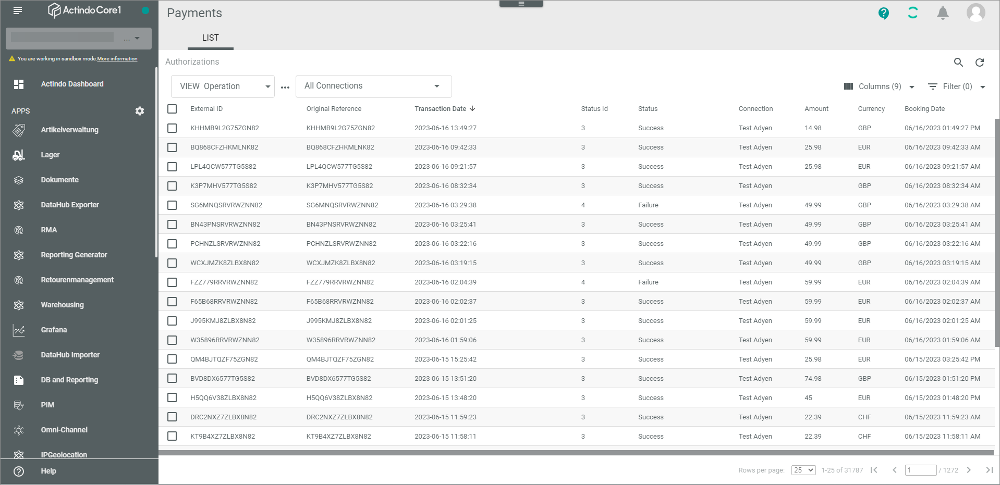
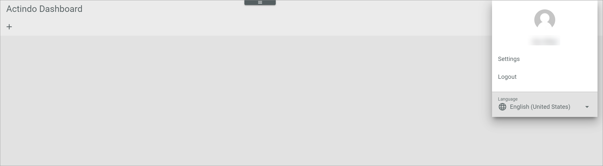
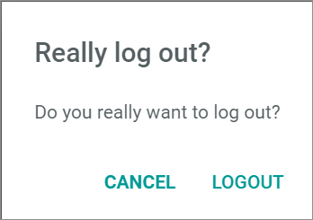

  
[!!Log in via U2F](./01b_U2FLogin.md)

# Login and logout the Actindo Core1 Platform 

## Login to the Actindo Core1 Platform
You can access the *Actindo Core1 Platform* as usual with a username and a password. 
> [INFO] Additionally, at your company, it might be necessary to use an additional authentication method to ensure that your company data are optimally protected. For detailed information, see [Set up U2F from the user side](../UsingCore1/01a_UserSetupActindo.md) and [Log in via U2F](./01b_U2FLogin.md).

#### Prerequisites

- You have a user in the main account or sandbox in which you want to log in. 

#### Procedure

*Login Actindo*

1. Enter your username in the *Username* field and click the [LOGIN] button.   
    The *Password* field is displayed.

    

2. Enter your password in the *Password* field and click the [LOGIN] button.  
  You are logged in. The *Actindo Dashboard* is displayed.

    

## Logout from the Actindo Core1 Platform

After finishing your tasks in the *Actindo Core1 Platform*, you should log out from the application.   

#### Prerequisites

- You are logged in to the *Actindo Core1 Platform*.  

#### Procedure

 1. Click your avatar icon in the upper right corner.   
    The profile menu is displayed.

    

2. Click the *Logout* entry in the profile menu.   
    The *Really log out?* window is is displayed.  

     

3. Click the [LOGOUT] button.   
You are logged out from the *Actindo Core1 Platform*.