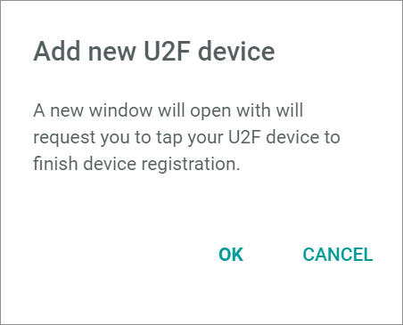

[!!Set up U2F from the administrator side](../AdministratingCore1/03_AdminSetupActindo.md)
[!!User interface Profile settings](../UserInterface/01d_U2F.md)

# Set up U2F from the user side

The secure access to Actindo can be granted by using *Multi-Factor Authentication (MFA)*. The *MFA authentication* method requires two or more verification factors to log in to an application or website. Actindo uses the *YubiKey* as a second factor for the two-factor authentication, using the *Universal Second Factor (U2F)* standard.

For the U2F setup of an Actindo account, a user-side setup as well as an administrator-side setup is necessary. As a user, you need to define several settings within your Actindo account to add *U2F* with the *YubiKey* as an authorization method.

#### Prerequisites

- You possess an *YubiKey*.
- You have an active Actindo account.

#### Procedure

*Login Actindo*

> [Info] For the user-side setup, you can log in to both a live account and a sandbox of the Core1 Platform.

1. Enter your username in the *Username* field and click the [LOGIN] button.   
    The *Password* field is displayed.

    

2. Enter your password in the *Password* field and click the [LOGIN] button.   
    You are logged in. The *Actindo Dashboard* is displayed.

    

3. Click your avatar icon in the upper right corner.   
    The profile menu is displayed.

    

4. Click the *Settings* entry in the profile menu.   
    The *Profile* tab is displayed.

    

5. Click to the *U2F* tab.   
    The *U2F* tab is displayed.

    

6. Click the  (Add) button in the bottom right corner.   
    The *Add new U2F device* window is displayed.

    

7. Click the [OK] button to continue the device registration for U2F.   
    The browser window *Verify your identity* is displayed to select the device type for the identity verification.

    

8. Select the *USB security key* option in the browser window.   
    The browser window changes to the *Use your security key* window and prompts you to insert the key and touch it.

    

9. Insert the *YubiKey* into your device.   
    The *YubiKey* starts to flash.

    > [Info] Note that problems with the connection to the *YubiKey* may occur if you use an adapter or an additional cable to connect the *YubiKey*.

8. Touch the flashing area on your *YubiKey*.    

   > [Info] Depending on the browser configuration, a confirmation message is displayed in the browser window. Click the [Accept] button in the browser window to authorize the website to read the key and close the browser window.    

   The U2F key is added to the list of keys and displayed in the *U2F* tab. The user side setup for U2F is completed.

> [Info] Note that the U2F login needs also to be activated by an administrator to be used for the Actindo U2F login.
