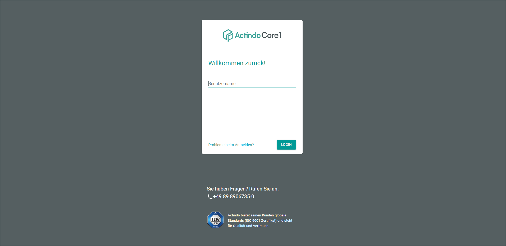
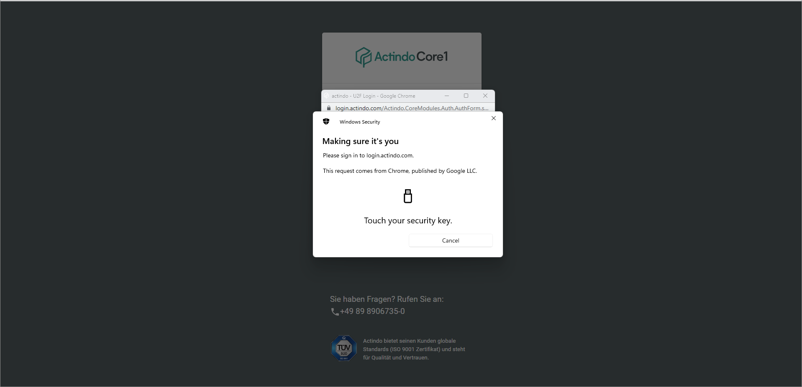

[!!Set up U2F from the user side](../../MFA/Integration/01_UserSetupActindo.md)
[!!Set up U2F from the administrator side](../../MFA/Integration/02_AdminSetupActindo.md)

# Log in via U2F

After U2F has been configured for your Actindo account, you will use U2F from your next login to your Actindo account on.

#### Prerequisites

- U2F has been configured for your account, see [Set up U2F from the user side](../UsingCore1/01a_UserSetupActindo.md) and [Set up U2F from the administrator side](../AdministratingCore1/03_AdminSetupActindo.md).
- You possess a *YubiKey*.

#### Procedure

*Login Actindo*

1. Login  to the *Actindo Core1 Platform*. For detailed information, see [Login to the Actindo Core1 Platform ](./01_Login.md).

2. Click the *Click here to start the second factor authentication* button. Note, some keys may require another procedure, for example, you might have to select the *USB security key* option to verify your identity.   
    The *Make sure it's you* window is displayed to select enter the U2F security key PIN. Note that there is a time-out if you do not enter the key in an appropriate time. In this case, restart the application.

    

3. Enter the U2F security key PIN.  
    The window prompts you to insert the key and touch it.

    

4. Insert the *YubiKey* into your device.   
    The *YubiKey* starts to flash.

    > [Info] Note that problems with the connection to the *YubiKey* may occur if you use an adapter or an additional cable to connect the *YubiKey*.

5. Touch the flashing area on your *YubiKey*.   
    The window is closed. You are logged in to your account after a few moments.  
