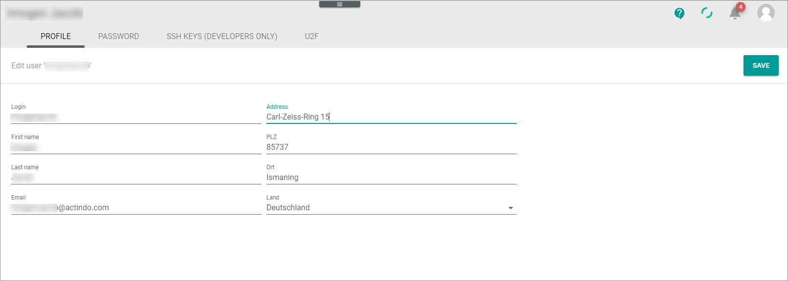
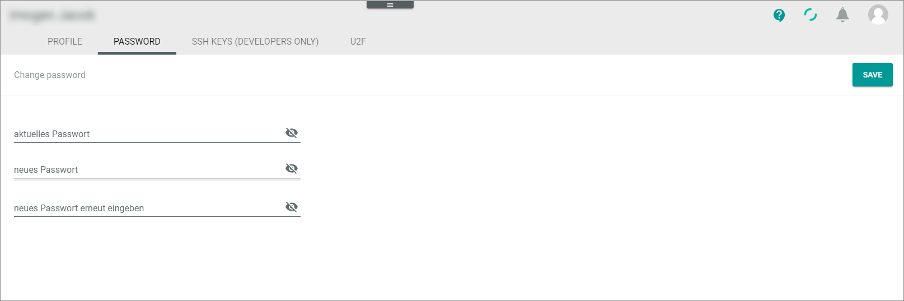

# Edit profile settings

Your personal settings are stored in the profile settings.  You can change your user data as well as your password. Additionally, you can add, see [Set up U2F from the user side](./01a_UserSetupActindo.md "Set up U2F from the user side") for detailed information. 

> [INFO] The setup of the SSH key is also part of the profile settings. It is relevant for developers only and therefore not subject of this documentation.   

## Edit your user profile

The user profile contains information to your username, your e-mail address, and your address. Address data are subject to data protection. Clarify with your contact persons if you should provide your private address data.

#### Prerequisites
- You have an active Actindo account in the current sandbox or main account.

#### Procedure

*Actindo Core1 Platform*

 1. Click your avatar icon in the upper right corner.   
    The profile menu is displayed.

    

2. Click the PROFILE tab.   
   The *Edit user "username"* view is opened.

   

3. Enter or change your data, if desired.

4. Click the [SAVE] button.   
   Your data are changed and transferred to all other sandboxes or main accounts in which your username exists. 

## Change password

 You can change the password for all sandboxes and the main account at the same time.  

#### Prerequisites
- You have a user in the currently opened sandbox or main account.

#### Procedure

*Actindo Core1 Platform*

1. Click your avatar icon in the upper right corner.   
    The profile menu is displayed.

    

2. Open the PASSWORD tab.   
   The *Change password* view is opened. Your full name is displayed top left.

   

3. Enter your current password in the *aktuelles Passwort (current password)* field.

4. Enter the new password in the *neues Passwort (new password)* field.  
   The quality of the password is displayed as a small red or green bar below the field. Think about a new password if the quality is poor (red bar).

     

   > [Info] A new password must fulfill certain requirements to be accepted. As a rule of thumb, use a password with at least ten characters length and a combination of numbers, symbols (special characters), lowercase letters, and uppercase alphabetic characters. Further, you cannot use a password that you have used before.

5. If desired, check the password by clicking on the (Visibility off) button.   
   Your entry is displayed. You can make it invisible again by clicking on the  (visibility) button.

6. Repeat the new password in the *neues Passwort erneut eingeben (Confirm password)* field. 

7. Click the [SAVE] button.   
   If the entered password is valid, it is saved, and the Password saved pop-up window is displayed.  

   

   The new password is now shared between the main account and all sandboxes of your company, so that you must use it for all Actindo logins.

