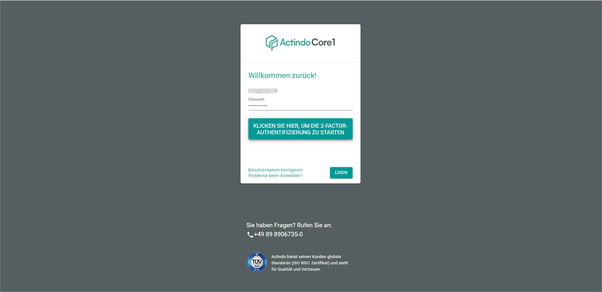
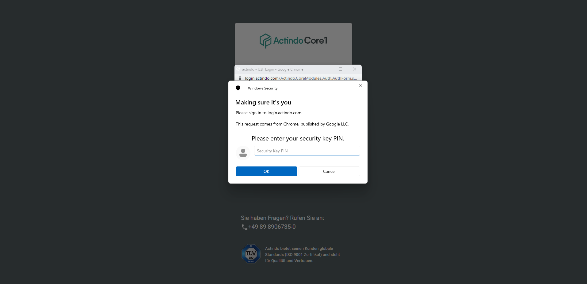

[!!Set up U2F from the user side](../../MFA/Integration/01_UserSetupActindo.md)
[!!Set up U2F from the administrator side](../../MFA/Integration/02_AdminSetupActindo.md)

# Log in via U2F

After U2F has been configured for your *Actindo* account, you use U2F the next time you log in to your *Actindo* instance.   
Note that some keys may require another procedure than the one described here. In this case, ask your internal contact person support.

#### Prerequisites

- U2F has been configured for your account, see [Set up U2F from the user side](../UsingCore1/02a_UserSetupActindo.md) and [Set up U2F from the administrator side](../AdministratingCore1/04_AdminSetupActindo.md).
- You possess a *YubiKey*.

#### Procedure

*Login Actindo*

1. Log in to the *Actindo Core1 Platform* by entering your username and password, see [Login to the Actindo Core1 Platform](./01_Login.md#login-to-the-actindo-core1-platform).   
    The *Click here to start the second factor authentication* button is displayed.  

      

2. Click the *Click here to start the second factor authentication* button.    
    The *Make sure it's you* window is displayed to enter the U2F security key PIN. 
    
    > [Info] Note that there is a time-out if you do not enter the key in an appropriate time. In this case, restart the application.

    

3. Enter the U2F security key PIN.  
    The window prompts you to insert the key and touch it.

    

4. Insert the *YubiKey* into your device.   
    The *YubiKey* starts to flash.

    > [Info] Note that problems with the connection to the *YubiKey* may occur if you use an adapter or an additional cable to connect the *YubiKey*.

5. Touch the flashing area on your *YubiKey*.   
    The window is closed. You are logged in to your account after a few moments.  
