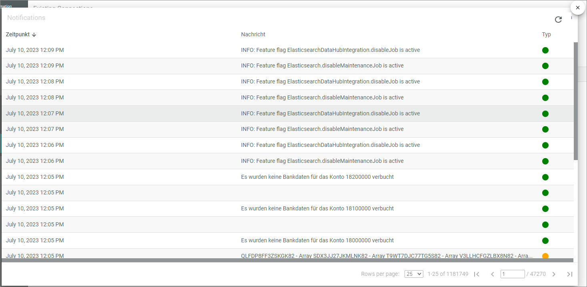
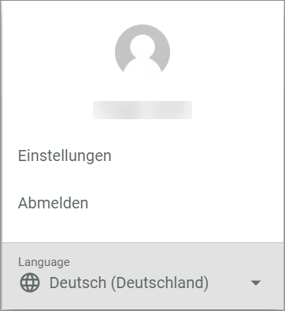
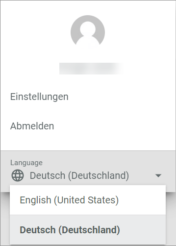

# Use general user interface functions

The *Actindo Core1 Platform* has general user interface functions that are available independently of the module/plugin, with which you are currently working.

## Expand/collapse the navigation menu
You can collapse the navigation menu, if you have not enough space in the workplace to work comfortably.

#### Prerequisites
- You are logged in the *Actindo Core1 Platform*.

#### Procedure

*Actindo Core1 Platform*

   

1. Click the  (Collapse) button top left to minimize the navigation menu.   
The navigation menu space is reduced in size. Only the module icons are displayed.

    

2. Click the  button top left to expand the navigation menu again.

## Sort navigation menu entries
You can change the sequence of the navigation menu entries. For example, this allows you to position often used menu entries at the beginning of the list.   
 > [Info] The list of menu entries contains only those modules/plugins that are in use at your company.

 #### Prerequisites
- You are logged in the *Actindo Core1 Platform*. 

#### Procedure
*Actindo Core1 Platform*

1. Click the  (Settings) button in the *APPS* row (below the *Actindo dashboard* entry).   
The  (Sort) button is displayed after each module/plugin name.  
2. Click the  (Sort) button and drag the desired menu entry at the position you prefer.   
The position on which the menu entry will be inserted, is indicated by a dash. 

      

3. Drop the entry at the desired position.  
 The menu entry is inserted at the position on which the dash was displayed before. You have changed the sequence in which the menu entries are displayed.

## Create ticket 

The  (Create ticket) button top right is used to create a support ticket in case that there is an error or an issue with any module/plugin of the *Actindo Core1 Platform*. For detailed information, see [Create ticket ](./08_CreateTicket.md "Create ticket").  

## Check processes

The processes  (Process running) and  (No processes running) buttons on top right indicates the processes that are currently running or waiting for starting. 
This information is mainly relevant for system administrators and especially helpful in a testing phase. 

#### Prerequisites
- You are logged in the *Actindo Core1 Platform*.

#### Procedure

*Actindo Core1 Platform* 

1. Click the  (Processes running) button to have a look on the running processes.   
A drop down window is opened in which currently running resp. currently waiting processes are listed. This list is permanently refreshed.  

    

2. Click the [VERWALTEN] (Manage) button to get a more static view on the processes.

**To be continued - es passiert nichts wenn ich da drauf drücke**

## Check notifications

Notifications are information on active jobs and other actions that has been done on the *Actindo Core1 Platform*, for example downloads, imports, postings, and much more. 
This information is mainly relevant for system administrators and developers. It is especially helpful in a testing phase.  

#### Prerequisites

- You are logged in the *Actindo Core1 Platform*.

#### Procedure

*Actindo Core1 Platform* 
   

1. Click the  (Notifications) button.   
A drop-down list is opened in which you can display currently created notifications. If no actual notifications are available, the text "no new notifications" is displayed.   

   
2. Click the [SHOW ALL] button to have a look on notifications that have been created recently.   
A window is opened in which recently created notifications are listed. 

      

    Each entry has a status information in the *Type* column. The following notification types are available:
   - Info (indicated by a green dot)   
     This is an information only.

   - Warning (indicated by a yellow dot)   
    This notification refers to a situation that might be potentially critical. If required, check the situation in the logging menu entry of the affected module/plugin.

   - Error (indicated by a red dot)   
    This notification refers to a situation that led to an error. Check the situation in the logging menu entry of the affected module/plugin.   

    > [Info] If warning or error notifications are available, a yellow or a red dot is added to the notifications button.   

3. If desired, sort the list to view older entries. To do this, click the *Zeitpunkt (Point of time)* button to sort the list ascending.

## Check your profile and log out

The  (Avatar) button top right gives you access to the following:
- **Profile settings**   
 For detailed information, see [Edit profile settings ](./ "Edit profile settings").
- **Logout**    
Click on the [Logout] button to leave the *Actindo Core1 Platform*.
- **Change language**   
For detailed information, see below under [Change language ](./03_GeneralUIFunctions.md#change-language).

### Change language

The *Actindo Core1 Platform* is currently available in English and German. You can change the language during your current session without the need of a new login.

#### Prerequisites
- You are logged in the *Actindo Core1 Platform*.

#### Procedure

*Actindo Core1 Platform*

1. Click the  (Avatar) button top right.   
A dropdown list is opened.  

1. Click the [Language] button.  
    A dropdown list is opened. It contains the language versions that are installed on your system.  
     
   

2. Select the desired language.   
The *Change language* pop-up window is opened.

     

3. Click the [CHANGE LANGUAGE] button to switch to another language.  
The application is being reloaded. Afterwards, it is available in the selected language.

    