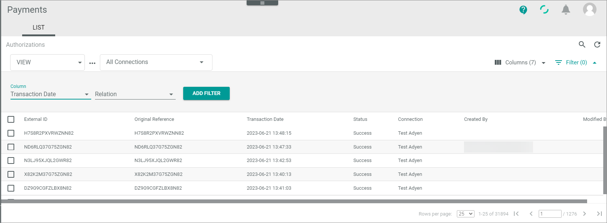

# Work with lists
A list in the *Actindo Core1 platform* describes a listing of items in a table-like environment. Each item is listed in a row and can be specified by different values in the columns. In contrast to a table, the list has no table border that is firmly separated from the rest of the workspace.

## Create view

## Sort list entries

## Add or remove columns

## Use filters
You can use filters to generate a specific view on a list you currently use. For example, you can output only specific status that you are interested in or restrict the list on a specific date.  
If required, you can save the filters with a view, so that you can provide different views on the database that is always is available to you, and if you publish the view, for all users. 

#### Prerequisites
- You have opened a LIST view in a module

#### Procedure

*Actindo Core1 Platform > Any module > LIST view*

1. Click the  Filter (x) button top right of the list. The *x* indicates the number of filters that are currently active.   
A pop-up window is opened in which you can define the filter.  

   

2. In the *Column* drop-down list, select the column for which you want to apply a filter.
The *Relation* field is shown. The *Relation* defines the filter operator, which specifies how the filter criteria relate to each other.
 
    

3. Select a relation by using the drop-down list.
   > [Info] The relations you can use depend on the module you are currently working in as well as on the column you specify.   
   

   The following relations are available:

     - **between**   
In most cases, this relation is available for date fields. You can use it to filter the list for values that are between a specific range, whereby the start and end date is included. For example, a filter between 05/05/2022 and 05/07/2022 displays all values available on 05/05/2022, 05/06/2022, and 05/07/2022.

        
        > [Info] If a value help is available, click the  (Calendar) button to open the value help, select the value, and click it again to apply the value.

     - **equal**   
This relation is available for character and date fields. You can use it to filter the list for a specific value, for example the date 06/13/2022 or the transaction ID KXQTFDGK4DQ2WN82.

       

     - **greater**   
This relation is available for numeric and date fields. You can use it to filter the list for values that are greater the value you specified. For example, if you enter the date 05/05/2022, you get all list entries from 05/06/2022.

       

     - **greater or equal**   
This relation is available for numeric and date fields. You can use it to filter the list for values that are greater or equal the value you specified. For example, if you enter the date 05/05/2022, you get all list entries from 05/05/2022.

       

     - **less**   
This relation is available for numeric and date fields. You can use it to filter the list for values that are less the value you specified. For example, if you enter the date 05/05/2022, you get all list entries until 05/04/2022.  

       

     - **less or equal**   
This relation is available for character and date fields. You can use it to filter the list for values that are less or equal the value you specified. For example, if you enter the date 05/05/2022, you get all list entries until 05/05/2022.

       

     - **like**   
This relation is available for date and character fields. You can use it to filter the list for values that contain a specific string. For example, by filtering an ID that starts with KX, you get all list entries that contain these string in the specified field. Or you want to filter the list for a specific month and enter 2022-05.

       

     - **not equal to**   
     This relation is available for character and date fields. You can use it to remove specific entries from the list, for example entries with a transaction date 06/13/2022 or the transaction ID KXQTFDGK4DQ2WN82.

       

   After selecting a relation, depending on the selected column, a value or one/two date field(s) are shown.

   

4. Select one/two date(s) or a value.
    > [Info] For some values also value helps are available.   

5. Click the [ADD FILTER] button.   
The filter is applied the list. The applied filter is shown above the *Columns* field.   

   

   You have now the following options:

     
    

    - You can delete the filter by clicking on the X right to the filter description. 
    - You can remove the filter by clicking on the checkbox to the left. This is recommended if you want to disable the filter briefly without deleting the filter.
    - You can change the filter by clicking on the  (Drop-down) button. Save your changes if required.
      

6. If desired, add further filters.

7. If desired, save the filter in the view.