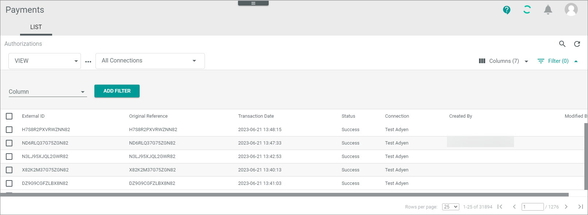
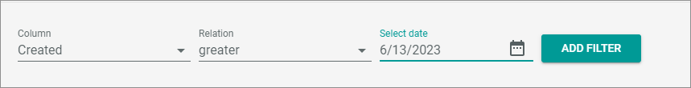
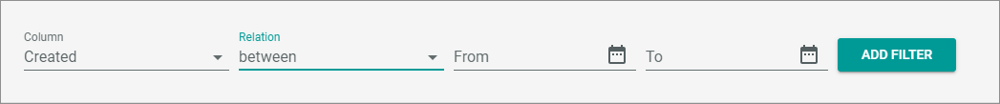

# Work with lists
A list in the *Actindo Core1 platform* describes a listing of items in a table-like environment. Each item is listed in a row and can be specified by different values in the columns. In contrast to a table, the list has no table border that is firmly separated from the rest of the workspace.

## Create view
If you are working in a list, you can create different views on the database where you define the columns to be displayed and the filters to be applied. You can define views for your own, but also publish it to make it available for all users.

#### Prerequisite

- You have opened a LIST in any module

#### Procedure

*Actindo Core1 Platform > Any module > LIST view*

1. Click the  (Points) button to the right of the *View* drop-down list.   
If there is not yet created a view, only the create option is displayed.    
If no views are defined yet, only the create option is available. 
2. Click the  [Create] entry.   
The *Create view* window is displayed.

   

3. Enter a name for the view and click the [SAVE] button.   
The new view is automatically selected now.

4. Define how the view is to be displayed.   
   - If applicable, define the standard filters that are placed above the list, for example *Connections*.   
    The standard filters are applied.   

     

    - Define the columns that are to be displayed in the view, see [Add or remove columns](#add-or-remove-columns "Add or remove columns").   

    - Sort the list entries, see [Sort list entries](#sort-list-entries "Sort list entries"). 

    - Define the filters you want to apply the view, see [Use filters](#use-filters "Use filters").

5. Click the  (Points) button and select the  [save] button.  
The view is saved. The next time you open the list, you can select your new view with the *VIEW* drop-down list.   
If desired, you can now delete the view by clicking the  (Points) button and selecting the  [Delete] button.

6. If desired, publish the view. To do this, Click the  (Points) button and select the  [publish] button.   
The view is visible to all users. If you want to unpublish the view, click the  (Points) button and select the  [unpublish] button.  

## Add or remove columns
You can define the columns that are to be displayed in a LIST.

#### Prerequisites

- You have opened a LIST in any module.

##### Procedure

*Actindo Core1 Platform > Any module > LIST view*

1. If desired, select the view for which you want to define the columns.  
Alternatively, you have the following options:   
   - You can define the columns for a temporary use without changing.
   - You can save the changes later in an existing view.
   - You can create a new view with the new defined columns.

2. Consider which columns should be visible without scrolling and which order would make sense.

3. Click the  (Columns (x)) button top right of the list. The *x* indicates the number of columns that are currently displayed.   
A pop-up window is opened in which you can specify the columns.

4. Check the existing columns.   
    - If desired, change the order of the columns. To do this, drag a column button and drop it at the required position.     
    - If desired, remove a column. To do this, click the  (Remove) button in the column button.
   
5. If you want to add a new column, click on the *Column* drop-down list, and select an entry from the list. The drop-down list contains all entries that are available for the LIST.

6. Click the [ADD COLUMN] button.   
The new column is placed at the end of the column button list. Drag and drop it to the desired position.

7. Click the [APPLY] button.   
The new column is applied the view. You have now the following options: 
   -  You can optimize the column size by moving the column separators as desired.   
   - You can save and publish the view. Alternatively, you can create a new view with your new settings, see [Create view](#create-view "Create view").

## Sort list entries

For some columns, you can sort list entries ascending and descending. You can save the sorting in a view.

#### Prerequisites

- You have opened a LIST in any module.

#### Procedure

*Actindo Core1 Platform > Any module > LIST view*

1. If desired, select the view for which you want to define the sorting.  
Alternatively, you have the following options:   
   - You can define the columns for a temporary use without changing.
   - You can save the changes later in an existing view.
   - You can create a new view with the new defined columns.

2. Move the mouse pointer over the columns.  
The mouse pointer is displayed as a little hand at all columns that can be sorted.

3. Click on one of these columns indicated by a little hand and toggle between the ascending, descending, and no sorting state.   
The column is sorted ascending, or descending, or not sorted. This depends on the state of sorting before. The sorting is indicated by a small arrow ( (Descending) and (Ascending)).
If no arrow is visible, the view is not sorted by this column.

    

4. If desired, you can now save and publish the view with the new sorting. Alternatively, you can create a new view with your new settings, see [Create view](#create-view "Create view").

## Use filters
You can use filters to generate specific views on a list you currently use. For example, you can output only specific status that you are interested in or restrict the list to a certain date range.  
If required, you can save the filters in a view, so that you can provide different views on the database that is always available to you, and if you publish the view, for all users. 

#### Prerequisites

- You have opened a LIST view in a module.

#### Procedure

*Actindo Core1 Platform > Any module > LIST view*

1. Click the  (Filter (x)) button top right of the list. The *x* indicates the number of filters that are currently active.   
A pop-up window is opened in which you can define the filter.  

   

2. In the *Column* drop-down list, select the column for which you want to apply a filter.   
The selected column is applied the *Column* drop-down list. In addition, the *Relation* field is shown. The relation defines the filter operator, which specifies how the filter criteria are to be related to each other.
 
    

3. Select a relation by using the drop-down list.
   > [Info] The relations you can use depend on the module you are working in and the column you specify.   
   

   The following relations are available for *Actindo* LISTS:<!---Bitte prüfen, ob die Angaben zu den Feldtypen stimmen-->

     - **between**   
In most cases, this relation is available for date fields. You can use it to filter the list for values that are between a specific date range, whereby the start and end date is included. For example, a filter between 05/05/2022 and 05/07/2022 displays all values available on 05/05/2022, 05/06/2022, and 05/07/2022.

        

        > [Info] If a value help for dates is available, click the  (Calendar) button to open the value help, select the value, and click it again to apply the value.

     - **equal**   
This relation is available for character and date fields. You can use it to filter the list for a specific value, for example the date 6/14/2023 or the transaction ID KXQTFDGK4DQ2WN82.

       

     - **greater**   
This relation is available for numeric and date fields. You can use it to filter the list for values that are greater the value you specified. For example, if you enter the date 6/13/2023, you get all list entries from 6/14/2023.

       

     - **greater or equal**   
This relation is available for numeric and date fields. You can use it to filter the list for values that are greater or equal the value you specified. For example, if you enter the date 6/13/2023, you get all list entries from 6/13/2023.

       

     - **less**   
This relation is available for numeric and date fields. You can use it to filter the list for values that are less the value you specified. For example, if you enter the date 6/13/2023, you get all list entries until 6/12/2023.  

       

     - **less or equal**   
This relation is available for character and date fields. You can use it to filter the list for values that are less or equal the value you specified. For example, if you enter the date 6/13/2023, you get all list entries until 6/13/2023.

       

     - **like**   
This relation is available for date and character fields. You can use it to filter the list for values that contain a specific string. For example, by filtering an ID that starts with KX, you get all list entries that contain this string in the specified field. Or you want to filter the list for a specific month and enter 2023-05.

       

     - **not equal to**   
     This relation is available for character and date fields. You can use it to remove specific entries from the list, for example entries with a *Transaction date* 06/21/2023 or the *Status ID* **2**.

       

   After selecting a relation, depending on the selected column, a value or one/two date field(s) are shown.

   

4. Select one/two date(s) or a value.
    > [Info] For some values are value helps available.   

5. Click the [ADD FILTER] button.   
The filter is applied the list. The applied filter is shown above the *Columns* field.   

   

   You have now the following options:

     
    

    - You can delete the filter by clicking on the  (Remove) button. 
    - You can temporarily remove the filter by clicking on the  (Checkbox) button. This is recommended if you want to disable the filter for a short time without deleting it.
    - You can edit the filter by clicking on the  (Drop-down) button. Save your changes if required.
      

6. If desired, add further filters.

7. If desired, save the filter in the view.

## Rename view

#### Prerequisite

- You have opened a LIST in any module

#### Procedure

*Actindo Core1 Platform > Any module > LIST view*

1. Select the view you want to rename in the *VIEW* drop-down list.

2. Click the  (Points) button to the right of the *VIEW* drop-down list.   

2. Click the   [rename] button.   
The *Rename "view name"* window is displayed.

   

3. Enter the new name for the view and click the [SAVE] button.   
The view is renamed.

