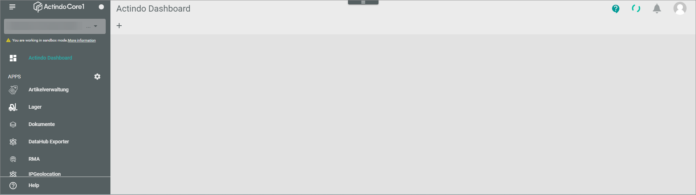

# General user interface functions

Expand/collapse (apps menu) 
Apps sorting button 
Processes/Notifications/Profile 
Help (Link zur Docu)

## Expand/collapse the navigation menu
You can collapse the navigation menu, if you have not enough space in the workplace to work comfortably.

#### Prerequisites
- You are logged in the *Actindo Core1 Platform*.

#### Procedure
*Actindo Core1 Platform*

1. Click the  button top left to minimize the navigation menu.   
The navigation menu space is reduced in size. Only the module icons are displayed.

   

2. Click the  button top left again to expand the navigation menu again.

## Sort navigation menu entries
You can change the sequence of the navigation menu entries. This allows you to position often used menu entries at the beginning of the list.   
 > [Info] The list of menu entries contains only those modules/plugins that are in use at your company.

 #### Prerequisites
- You are logged in the *Actindo Core1 Platform*. 

#### Procedure
*Actindo Core1 Platform*

1. Click the  (Settings) button in the *APPS* row (below the *Actindo dashboard* entry).   
The  (Sort) button is displayed after each module/plugin name.  
2. Click the  (Sort) button and drag the desired menu entry at the position you prefer.   
The position on which the menu entry will be inserted, is indicated by a dash. 

      

3. Drop the entry at the desired position.  
 The menu entry is inserted at the position on which the dash was displayed before. You have changed the sequence in which the menu entries are displayed.