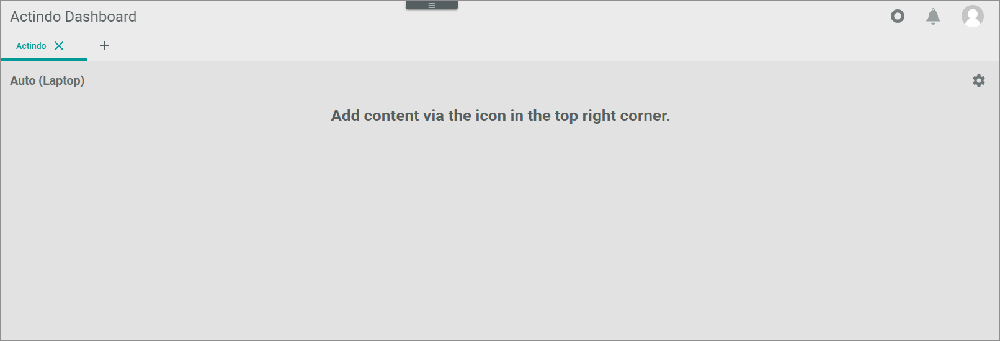

[!!Dashboard](../UserInterface/02_Dashboard.md)

# Manage dashboards

The *Actindo Dashboard* module gives an overview of important module-specific key figures and statistics directly when starting the *Actindo Core1 Platform*. 
Depending on your user role(s), different information might be relevant, so that you can configure different dashboards for different purposes. Note that you configure dashboards for supporting your own daily work. They are not visible for other Actindo users.   
The number of dashboards is unlimited. For certain modules, a set of dashlets is predefined. A dashlet is an individual component that you can add or remove from a dashboard.

## Create dashboard

Create a dashboard to define a specific view on key figures and statistics.

#### Prerequisites

No prerequisites to fulfill.

#### Procedure

*Actindo Core1 Platform*

1. Click the  (Add) button in the header.   
    The *Add tab* window is displayed. By default, the *Create tab* tab is preselected.

    

2. Enter a name for the dashboard tab in the *Tab name* field.

3. Click the [SAVE] button in the bottom right corner.   
    The *Add tab* window is closed. The new dashboard has been saved and is displayed.

## Customize dashboard

Customize a dashboard to your special needs by adding the desired dashlets, deleting unnecessary dashlets, select the viewport, and define the dashlets' arrangement.

### Add dashlet

Add the desired dashlets to your dashboard.

#### Prerequisites

A dashboard tab has been created, see [Create a dashboard](#create-a-dashboard).

#### Procedure

*Actindo Dashboard*

1. Select the tab of the dashboard to which you want to add a dashlet.    
    The selected dashboard tab is displayed.

2. Click the  (Settings) button in the upper right corner.    
    The *Edit tab* view is displayed.

    

3. Click the [ADD ELEMENT] button in the upper right corner.    
    The *Dashlet picker* window is displayed.

    

    For detailed information on the standard dashlets, see [Dashlet picker ](../UserInterface/02_Dashboard.md#dashlet-picker).

4. Select the checkboxes of the dashlets you want to add to your dashboard. If you click the checkbox in the header, all dashlets in the list are selected.

5. Click the [ACCEPT] button in the bottom right corner of the window.   
    The selected dashlets have been added to the dashboard. The *Dashlet picker* window is closed.

6. Click the [SAVE] button.   
    The dashboard has been saved. The *Edit tab* view is closed.

    > [Info] If you want to change the dashlet positioning, see [Change the dashlets arrangement](#change-the-dashlets-arrangement).

### Change viewport

Change the viewport to optimize the view of the dashboard for a specific device, for example, mobile, desktop, or tablet.
The viewport is saved for a single dashboard, so you can create dashboards with different viewports.   
Note that the size of a dashlet is fixed and will not be adjusted to the size of a specific device. For example, this means that a viewport for a mobile device should show only a few dashlets side by side so that it is not necessary to scroll horizontally to display the dashlets on the mobile device.

#### Prerequisites

A dashboard tab has been created, see [Create a dashboard](#create-a-dashboard).

#### Procedure
*Actindo Core1 Platform*

1. Select the tab of the dashboard of which you want to change the viewport.   
    The selected dashboard tab is displayed.

2. Click the  (Settings) button in the upper right corner.    
    The *Edit tab* view is displayed.

    

3. Click the *Select viewport* drop-down list in the upper left corner and select the desired view format. The following viewports are available:
    - **Automatic**   
        The system automatically chooses the dashboard that has a suitable size for the current device. For using this function, it is necessary that you have created a viewport for all devices on which you use the dashboard.
    - **Mobile**   
        The dashboard size is optimized for a mobile device.  
    - **Tablet**   
        The dashboard size is optimized for a tablet device.
    - **Laptop**   
        The dashboard size is optimized for a laptop device. 
    - **Desktop**   
        The dashboard size is optimized for a desktop device.   

    The tab layout has been adapted to the selected view. The *Viewport loaded* notice is displayed in the footer.

4. Click the [SAVE] button.   
    Any changes to the dashboard have been saved. The *Edit tab* view is closed.

[comment]: <> (Wenn ich einen anderen viewport wählen, verschwinden alle Dashlets -> BUG-219)

### Change dashlet arrangement

Change the arrangement of the dashlets on a dashboard to optimize the view for your purposes or another viewport.

#### Prerequisites

- A dashboard tab has been created, see [Create a dashboard](#create-a-dashboard).
- At least one dashlet has been added to the dashboard, see [Add a dashlet](#add-a-dashlet).

#### Procedure

*Actindo Core1 Platform*

1. Select the tab of the dashboard to which you want to change the positioning of dashlets.   
    The selected dashboard tab is displayed.

2. Click the  (Settings) button in the upper right corner.   
    The *Edit tab* view is displayed.

    

3. Hover over a dashlet until the cursor icon changes to the cross arrow's cursor.

4. Click the dashlet and move it on the desired position on the dashboard using drag and drop. When moving the dashlet across the dashboard, the possible positions on the predefined grid are highlighted.

    

5. Click the [SAVE] button.   
    Any changes to the dashboard have been saved. The *Edit tab* view is closed.

### Remove dashlet

Remove a dashlet from a dashboard if it is no longer needed for the purposes or has been added accidentally to the dashboard.   
You cannot undo the removal. To recover a dashlet, you have to add it again, see [Add a dashlet](#add-a-dashlet).

#### Prerequisites

- A dashboard tab has been created, see [Create a dashboard](#create-a-dashboard).
- At least one dashlet has been added to the dashboard, see [Add a dashlet](#add-a-dashlet).

#### Procedure

*Actindo dashboard*

1. Select the tab of the dashboard from which you want to remove a dashlet.   
    The selected dashboard tab is displayed.

2. Click the  (Settings) button in the upper right corner.    
    The *Edit tab* view is displayed.

    

3. Click the  (Remove) button in the upper right corner of the dashlet you want to delete.    
    The dashlet has been removed from the dashboard.

4. Click the [SAVE] button.   
    Any changes to the dashboard have been saved. The *Edit tab* view is closed.

## Delete dashboard

Delete a dashboard that is no longer needed to keep track of the other dashboards.     
Be aware that you cannot undo the deletion.

#### Prerequisites

A dashboard has been created, see [Create a dashboard](#create-a-dashboard).

#### Procedure

*Actindo dashboard*

1. Click the  (Delete) button to the right of the name of the dashboard you want to delete.   
    The *Confirm tab deletion* window is displayed.

    

2. Click the [ACCEPT] button in the bottom right corner.   
    The *Confirm tab deletion* window is closed. The dashboard has been deleted.