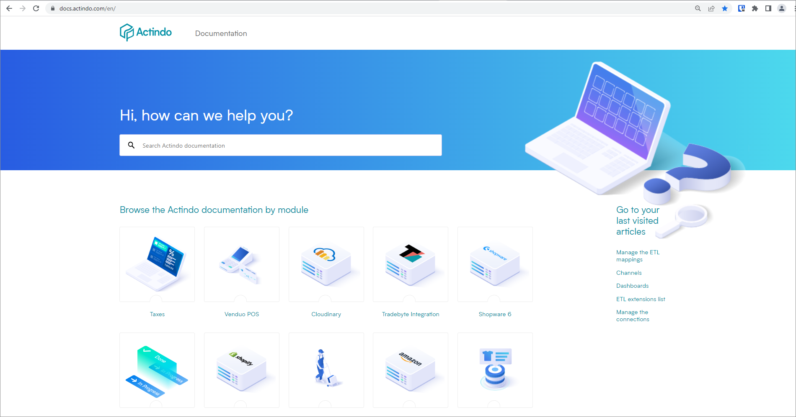
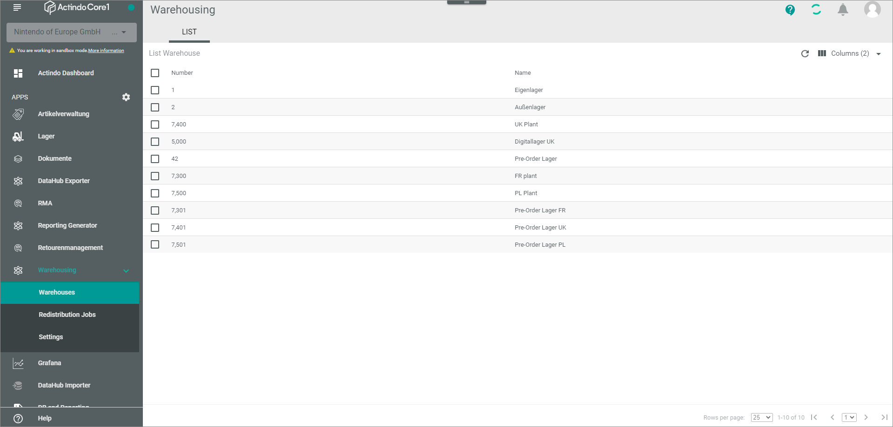

# Navigating the Actindo documentation

The Actindo documentation offers a lot of ways to navigate between module documentations, navigate within a document, and navigate between the documents within a module/plugin documentation.

## Opening the Actindo documentation site

### Opening the site via the Actindo web presence.

You can open the Actindo documentation site via the Actindo web presence. Alternatively, you can open the Actindo documentation site directly under [Actindo Documentation (https://doc.actindo/en)](https://doc.actindo/en/ "ActindoDocumentation").

#### Prerequisites
- You have internet access.

#### Procedure
*Actindo web presence > Resources > HELP & INFORMATION > Documentation (EN)*

1. Open the Actindo Website under [Actindo (https://www.actindo.com/en/)](https://www.actindo.com/en/ "Actindos Homepage").
2. In the navigation panel on top of the page, choose **Resources**.
3. In the *HELP & INFORMATION* section, choose **Documentation (EN)**.   
The *Actindo Documentation* site is opened.

4. Select the module documentation you want to read. To do this, click on the corresponding item. Alternatively, you can open the last articles you have visited before. To do this, click on the relevant article in the *Go to your last visited articles* section on the right.

### Opening the site via the Actindo Core1 Platform

You can open the Actindo documentation site directly from the *Actindo Core1 Platform* interface.

#### Prerequisites
- You are logged in the *Actindo Core1 Platform*.

#### Procedure

*Actindo Core1 Platform*

1. Click on the  [Help] button down right.   
The *Actindo Documentation* site is opened in a new window.

Click on the Actindo logo to return to the documentation overview site.

## Searching the documentation

- Search the whole Actindo documenation

- Search within a module/plugin documentation

## Related content

## Navigating within a topic
Previous next article and go to top button

## Screen shots
Click on a screenshot to display it in full screen mode, use the back button of your browser to return to the documentation
