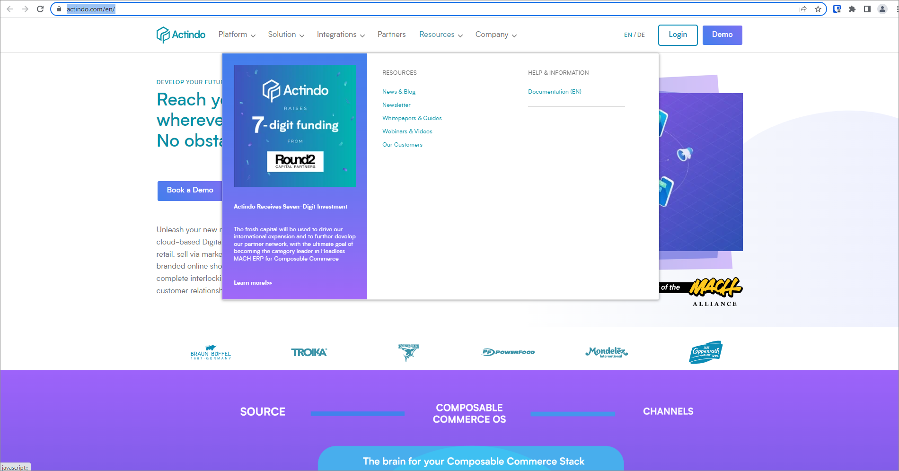
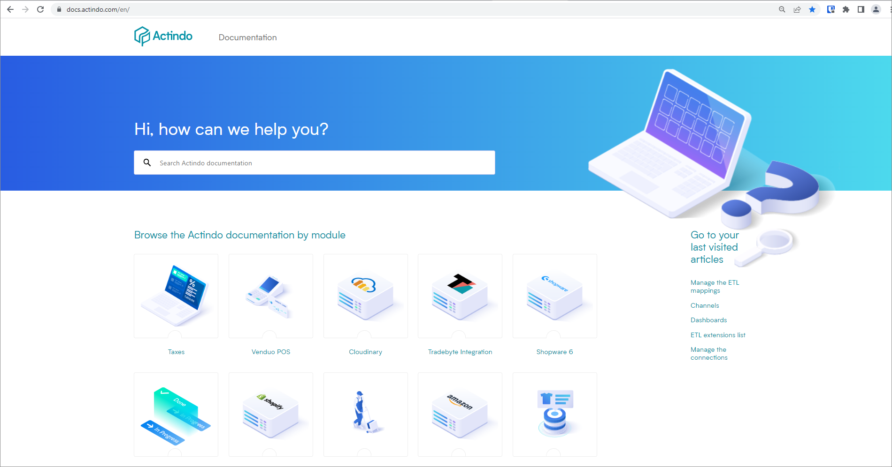
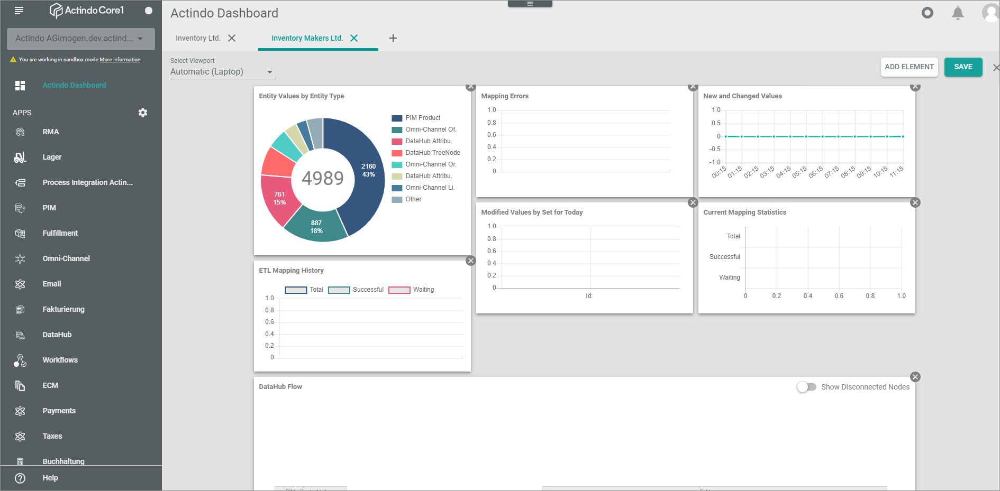
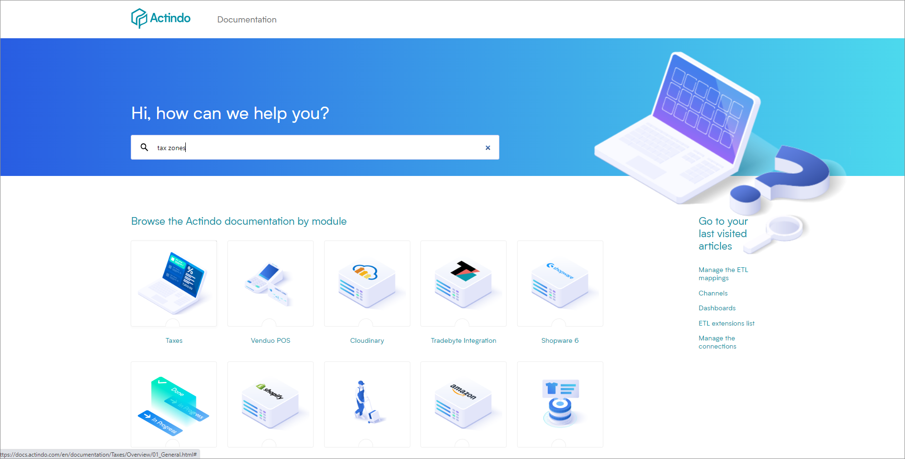
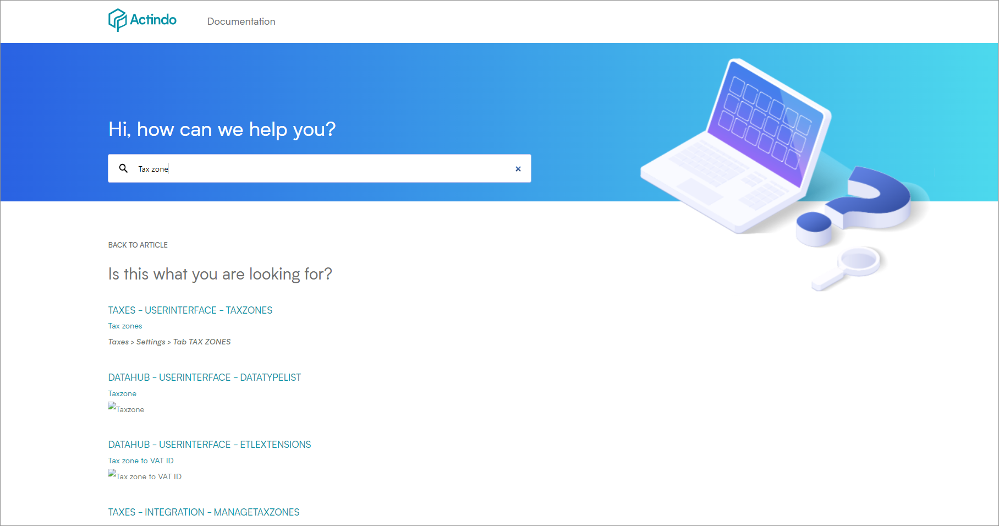
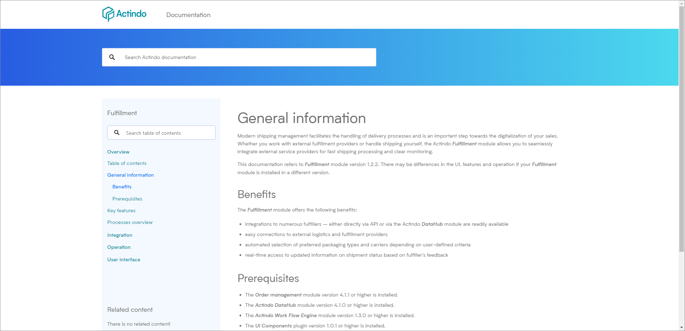
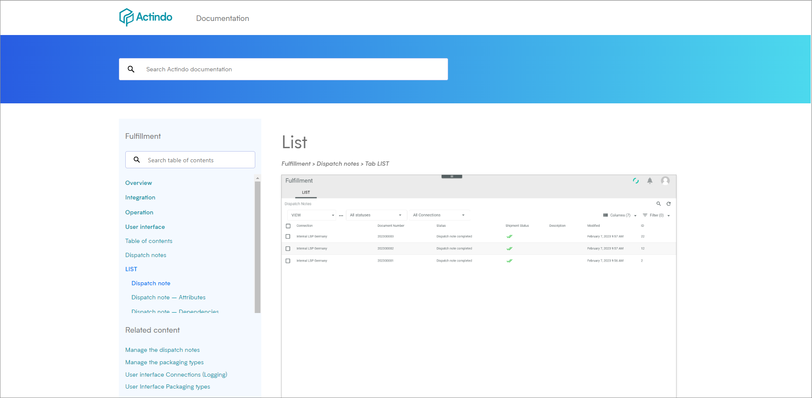
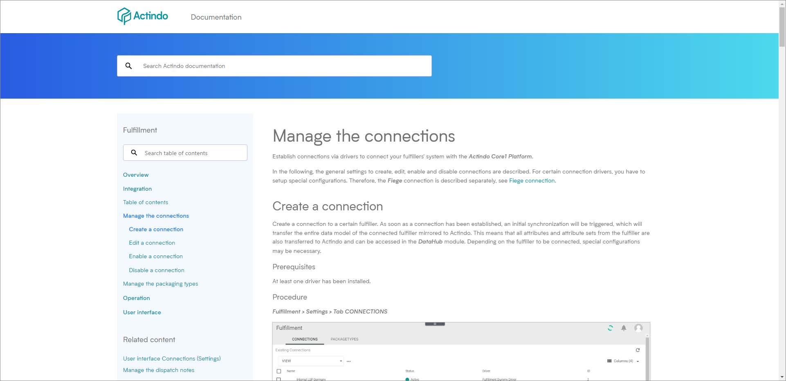
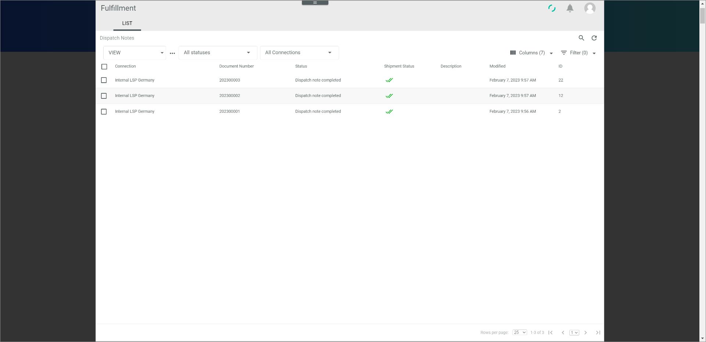

# Move around in the Actindo documentation

The Actindo documentation offers a lot of ways to navigate between module documentations, to navigate within a document, and to navigate between topics within a module/plugin documentation.

## Open the Actindo documentation site

### Open the site via the Actindo web presence.

You can open the Actindo documentation site via the Actindo web presence. Alternatively, you can open the Actindo documentation site directly under the following link: <a href="https://docs.actindo.com/en" target="_blank">Actindo documentation (https://docs.actindo.com/en)</a>.

#### Prerequisites
- You have internet access.

#### Procedure
*Actindo web presence > Resources > HELP & INFORMATION > Documentation (EN)*

1. Open the Actindo Website under <a href="https://actindo.com/en" target="_blank">Actindo home page (https://Actindo.om/en)</a>.   
    > [Info] The dropdown list contains links to further sources of information.
2. In the navigation panel on top of the page, choose **Resources**.
3. In the *HELP & INFORMATION* section, choose **Documentation (EN)**.   
The *Actindo Documentation* site is opened.

4. Select the module documentation you want to read. To do this, click on the corresponding item.   
Alternatively, you can open the last articles you have visited before. To do this, click on the relevant article in the *Go to your last visited articles* section on the right.   
    >[Info] If you have opened a module documentation, you can always return to the main documentation page by clicking on the Actindo logo.

### Open the site via the Actindo Core1 Platform

You can open the Actindo documentation site directly from the *Actindo Core1 Platform* interface.

#### Prerequisites
- You are logged in the *Actindo Core1 Platform*.

#### Procedure

*Actindo Core1 Platform*

1. Click on the  [Help] button down right.   
The *Actindo Documentation* site is opened in a new window.   

## Search the documentation
A full text search is available for the Actindo documentation. You can search the complete documentation as well as search only the previously selected module documentation.

### Search the whole Actindo documentation
Ae full text search is available that starts a search over the whole Actindo documentation. The search result list displays all topics containing the specified character string.

#### Prerequisites
- You have internet access.
- You have opened the Actindo Documentation site. For detailed information, see [Opening the site via the Actindo web presence](#opening-the-site-via-the-actindo-web-presence) or [Opening the site via the Actindo Core1 Platform](#opening-the-site-via-the-actindo-core1-platform).

#### Procedure  

*Actindo Documentation site*

1. In the *Search Actindo documentation* field in the *Hi, how can we help you?* section, enter the search characters of the subject you want to search for.   
    > [Info] If you want to clear the search, click on the  icon on the right side in the search field. 
2. Press **Enter**.   
A list with the search results is displayed.   
A single search result contains the following information:    
   - First line: [Module documentation title, for example *TAXES*]- [Title of the chapter, for example *USERINTERFACE*] - [Title of the topic].
   - Second line: Topic section in which the search term is included.
   - Third line: Row in which the search term is included.   

       

3. Check the list and select the topic in which you want to find the required information.

### Search the module/plugin documentation 
A full text search is available that starts a search over the module/plugin documentation that you have recently opened. The search result list displays all topics containing the specified character string.   

#### Prerequisites
- You have opened the Actindo Documentation site. For detailed information, see [Opening the site via the Actindo web presence](#opening-the-site-via-the-actindo-web-presence) or [Opening the site via the Actindo Core1 Platform](#opening-the-site-via-the-actindo-core1-platform).  
- You have opened a module/plugin documentation.

#### Procedure
*Actindo Documentation site > Select a module/plugin documentation*

 1. In the search field of the left panel, enter the search characters of the subject you want to search for.
 The search results are directly displayed.   

    

2. Check the list and select the topic in which you want to find the required information.   
    > [Info] If you want to clear the search, click on the  icon on the right side in the search field. 

## Explore related content
The content of some topics can relate to a certain document in the same chapter, to a document within another chapter, or even to a document in another module. On the documentation website, the links are displayed in the *Related content* section of the left side bar in the same order they are listed in the document. By following these links, you can get further information on a specific subject.

#### Prerequisites
- You have opened the Actindo Documentation site. For detailed information, see [Opening the site via the Actindo web presence](#opening-the-site-via-the-actindo-web-presence) or [Opening the site via the Actindo Core1 Platform](#opening-the-site-via-the-actindo-core1-platform).  
- You have opened a module/plugin documentation

#### Procedure
*Actindo Documentation site > Select a module/plugin documentation*

 
1. Check the *Related content* section on the left side bar. 
   Related links to other sources of information are displayed there.
2. Click on a link that might be interesting for you.
 

## Navigate within a topic
If you are currently reading a topic, you have additional options to move within the topic or within the module/plugin documentation.

#### Prerequisites
- You have opened a module/plugin documentation. For detailed information, see [Opening the site via the Actindo web presence](#opening-the-site-via-the-actindo-web-presence) or [Opening the site via the Actindo Core1 Platform](#opening-the-site-via-the-actindo-core1-platform). 

#### Procedure
*Actindo Documentation site > Select a module/plugin documentation*

1. Read the documentation. 
2. Use the [Go to top] button at the bottom right to quickly return to the beginning of the page.
3. At the end of a topic, use the [<< Previous article] or [>> Next article] buttons to browse the table of content (TOC).

## Open screenshot in full screen mode
If you want to study a screenshot in detail, you can open it in full screen mode.

#### Prerequisites
- You have opened a module/plugin documentation. For detailed information, see [Opening the site via the Actindo web presence](#opening-the-site-via-the-actindo-web-presence) or [Opening the site via the Actindo Core1 Platform](#opening-the-site-via-the-actindo-core1-platform). 

#### Procedure
*Actindo Documentation site > Select a module/plugin documentation*

1. Open a page on which a screenshot is displayed.
2. Click on the screenshot.  
   The screenshot is displayed in full screen mode.

   

3. Click the  [Back] button of your browser to return to the documentation.
