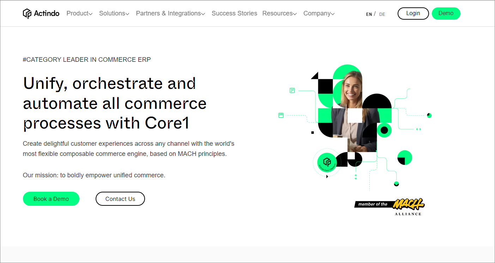
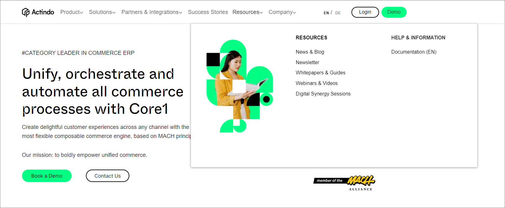

# Move around in the Actindo documentation

The Actindo documentation offers a lot of ways to navigate between module documentations, to navigate within a document, and to navigate between topics within a module/plugin documentation.

## Open the Actindo Documentation home page

You can access the *Actindo Documentation* home page via the *Actindo* home page or directly via the *Actindo Core1 Platform*. 

### Open the site via the Actindo home page

You can open the *Actindo Documentation* home page in the *Actindo* home page via the *Resources* tab. Alternatively, you can open it directly under the following link: <a href="https://docs.actindo.com/en" target="_blank">https://docs.actindo.com/en</a>.

#### Prerequisites

You have internet access.

#### Procedure

*Actindo home page*   

1. Open the Actindo home page under <a href="https://actindo.com/en" target="_blank">https://actindo.com/en</a>.   

2. In the navigation panel on top of the page, choose **Resources**.   
    A drop-down list is opened that contains links to further sources of information.

   

3. In the *HELP & INFORMATION* section, choose **Documentation (EN)**.   
    The *Actindo Documentation* home page is opened.

   

4. Select the module documentation you want to read. To do this, click the corresponding item.   
    Alternatively, you can open the last articles you have visited before. To do this, click the relevant article in the *Go to your last visited articles* section on the right.   

    >[Info] If you have opened a module documentation, you can always return to the main documentation page by clicking the Actindo logo.

### Open the site via the Actindo Core1 Platform

You can open the *Actindo Documentation* home page directly from the *Actindo Core1 Platform* user interface.

#### Prerequisites

You are logged in to the *Actindo Core1 Platform*.

#### Procedure

*Actindo Core1 Platform*

1. At the button in the navigation menu, click the  [Help] button.   
    The *Actindo Documentation* home page is opened in a new window.   
    

2. Select the module documentation you want to read. To do this, click the corresponding item.   
    Alternatively, you can open the last articles you have visited before. To do this, click the relevant article in the *Go to your last visited articles* section on the right.   

    >[Info] If you have opened a module documentation, you can always return to the main documentation page by clicking the Actindo logo.

## Search the documentation

A full text search is available for the Actindo documentation. You can search the complete documentation as well as search only the selected module documentation.

### Search the whole Actindo documentation

A full text search is available that starts a search over the whole *Actindo* documentation. The search result list displays all topics containing the specified character string.

#### Prerequisites
- You have internet access.
- You have opened the *Actindo Documentation* home page. For detailed information, see [Opening the site via the Actindo home page](#opening-the-site-via-the-actindo-home-page) or [Opening the site via the Actindo Core1 Platform](#opening-the-site-via-the-actindo-core1-platform).

#### Procedure  

*Actindo Documentation home page*

1. In the *Search Actindo documentation* field in the *Hi, how can we help you?* section, enter the search characters of the subject you want to search for. 

2. Press **Enter**.   
    A list with the search results is displayed.   
    A single search result contains the following information:    
   - First line: [Module documentation title, for example *TAXES*]- [Title of the chapter, for example *USERINTERFACE*] - [Title of the topic].
   - Second line: Topic section in which the search term is included.
   - Third line: Row in which the search term is included.   

       

3. Check the list and select the topic in which you want to find the required information.

    > [Info] If you want to clear the search, click the  icon on the right side of the search field.  

### Search the module/plugin documentation 

A full text search is available that starts a search over the module/plugin documentation that you have recently opened. The search result list displays all topics containing the specified character string.   

#### Prerequisites

You have opened the *Actindo Documentation* home page. For detailed information, see [Opening the site via the Actindo home page](#opening-the-site-via-the-actindo-home-page) or [Opening the site via the Actindo Core1 Platform](#opening-the-site-via-the-actindo-core1-platform).  

#### Procedure

*Actindo Documentation home page > Select a module/plugin documentation*

 1. In the *Search table of content* field in the left sidebar, enter the search characters of the subject you want to search for.
    The search results are directly displayed.   

    

2. Check the list and select the topic or section in which you want to find the required information. 

    > [Info] If you want to clear the search, click the  icon on the right side of the search field. 

## Explore related content

The content of some topics can relate to a certain topic in the same chapter, to a topic within another chapter, or even to a topic in another module. On the *Actindo Documentation* home page, links to such topics are displayed in the *Related content* section of the left sidebar. By following these links, you can get further information on a specific subject.

#### Prerequisites

You have opened the *Actindo Documentation* home page. For detailed information, see [Opening the site via the Actindo home page](#opening-the-site-via-the-actindo-home-page) or [Opening the site via the Actindo Core1 Platform](#opening-the-site-via-the-actindo-core1-platform).  
- You have opened a module/plugin documentation.

#### Procedure

*Actindo Documentation home page > Select a module/plugin documentation*

 
1. Check the *Related content* section on the left side bar. 
   Related links to other sources of information are displayed there.

2. Click a link that might be interesting for you.
 

## Use navigation within a topic

If you are currently reading a topic, you have additional options to move within the topic or within the module/plugin documentation.

#### Prerequisites

You have opened a module/plugin documentation. For detailed information, see [Opening the site via the Actindo home page](#opening-the-site-via-the-actindo-home-page) or [Opening the site via the Actindo Core1 Platform](#opening-the-site-via-the-actindo-core1-platform). 

#### Procedure

*Actindo Documentation home page > Select a module/plugin documentation*

1. Read the documentation. 

2. Use the [Go to top] button in the bottom right corner to quickly return to the beginning of the topic.  

3. At the end of a topic, use the [<< Previous article] or [>> Next article] buttons to browse the table of content (TOC).

## Open screenshot in full screen mode

If you want to study a screenshot in detail, you can open it in full screen mode.

#### Prerequisites
You have opened a module/plugin documentation. For detailed information, see [Opening the site via the Actindo home page](#opening-the-site-via-the-actindo-home-page) or [Opening the site via the Actindo Core1 Platform](#opening-the-site-via-the-actindo-core1-platform). 

#### Procedure

*Actindo Documentation home page > Select a module/plugin documentation*

1. Open a page on which a screenshot is displayed.  

2. Click the screenshot.  
   The screenshot is displayed in full screen mode.

   

3. Click the  [Back] button of your browser to return to the documentation.
