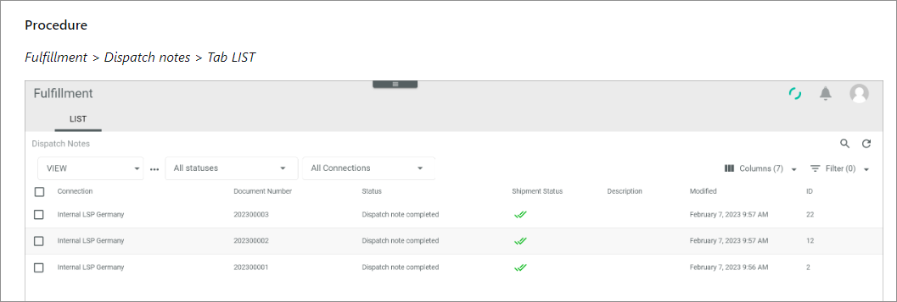

# Documentation structure

The *Actindo Core1 Platform* documentation pursues the goal that you can quickly find your way around the information that we provide you on the modules or plugins. For this reason, the documentation follows a strong structure so that you can quickly find the information you require.   
This topic provides you with a description of each section and the content you can expect there.

> [Info] The *Get started* documentation you currently read does not follow these principles strictly, because too much different subjects are described here.  

The Actindo Core1 module/plugin documentation has the following structure, whereby each section starts with a TOC document giving an overview of its content:

## Overview

The overview chapter provides you with general information on the module/plugin. It describes the overall purpose of the module/plugin as well as the key features. The overview chapter is divided into the following parts:   

- **General information**   
   This part describes the overall benefits of the module/plugin as well as the version on which the present documentation is based.   
   The prerequisites for using the module/plugin are briefly stated, such as the installation of certain programs, the connection of external hardware, or a certain version that is required for an additionally required module/plugin.   

- **Key features**   
    This part describes the main functions of the module/plugin.

- **Processes overview**   
    This part provides you with a scheme of the processes that are described in the module documentation. It gives an overview of the individual processes, the connection between the processes as well as the connection to other modules.   
    This part might not be available for the documentation of drivers or other special plugins.

In addition to the topics named above, other topics may be included if required.

## Integration

This section describes the preparatory procedures that are to be executed or to set up to fully use the module/plugin. For example, this section contains information on how to set up a connection to drivers or channels, or information on specific attributes that are to be set up in advance. 

## Operation

This section describes all executing procedures when using the module/plugin. For example, this section contains procedure descriptions of managing specific module objects such as offers, products, or templates. Each procedure starts with a breadcrumb path that describes the starting point of the procedure.

## Troubleshooting

This section describes issues and errors that can occur during running the module/plugin. It provides you with workable solutions.   
This section might not be included in all module/plugin documentation, because often no general issues or errors are known that are valid for all Actindo customers. Each procedure starts with a breadcrumb path that describes the starting point of the procedure.

## User Interface  

This section provides you with a detailed description of the user interface of each menu entry respectively function of a module/plugin. It contains a detailed specification of all tabs as well as lists with field and button descriptions.   
Note that this chapter contains no action descriptions or far-reaching explanations of interrelationships. It provides only a description of the interface and the individual functions of UI elements. Use this chapter as helpful addition to the procedures that are part of the *Operation* and the *Integration* section. 
