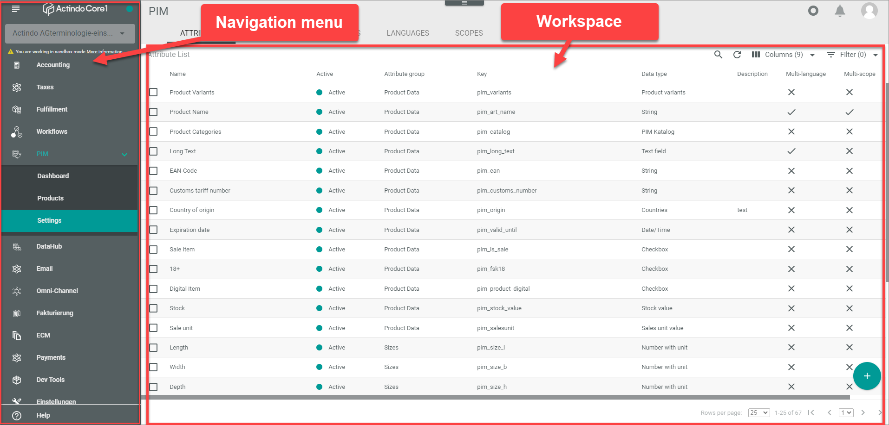
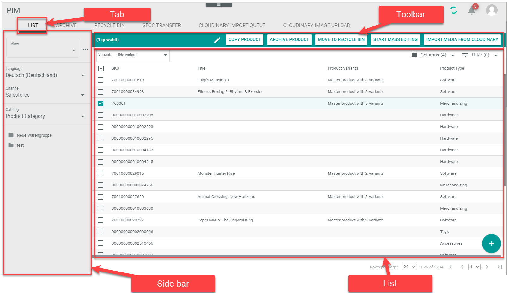

# General user interface terminology

<!---Hallo Marina, ich habe hier die Themen aus https://actindo.atlassian.net/wiki/spaces/DOC/pages/96862272/UI+Terminology. von den Elementen, die ich am Wichtigsten fand...-->

The following list makes you familiar with the names and designations that are used to describe specific user interface elements in the documentation.

## Navigation menu and workspace

**Navigation menu**

The navigation menu is the main side menu in the *Actindo Core1 Platform*. It contains all modules, the Actindo Dashboard, and the Account/Sandbox selection.
Each element of the menu is called menu entry in the documentation.

**Workspace**

The workspace is the whole space to the right of the navigation menu. In the workspace, the corresponding view of the selected menu entry with all tabs is displayed. 

## Workspace elements

**Tabs**   

A menu entry contains one or several tabs that are displayed in the header of the workspace directly under the module name. 

 **Side bar**   
A side bar is a bar that is displayed on one side of current view in the workspace. It may contain different content. In contrast to a side menu, the side bar does not contain a menu.

**Toolbar**   
A toolbar is displayed when you select an item. The toolbar contains different buttons to process the currently selected item. Depending on the sort of toolbar, the toolbar might be specified in the documentation, for example as an editing toolbar to edit the selection.

**List**   
A list describes a listing of items in a table-like environment. Each item is listed in a row and specified by different values in the columns. In contrast to a table, the list has not a table border that is firmly separated from the rest of the workspace.   
For more information, see [Work with lists](../UsingCore1/04_WorkWithLists.md).

## Further workspace elements

**View**   
The view describes the part in the workspace below the tabs. A tab may contain different views. The view name is indicated in the upper left corner of the view.

**Section**   
A section is a certain area within a view. A section is introduced by a section title.

**Box**   
A box is a certain area within a view. A box has a box title that is indicated in the upper left corner of the box. In contrast to a section, a box is highlighted by a light gray background and a border that limits the box. A box may contain different content, for example lists, buttons or fields.
