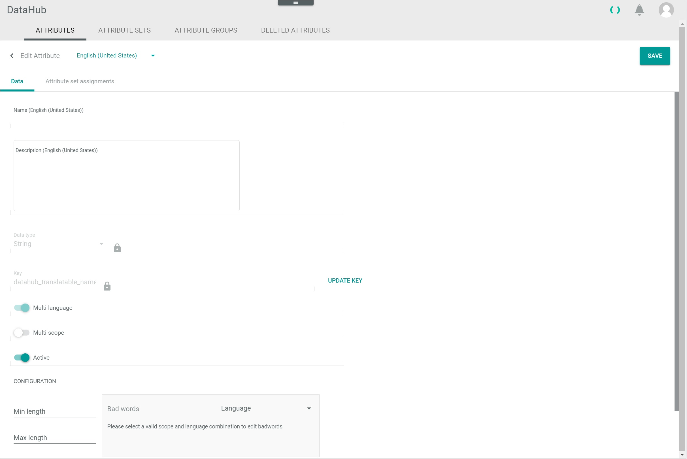

[!!PIM](../../PIM/Overview/01_General.md)
[!!User Interface Attributes](../UserInterface/02a_Attributes.md)
[!!Manage the products](../../PIM/Operation/01_ManageProducts.md)
[!!Manage the attribute sets](./02_ManageAttributeSets.md)
[!!Data type list](../../PIM/UserInterface/04_DataTypeList.md)

# Manage an attribute

An attribute defines a characteristic to describe a product. You can create attributes, edit existing attributes and deactivate or delete attributes that are not in use. Further, you can add attributes to an attribute set or remove them from an attribute set.  
In the *DataHub* module, attributes from all plugins are displayed.

## Create an attribute

No prerequisites to fulfill.

#### Prerequisites

An attribute set has been created, see [Create an attribute set](./02_ManageAttributeSets.md#Create-an-attribute-set).

#### Procedure
*DataHub > Settings > Tab ATTRIBUTES*

1. Click the  (Add) button in the bottom right corner.   
  The *Create attribute* view is displayed.

  

2. Enter a name for the attribute in the *Name* field and, if desired, add an attribute description in the  *Description* field.

3. Select a data type in the *Data type* drop-down list.   
 For detailed information about all data types, see [Data type list](../../PIM/UserInterface/04_DataTypeList.md).

   > [Info] The settings displayed in the *CONFIGURATION* section depend on the selected data type.

4. Enter a key for the attribute in the *Key* field. The key is required for API access and must be system wide unique.

  > [Info] In order to facilitate the assignment of attributes in the further process (for instance in the ETL mapping), it is recommended to add the prefix **datahub_** to all attributes created in the *DataHub* module.     

5. If desired, enable the *Multi-language* toggle to assign values in multiple languages to the attribute or enable the *Multi-channel* toggle to assign different attribute values in different channels.

  > [Info] Be aware that only attributes which are neither multi-language nor multi-channel can be used as defining attributes for variants. For detailed information, see [Create a variant set](../../PIM/Integration/07_ManageVariantSets.md#create-a-variant-set).

6. Click the  (Add) button in the *Assigned sets* field. The button is locked if you have not yet selected a data type.   
  A drop-down list with all active attribute sets is displayed. Data types can be restricted to certain entity types and therefore attribute sets

7. Select an attribute set in the *Assigned sets* drop-down list.

  > [Info] You can assign the attribute to multiple sets. Repeat the steps **7** to **8** to assign the attribute to a further attribute set. To delete the assignment to a selected set, click the  (Delete) button right to the set.

8. If required, configure the settings in the *CONFIGURATION* section. For detailed information about the different configuration settings, see [Data type list](../../PIM/UserInterface/04_DataTypeList.md).

9. Click the [SAVE] button in the upper right corner.   
  The new attribute has been saved. The *Create attribute* view is closed.  

## Edit an attribute

After you have created an attribute, you can edit it. However, only some attribute properties are editable. For instance, the data type and the attribute key cannot be subsequently modified. The assignment of an attribute to an attribute set must be changed in the [attribute set](./02_ManageAttributeSets) itself.   
There are also some attributes that are automatically created by the system, for instance when installing a plugin or module. These system attributes are read-only and cannot be edited. It is highly recommended not to deactivate these attributes to avoid interfering with the functioning of the *Core1 Platform*.

#### Prerequisites

At least one attribute has been created, see [Create an attribute](#create-an-attribute).

> [Info] By default, a certain number of attributes has been predefined in the *PIM Basic Set* attribute set.

#### Procedure
*DataHub > Settings > Tab ATTRIBUTES*

1. Click the attribute you want to edit in the list of attributes.   
  The *Edit attribute* view is displayed. The *Data* tab is preselected.

  

  > [Info] Be aware that you can only edit the attribute name, description, its status and configuration. All other fields and toggles are locked.

2. Edit the desired data of the attribute in the corresponding fields in the *Data* tab.

3. If desired, click the *Attribute set assignments* tab to check to which sets the selected attribute is assigned.

  

   > [Info] If you want to change the attribute set assignments of the selected attribute, you have to modify the corresponding attribute set.

4. Click the [SAVE] button in the upper right corner.   
  The changes have been saved. The *Edit attribute* view is closed.  

## Deactivate an attribute

It is recommended to deactivate an attribute instead of deleting it to prevent any problems because of existing dependencies. If you deactivate an attribute, it is no longer available for new attribute sets and it is hidden in existing products with this attribute. Deactivated attributes are not included in
the completeness calculation even if they are required.

#### Prerequisites

At least one attribute has been created, see [Create an attribute](#create-an-attribute).

> [Info] By default, a certain number of attributes has been predefined in the *PIM Basic Set* attribute set.

#### Procedure
*DataHub > Settings > Tab ATTRIBUTES*

1. Click the attribute you want to deactivate in the list of attributes.   
  The *Edit attribute* view is displayed. The *Data* tab is preselected.

  

2. Disable the *Active* toggle in the *Data* tab.

   > [Info] If you want to reactivate an attribute, enable the *Active* toggle.

3. Click the [SAVE] button in the upper right corner.   
  The attribute has been deactivated. The *Edit attribute* view is closed.

4. Press **F5** to initialize the *Core1 Platform* and to apply the changes.   

## Delete an attribute

You can move an attribute to the *DELETED ATTRIBUTES* tab if it is no longer needed. As there are usually dependencies on an attribute, for example through an attribute set or created products, it is strongly recommended not to delete an attribute. Instead, you can deactivate an attribute and thus prevent its use.

#### Prerequisites

At least one attribute has been created, see [Create an attribute](#create-an-attribute).

> [Info] By default, a certain number of attributes has been predefined in the *PIM Basic Set* attribute set.

#### Procedure
*DataHub > Settings > Tab ATTRIBUTES*

1. Select the checkbox of the attribute you want to delete in the list of attributes.   
  The editing toolbar is displayed above the attributes list.

2. Click the  (Delete) button in the toolbar. The *Confirm deletion of attribute?* window is displayed.

  > [Info] In the window all dependencies to attribute sets, ETL-mappings and entity entries are displayed. Be aware that problems may occur if you delete an attribute with existing dependencies.

3. Click the [CONFIRM] button in the bottom right corner.   
  The attribute has been deleted and is moved to the *DELETED ATTRIBUTES* tab in the *DataHub* module. The *Confirm deletion of attribute?* window is closed.

> [Info] The attribute is moved to the *DELETED ATTRIBUTES* tab, but it can still be recovered. To irretrievably delete the attribute, see [Finally delete an attribute](#finally-delete-an-attribute).

## Recover an attribute

If you have moved an attribute to the *DELETED ATTRIBUTES* tab, you can recover the attribute and make the deletion undone.

#### Prerequisites

At least one attribute has been moved to the *DELETED ATTRIBUTES* tab, see [Delete an attribute](#delete-an-attribute).

#### Procedure
*DataHub > Settings > Tab DELETED ATTRIBUTES*

1. Select the checkbox of the attribute you want to recover in the list of deleted attributes.   
  The editing toolbar is displayed above the deleted attributes list.

2. Click the [RECOVER] button in the toolbar.   
  The selected attribute has been recovered and is removed from the list of deleted attributes.

[comment]: <> (Why can I not recover certain attributes? Is it a bug?)

## Finally delete an attribute

You can finally delete an attribute if it is no longer needed. As there are usually dependencies on an attribute, for example through an attribute set or created products, it is strongly recommended not to delete an attribute irretrievably. Finally deleted attributes cannot be recovered.

#### Prerequisites

At least one attribute has been moved to the *DELETED ATTRIBUTES* tab, see [Delete an attribute](#delete-an-attribute).

#### Procedure
*DataHub > Settings > Tab ATTRIBUTES*

1. Select the checkbox of the attribute you want to finally delete in the list of deleted attributes.    
  The editing toolbar is displayed above the attributes list.

  > [Info] If the deleted attribute is not yet displayed in the list of deleted attributes, click the  (Refresh) button to update the list.

2. Click the [Delete] button in the toolbar.  
  The attribute has been irretrievably deleted. The deletion cannot be undone.

   > [Warning] Problems may occur if you delete an attribute with existing dependencies.  
