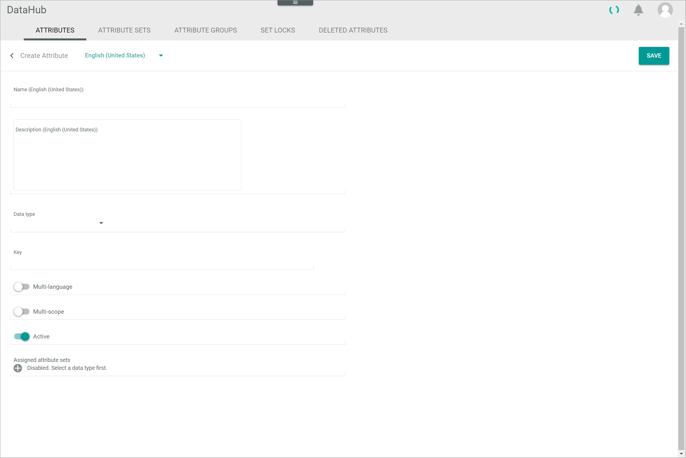
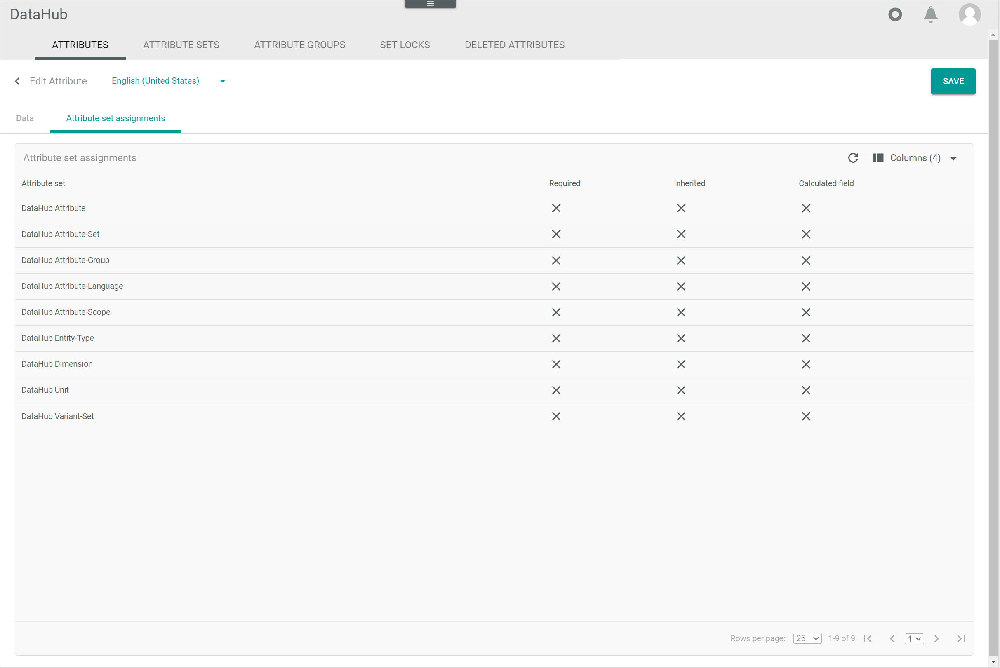

[!!Manage an attribute set](./02_ManageAttributeSets.md)
[!!User interface Attributes](../UserInterface/01a_Attributes.md)
[!!Data type list](../UserInterface/05_DataTypeList.md)
[!!Manage a product in PIM](../../PIM/Operation/01_ManageProducts.md)

# Manage an attribute

An attribute defines a characteristic to describe an entity, for example, a *PIM* product or a *Fulfillment* dispatch note. When describing a product, you need attributes such as *Name*, *Price*, and *SKU*. To describe a dispatch note, on the other hand, you may use attributes such as *Carrier*, *Shipment status*, and *Tracking number*. The entity attributes are then provided with a value in the specific entity, such as an individual product. For example, a black shirt in size M has a name (Actindo shirt), a price (50.00 EUR), and an SKU (BLK-ACT-SHIRT-M), all its specific attributes and values that describe that individual product. 

You can create attributes, edit attributes, and deactivate or delete attributes that are not in use. Further, you can add attributes to an attribute set or remove them from an attribute set.  
In the *DataHub* module, attributes from all plugins are displayed.

## Create an attribute

Create an attribute to specify a new property for an entity type.

#### Prerequisites

No prerequisites to fulfill.

#### Procedure

*DataHub > Data model > Tab ATTRIBUTES*

1. Click the  (Add) button in the bottom right corner.   
    The *Create attribute* view is displayed.

    

2. Enter a name for the attribute in the *Name* field and, if desired, add an attribute description in the  *Description* field.  

    > [Info] If you want to provide the attribute name and description in different languages in the system, you can select the desired system language in the "Language" drop-down list on top of this view. By default, the following options are currently available: English (United States) and Deutsch (Deutschland). 

3. Select a data type in the *Data type* drop-down list.   
    Depending on the selected data type, the *Contains sensitive data* toggle and the *CONFIGURATION* section are displayed. For detailed information about all data types, see [Data type list](../UserInterface/05_DataTypeList.md). 

   > [Info] The settings displayed in the *CONFIGURATION* section depend on the selected data type.

4. Enter a key for the attribute in the *Key* field. The key is required for API access and must be system-wide unique. An attribute key must fulfill the following criteria:
    - valid characters are **a-z** (upper and lower case), **0-9** and the underscore ( **_** )
    - the key must not start with a number
    - a double underscore ( **___** ) and a trailing underscore are forbidden

    > [Info] In order to facilitate the assignment of attributes in the further process (for instance in the ETL mapping), it is recommended to add the prefix **datahub_** to all attributes created in the *DataHub* module.     

[comment]: <> (Entwicklung: UPDATE KEY button hier abbauen!)

5. If desired, enable the *Multi-language* toggle to assign values in multiple languages to the attribute or enable the *Multi-scope* toggle to assign different attribute values in different scopes.

    > [Info] Be aware that only attributes which are neither multi-language nor multi-scope can be used as defining attributes for variants. For detailed information, see [Create a variant set](../Integration/07_ManageVariantSets.md#create-a-variant-set).

6. If required, enable the *Contains sensitive data* toggle if the potential attribute values may be sensitive, such as name, date of birth, or zip code.

    > [Info] By doing so, you label this data as sensitive, allowing our data anonymization tools to recognize it as such and access it for anonymization purposes if necessary.   

7. Click the  (Add) button in the *Assigned attribute sets* field. The button is locked if you have not yet selected a data type.   
    A drop-down list with all active attribute sets is displayed.

    > [Info] Note that data types can be restricted to certain entity types and therefore also to attribute sets.

8. Select an attribute set in the *Assigned attribute sets* drop-down list.

    > [Info] You can assign the attribute to multiple sets. Repeat the steps **7** to **8** to assign the attribute to a further attribute set. To delete the assignment to a selected attribute set, click the  (Delete) button right to the attribute set.

9. If required, configure the settings in the *CONFIGURATION* section.   
    For detailed information about the different configuration settings, see [Data type list](../UserInterface/05_DataTypeList.md).

    > [Info] By default, the status of a new attribute is set to active. To deactivate a new attribute for use, disable the *Active* toggle.    
    For detailed information, see [Deactivate an attribute](#deactivate-an-attribute).

10. Click the [SAVE] button in the upper right corner.   
    The new attribute has been saved. The *Create attribute* view is closed.  

## Edit an attribute

After you have created an attribute, you can edit it. However, only some attribute properties are editable. For instance, the data type, and the multi-language and multi-scope settings cannot be subsequently modified. 

The attribute key is locked but can be modified in exceptional cases, for example, if you have named it wrongly. 

> [Caution] Attribute keys are used for API access. Changing the attribute key, which is strongly discouraged, has an impact on the API naming for all affected entities where this attribute is included. That means that all external API consumers, workflows, webhooks, or other custom code need to be adjusted accordingly in case any of them address this attribute.

The assignment of an attribute to an attribute set must be changed in the attribute set itself, see [Edit an attribute set](./02_ManageAttributeSets.md#edit-an-attribute-set).   

There are also some attributes that are automatically created by the system, for instance when installing a plugin or module. Some of these system attributes are read-only and cannot be edited at all. It is highly recommended not to deactivate these system attributes to avoid interfering with the functioning of the *Actindo Core1 Platform*.

#### Prerequisites

At least one attribute has been created, see [Create an attribute](#create-an-attribute).

#### Procedure

*DataHub > Data model > Tab ATTRIBUTES*

1. Click the attribute you want to edit in the list of attributes.   
    The *Edit attribute* view is displayed. The *Data* tab is preselected.

    

    > [Info] Bear in mind that you can only edit the attribute name, description, its status and configuration. You can also enable or disable the sensitive data toggle. All other fields and toggles are locked. In exceptional cases, you can update the attribute key by clicking the [UPDATE KEY] button. 

2. Edit the desired data of the attribute in the corresponding fields in the *Data* tab.

3. If desired, click the *Attribute set assignments* tab to check to which sets the selected attribute is assigned.

    

    > [Info] If you want to change the attribute set assignments of the selected attribute, you have to modify the corresponding attribute set. For detailed information, see [Manage an attribute set](./02_ManageAttributeSets.md).

4. Click the [SAVE] button in the upper right corner.   
    The changes have been saved. The *Edit attribute* view is closed.  

## Deactivate an attribute

It is recommended to deactivate an attribute instead of deleting it to prevent any problems because of existing dependencies. If you deactivate an attribute, it is no longer available for new attribute sets and it is hidden in existing entities with this attribute.   

However, the values previously stored in an attribute are not deleted when the attribute is deactivated. As soon as the attribute is reactivated, the stored values are also visible again.   

Deactivated attributes are not included in the completeness calculation even if they are required.

#### Prerequisites

At least one attribute has been created, see [Create an attribute](#create-an-attribute).

#### Procedure

*DataHub > Data model > Tab ATTRIBUTES*

1. Click the attribute you want to deactivate in the list of attributes.   
    The *Edit attribute* view is displayed. The *Data* tab is preselected.

    

2. Disable the *Active* toggle in the *Data* tab.

   > [Info] If you want to reactivate an attribute, enable the *Active* toggle.

3. Click the [SAVE] button in the upper right corner.   
    The attribute has been deactivated. The *Edit attribute* view is closed.

    > [Info] Note that the values stored in an attribute are not deleted when it is deactivated. As soon as the attribute is reactivated, the stored values are also visible again.

4. Press the **F5** key to initialize the *Core1 Platform* and to apply the changes.   

## Delete an attribute

You can move an attribute to the *DELETED ATTRIBUTES* tab if it is no longer needed. Attributes that are assigned as defining attributes to any variant set cannot be deleted. For detailed information on variant sets, see [Manage a variant set](./07_ManageVariantSets.md). 

As there are usually dependencies on an attribute, for example, through an attribute set or created entities, it is strongly recommended not to delete an attribute. Instead, you can deactivate an attribute and thus prevent its use, see [Deactivate an attribute](#deactivate-an-attribute).

#### Prerequisites

At least one attribute has been created, see [Create an attribute](#create-an-attribute).

#### Procedure

*DataHub > Data model > Tab ATTRIBUTES*

1. Select the checkbox of the attribute you want to delete in the list of attributes.   
    The editing toolbar is displayed above the attributes list.

2. Click the [DELETE] button in the editing toolbar.    
    The *Confirm deletion of attribute?* window is displayed.

    

    All dependencies to attribute sets, ETL mappings and entity entries are displayed in this window. For defining attributes, the [CONFIRM] button is not displayed in the *Confirm deletion of attribute?* window as they cannot be deleted.   

    > [Caution] Deleting will permanently remove the selected data. The deletion cannot be undone and the deleted data cannot be restored. Problems may occur due to unresolved dependencies. Make sure you really want to delete the selected data.

3. Click the [CONFIRM] button in the bottom right corner.   
    The attribute has been deleted and is moved to the *DELETED ATTRIBUTES* tab. The *Confirm deletion of attribute?* window is closed.
 
    > [Info] The attribute is moved to the *DELETED ATTRIBUTES* tab, but it can still be recovered. To irretrievably delete the attribute, see [Permanently delete an attribute](../Operation/04_ManageDeletedAttributes.md#permanently-delete-an-attribute).

