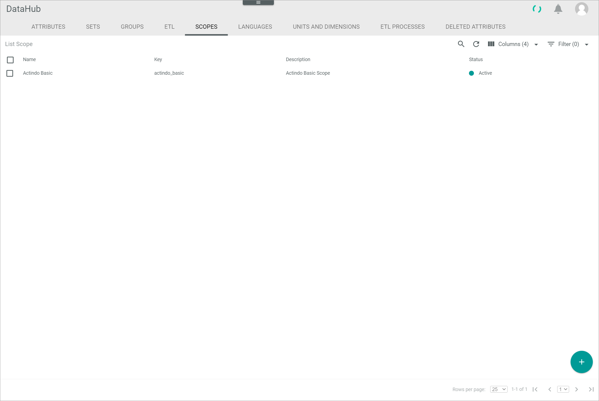
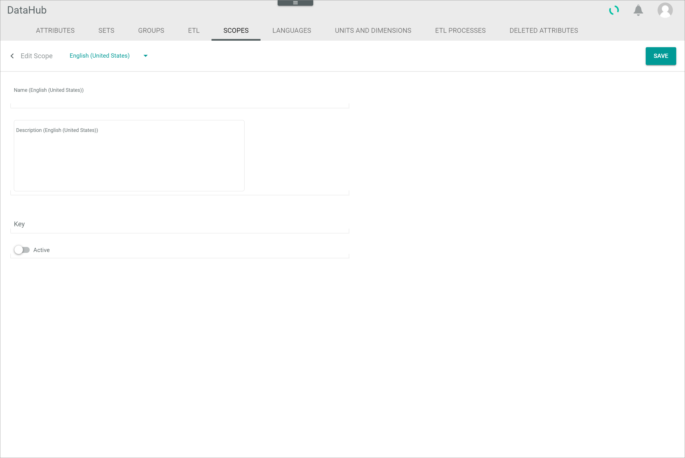
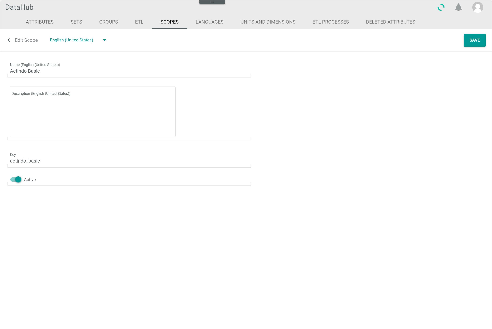

[!!User interface Channels](../UserInterface/02e_Channels.md)
[!!Configure the channel settings in PIM](../../PIM/Integration/ConfigureChannels.md)

# Manage the channels

A channel is needed to create offers for a certain connection.
By default, the *Actindo Basic* channel is predefined.
If you want to maintain multiple channels, you have to create and activate the respective channels.

> [Info] A channel does not equal a marketplace or web store connection. It is just a dimension that can be added to the multi-channel attributes.

[comment]: <> (Insert link for procedure about creating a new connection when available)

## Create a channel

Create a channel to maintain multiple channels or to create a new connection via the new channel.

#### Prerequisites

No prerequisites to fulfill.

#### Procedure

*DataHub > Settings > Tab CHANNELS*

1. Click the  (Add) button in the bottom right corner.   
    The *Create channel* view is displayed.

    

2. Enter a name for the channel in the *Name* field and, if desired, add a channel description in the  *Description* field.

3. Enter a key for the channel in the *Key* field. The key is required for API access and must be system wide unique. A channel key must fulfill the following criteria:
    - valid characters are **a-z** (upper and lower case), **0-9** and the underscore ( **_** )
    - the key must not start with a number
    - a double underscore ( **___** ) and a trailing underscore are forbidden

4. Enable the *Active* toggle to set the channel directly after creation to active.

    > [Info] The channel must be activated to be used.

5. Click the [SAVE] button in the upper right corner.   
    The new channel has been saved. The *Create channel* view is closed.  

## Edit a channel

After you have created a channel, you can edit its name, description and key.

#### Prerequisites

At least one channel has been created, see [Create a channel](#create-a-channel).

> [Info] By default, the *Actindo Basic* channel has been predefined in the *Core1 Platform*.

#### Procedure

*DataHub > Settings > Tab CHANNELS*

1. Click the channel you want to edit in the list of channels.   
    The *Edit channel* view is displayed.

    

2. Edit the desired data of the channel in the corresponding fields.

3. Click the [SAVE] button in the upper right corner.   
    The changes have been saved. The *Edit channel* view is closed.  

## Deactivate a channel

Deactivate a channel if it will not be used for a certain time.
If you deactivate a channel, it is no longer available for offers.
Further, it is recommended to deactivate a channel instead of deleting it to prevent any problems because of existing connections.

#### Prerequisites

At least one channel has been created, see [Create a channel](#create-a-channel).

> [Info] By default, the *Actindo Basic* channel has been predefined in the *Core1 Platform*.

#### Procedure

*DataHub > Settings > Tab CHANNELS*

1. Click the channel you want to edit in the list of channels.   
    The *Edit channel* view is displayed.

    

2. Disable the *Active* toggle.

3. Click the [SAVE] button in the upper right corner.   
    The channel has been deactivated. The *Edit channel* view is closed.

## Delete a channel

You can delete a channel if it is no longer needed. As there are usually existing connections via a channel, it is highly recommended not to delete a channel. Instead, you can deactivate a channel and thus prevent its use, see [Deactivate a channel](#deactivate-a-channel).

#### Prerequisites

At least one channel has been created, see [Create a channel](#create-a-channel).

> [Info] By default, the *Actindo Basic* channel has been predefined in the *Core1 Platform*. The *Actindo Basic* channel cannot be deleted.

#### Procedure

*DataHub > Settings > Tab CHANNELS*

1. Select the checkbox of the channel you want to delete in the list of channels.    
    The editing toolbar is displayed above the channel list.

2. Click the [DELETE] button in the editing toolbar.  
    The channel has been deleted. The deletion cannot be undone.

    > [Info] If the selected channel cannot be deleted, an error message is displayed in the upper right corner. To prevent the channels use, it is recommended to deactivate the channel instead of deleting it, see [Deactivate a channel](#deactivate-a-channel).
