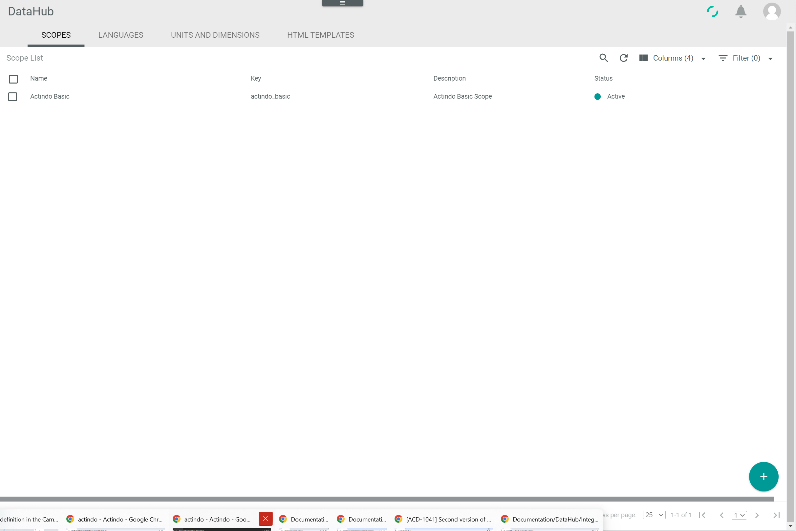
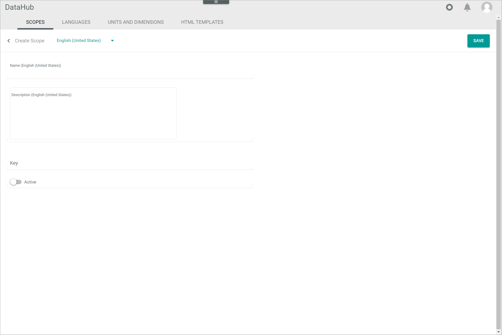
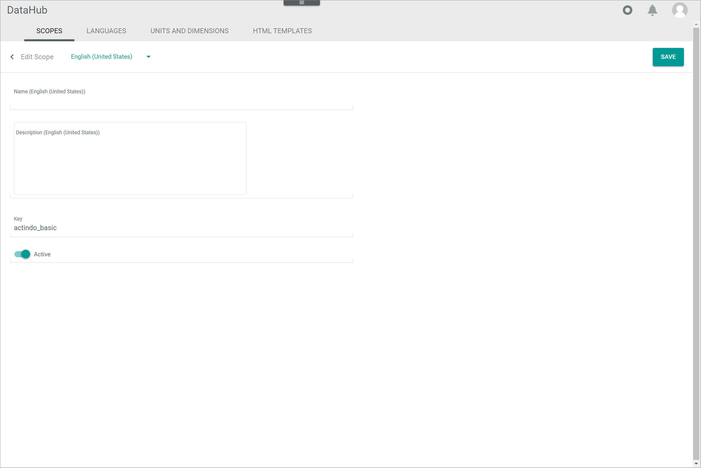

[!!User interface Scopes](../UserInterface/03a_Scopes.md)
[!!Configure the channel settings in PIM](../../PIM/Integration/05_ConfigureChannels.md)

# Manage the scopes

A scope is needed to create offers for a certain connection.
By default, the *Actindo Basic* scope is predefined.
If you want to maintain multiple scopes, you have to create and activate the respective scopes.

> [Info] A scope does not equal a sales channel or web store connection. It is just a dimension that can be added to the multi-scope attributes. For detailed information about creating a connection to a sales channel or web store, see [Create a connection in Omni-Channel](../../Channels/Integration/01_ManageConnections.md#create-a-connection).

[comment]: <> (Evtl. ergänzen, besser erklären/definieren. Beispiel?)

## Create a scope

Create a scope to maintain multiple scopes or to create a new connection via the new scope.

[comment]: <> (Evtl. umformulieren)

#### Prerequisites

No prerequisites to fulfill.

#### Procedure

*DataHub > Settings > Tab SCOPES*

1. Click the  (Add) button in the bottom right corner.   
    The *Create scope* view is displayed.

    

2. Enter a name for the scope in the *Name* field and, if desired, add a scope description in the *Description* field.

3. Enter a key for the scope in the *Key* field. The key is required for API access and must be system wide unique. A scope key must fulfill the following criteria:
    - valid characters are **a-z** (upper and lower case), **0-9** and the underscore ( **_** )
    - the key must not start with a number
    - a double underscore ( **___** ) and a trailing underscore are forbidden

4. Enable the *Active* toggle to set the scope directly after creation to active.

    > [Info] The scope must be activated to be used.

5. Click the [SAVE] button in the upper right corner.   
    The new scope has been saved. The *Create scope* view is closed.  

## Edit a scope

After you have created a scope, you can edit its name, description and key.

#### Prerequisites

At least one scope has been created, see [Create a scope](#create-a-scope).

> [Info] By default, the *Actindo Basic* scope has been predefined in the *Core1 Platform*.

#### Procedure

*DataHub > Settings > Tab SCOPES*

1. Click the scope you want to edit in the list of scopes.   
    The *Edit scope* view is displayed.

    

2. Edit the desired data of the scope in the corresponding fields.

3. Click the [SAVE] button in the upper right corner.   
    The changes have been saved. The *Edit scope* view is closed.  

## Deactivate a scope

Deactivate a scope if it will not be used for a certain time.
If you deactivate a scope, it is no longer available for offers.
Further, it is recommended to deactivate a scope instead of deleting it to prevent any problems because of existing connections.

#### Prerequisites

At least one scope has been created, see [Create a scope](#create-a-scope).

> [Info] By default, the *Actindo Basic* scope has been predefined in the *Core1 Platform*.

#### Procedure

*DataHub > Settings > Tab SCOPES*

1. Click the scope you want to edit in the list of scopes.   
    The *Edit scope* view is displayed.

    

2. Disable the *Active* toggle.

3. Click the [SAVE] button in the upper right corner.   
    The scope has been deactivated. The *Edit scope* view is closed.

## Delete a scope

You can delete a scope if it is no longer needed. As there are usually existing connections via a scope, it is highly recommended not to delete a scope. Instead, you can deactivate a scope and thus prevent its use, see [Deactivate a scope](#deactivate-a-scope).

#### Prerequisites

At least one scope has been created, see [Create a scope](#create-a-scope).

> [Info] By default, the *Actindo Basic* scope has been predefined in the *Core1 Platform*. The *Actindo Basic* scope cannot be deleted.

#### Procedure

*DataHub > Settings > Tab SCOPES*

1. Select the checkbox of the scope you want to delete in the list of scopes.    
    The editing toolbar is displayed above the scope list.

2. Click the [DELETE] button in the editing toolbar.  
    The scope has been deleted. The deletion cannot be undone.

    > [Info] If the selected scope cannot be deleted, an error message is displayed in the upper right corner. To prevent the scope from being used, it is recommended to deactivate the scope instead of deleting it, see [Deactivate a scope](#deactivate-a-scope).
