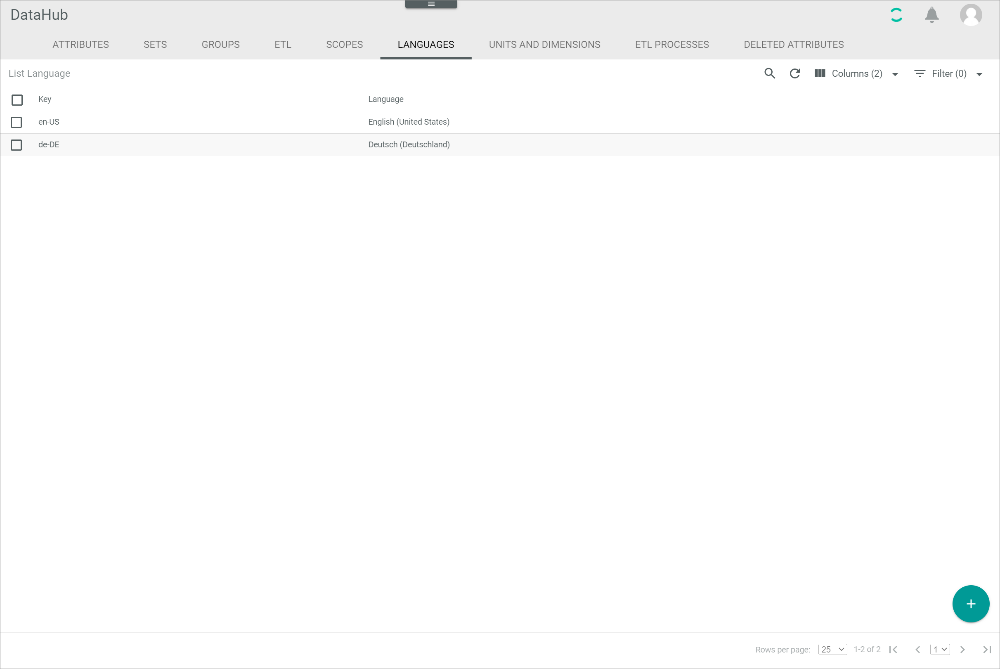
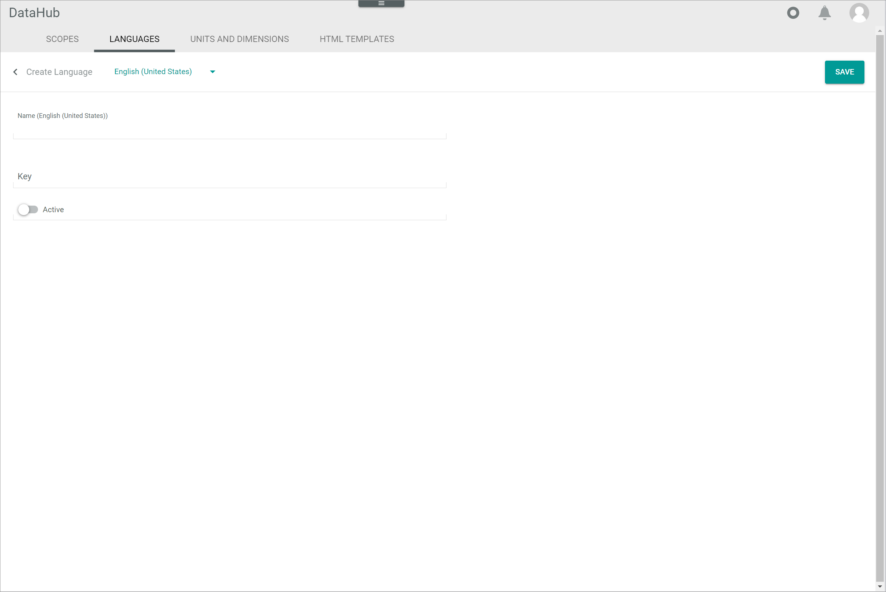

[!!User interface Languages](../UserInterface/03b_Languages.md)
[!!Configure the language settings in PIM](../../PIM/Integration/04_ConfigureLanguages.md)

# Manage the languages

The different languages are needed to be able to maintain attributes in different languages.
By default, the languages *English (United States)* and *German (Germany)* are predefined.
If you want to maintain further languages, you have to create and activate the respective languages.
You can create an unlimited number of languages.

## Create a language

Create a language to maintain attributes in the desired language.

#### Prerequisites

No prerequisites to fulfill.

#### Procedure

*DataHub > Settings > Tab LANGUAGES*

1. Click the  (Add) button in the bottom right corner.   
    The *Create language* view is displayed.

    

2. Enter a name for the language in the *Name* field.  

    > [Info] If you want to provide the language name and description in English and German in the user interface, you can select the desired language in the "Language" drop-down list on top of this view. By default, the user interface is available in English (United States) and German (Germany). 

3. Enter a key for the language in the *Key* field. The key is required for API access and must be system wide unique. The language key must fulfill the criteria of the language codes according to [RFC 4646](https://www.heise.de/netze/rfc/rfcs/rfc4646.shtml "[https://www.heise.de/netze/rfc/rfcs/rfc4646.shtml]"). For instance, keys with the following structure are valid:
    - en
    - en_US
    - en-US

4. Enable the *Active* toggle to set the language directly after creation to active.

    > [Info] The language must be activated to be used.

5. Click the [SAVE] button in the upper right corner.   
    The new language has been saved. The *Create language* view is closed.  

## Edit a language

After you have created a language, you can edit its name or key.

> [Caution] Bear in mind that a language key (language code) can be part of an attribute key. Keys are used for API access. Changing the attribute key, which is strongly discouraged, has an impact on the API naming for all entities where this attribute is included. That means, that all external API consumers, workflows, webhooks, or other custom code need to be adjusted accordingly in case any of them address this attribute.

#### Prerequisites

At least one language has been created, see [Create a language](#create-a-language).

> [Info] By default, the languages *English (United States)* and *German (Germany)* have been predefined in the *Core1 Platform*.

#### Procedure

*DataHub > Settings > Tab LANGUAGES*

1. Click the language you want to edit in the list of languages.   
    The *Edit language* view is displayed.

    

2. Edit the desired data of the language in the corresponding fields.

3. Click the [SAVE] button in the upper right corner.   
    The changes have been saved. The *Edit language* view is closed.  

## Deactivate a language

Deactivate a language if it will not be used for a certain time.
If you deactivate a language, it is no longer available.
Further, it is recommended to deactivate a language instead of deleting it to prevent any problems because of existing dependencies.

#### Prerequisites

At least one language has been created, see [Create a language](#create-a-language).

> [Info] By default, the languages *English (United States)* and *German (Germany)* have been predefined in the *Core1 Platform*.

#### Procedure

*DataHub > Settings > Tab LANGUAGES*

1. Click the language you want to edit in the list of languages.   
    The *Edit language* view is displayed.

    

2. Disable the *Active* toggle.

3. Click the [SAVE] button in the upper right corner.   
    The language has been deactivated. The *Edit language* view is closed.

## Delete a language

You can delete a language if it is no longer needed.
As there are usually existing dependencies, it is highly recommended not to delete a language.
Instead, you can deactivate a language and thus prevent its use, see [Deactivate a language](#deactivate-a-language).

#### Prerequisites

At least one language has been created, see [Create a language](#create-a-language).

> [Info] By default, the languages *English (United States)* and *German (Germany)* have been predefined in the *Core1 Platform*.

#### Procedure

*DataHub > Settings > Tab LANGUAGES*

1. Select the checkbox of the language you want to delete in the list of languages.    
    The editing toolbar is displayed above the language list.

[comment]: <> (Caution beim Löschen?)

2. Click the [DELETE] button in the editing toolbar.  
    The language has been deleted. The deletion cannot be undone.

    > [Info] If the selected language cannot be deleted, an error message is displayed in the upper right corner. To prevent the language from being used, it is recommended to deactivate the language instead of deleting it, see [Deactivate a language](#deactivate-a-language).
