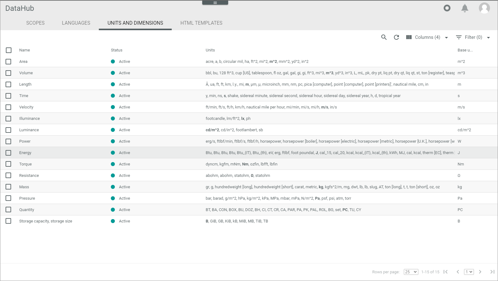

[!!User Interface Units and dimensions](../UserInterface/03c_UnitsDimensions.md)

# Manage the units and dimensions

The units and dimensions are used to assign units to attributes with different data types. While editing attributes, you can select predefined units and dimensions within drop-down lists.   

The units are predefined and grouped by dimensions.  For example, the length dimension contains units of length such as meters, kilometers or miles. Each dimension has one base unit that cannot be changed. This is a used to measure various units of a dimension according to international standards, for example units of the dimension length in meters. You can activate or deactivate single units within a dimension.

## Deactivate a unit

Deactivate a unit if you do not want to use it. For example, if a unit is not used in the countries you ship to, and you want to shorten the unit's drop-down list. You can always activate a unit again, if you find you still need it.

#### Prerequisites

No prerequisites to fulfill.

#### Procedure

*DataHub > Settings > Tab UNITS AND DIMENSIONS*

1. Click the dimension, in which the unit is located you want to deactivate.   
   The *List details of dimension* view is displayed. 

   

2. Select the checkbox of all units you want to deactivate.   
  The editing toolbar is displayed.

3. Click the [DEACTIVATE] button.   
   For all units that you had previously selected, the  icon has changed to a  icon.

## Activate a unit

Activate a unit if you want to use it again. For example, if a unit is not now used in the countries you ship to, and you want to have this unit in the unit's drop-down list again.

#### Prerequisites

No prerequisites to fulfill.

#### Procedure

*DataHub > Settings > Tab UNITS AND DIMENSIONS*

1. Click the dimension, in which the unit is located you want to activate.   
   The *List details of dimension* view is displayed. 

   

2. Select the checkbox of all units you want to activate.   
  The editing toolbar is displayed.

3. Click the [ACTIVATE] button.   
   For all units that you had previously selected, the  icon has changed to a  icon.
