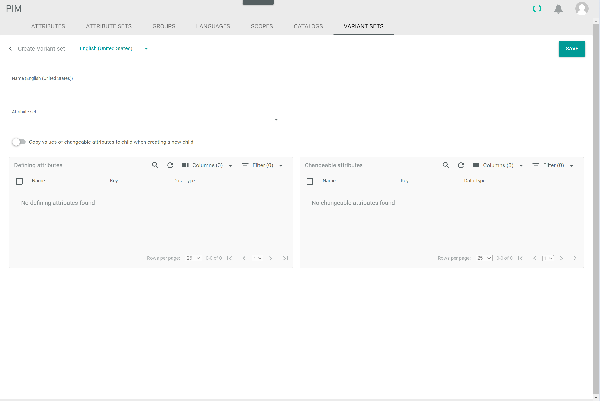
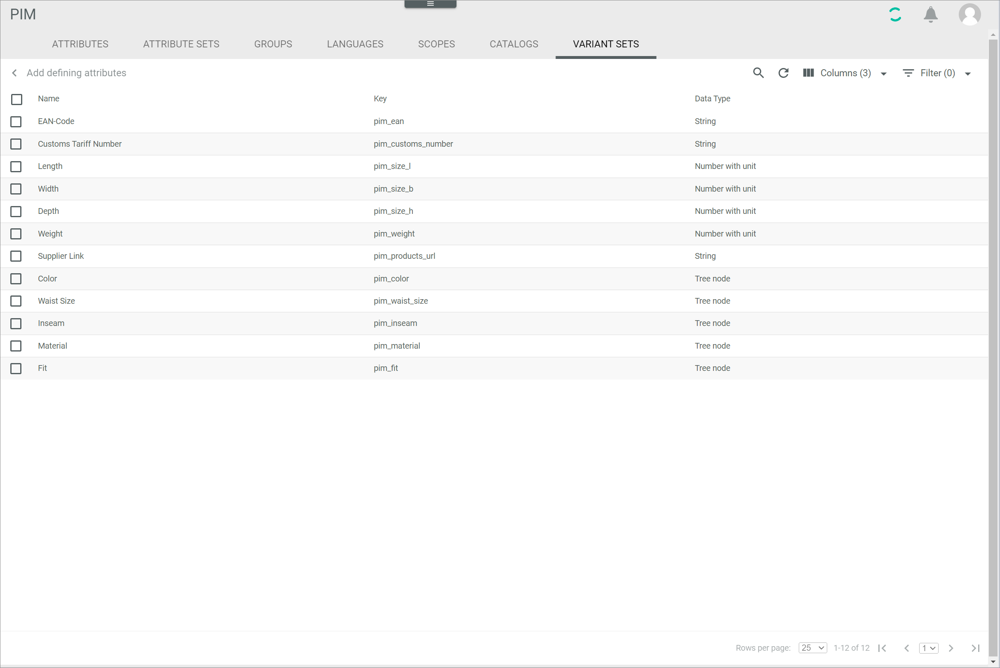
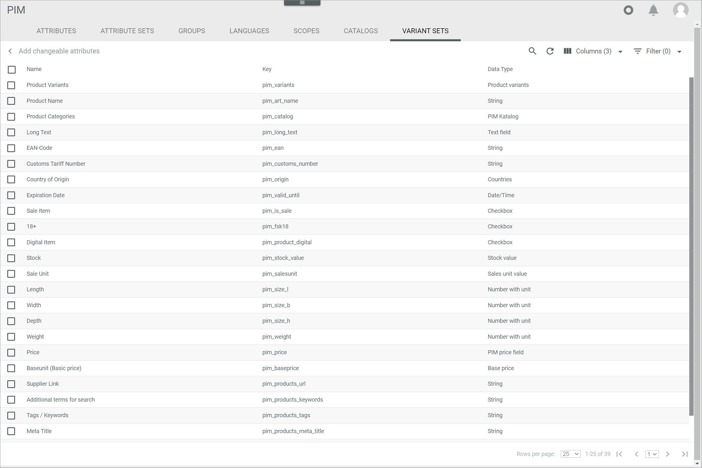
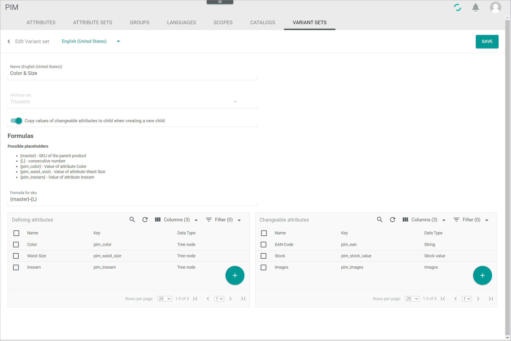

[!!User interface Variant sets](../UserInterface/03g_VariantSets.md)
[!!Manage the variants](../Operation/02_ManageVariants.md)
[!!Manage an attribute set](./02_ManageAttributeSets.md)

# Manage a variant set

You can create a variant set for a *PIM* product or an *Omni-Channel* offer. A variant set represents a special characteristic of a product or offer, for instance the size or the color. A variant set includes therefore the attributes needed to define a variant to a product or offer. 

You can manage the variant sets both in the *PIM* and the *Omni-Channel* modules depending on your specific module configuration, since the two modules are independent of each other. If both the *Omni-Channel* and the *PIM* modules are used, there is a predefined mapping that automatically applies the variant sets from *PIM* to *Omni-Channel*. Otherwise, you can manage the variant sets directly in your *Omni-Channel* module. The data displayed differ slightly, as only the attributes that are relevant for *PIM* or *Omni-Channel* are displayed in the respective module. The functionality itself, however, is based on the data models defined in the *DataHub* module. 

[comment]: <> (zu prüfen)

## Create a variant set

Create a variant set to be able to create variants to products or offers. A variant set is always assigned to a certain attribute set. When a variant set is created to an attribute set, you can create variants to all products or offers with this attribute set. You must assign at least one defining attribute to a variant set. Moreover, you can assign further defining and changeable attributes.   

### Define the variant set basic data

Define the basic inputs, such as name and attribute set, for the variant set.

#### Prerequisites

An attribute set has been created, see [Create an attribute set](./02_ManageAttributeSets.md#create-an-attribute-set).

> [Info] By default, the *PIM Basic Set* attribute set has been created when installing the *PIM* module.

#### Procedure

*PIM > Settings > Tab VARIANT SETS*  
*Omni-Channel > Settings > Tab VARIANT SETS*

1. Click the  (Add) button in the bottom right corner.   
    The *Create variant set* view is displayed.

    

2. Enter a name for the variant set in the *Name* field.

3. Select an attribute set in the *Attribute set* drop-down list. All active attribute sets are displayed in the list. Bear in mind that only those attribute sets that are relevant for the module are displayed.   
    The *Formulas* section with the *Formula for SKU* field is displayed.

    > [Info] You need to specify defining and changeable attributes for the variant set at a later step. Be aware that only those attributes assigned to the selected attribute set will be available.

    

4. Enter a formula for the variants SKU in the *Formula for SKU* field using the displayed placeholders. By default, you can enter the formula **{master}-{L}**.   

    > [Info] The value of the defining attributes can be included into the SKU formula. When you have added a defining attribute, the corresponding placeholder for this attribute is displayed in the *Formulas* section.

5. If desired, enable the *Copy values of changeable attributes to variant when creating a new variant* toggle. It is recommended to enable it.

    > [Info] This feature makes it easier for you to associate independently created products and create a master-variant relationship between them. For example, if you have the same T-shirt in different colors, all the color T-shirts should be added as variants to a master T-shirt. If this toggle is enabled, the changeable attributes and its values, which are different pro variant, are copied once when creating the variant, so that you just have to update the values if necessary. 

[comment]: <> (zu prüfen)

6. For the next steps to create a variant set, follow the procedures below:   
    - [Add defining attributes](#add-defining-attributes)
    - [Add changeable attributes](#add-changeable-attributes)

    > [Info] At least one defining attribute is required to create a variant set. Changeable attributes can be selected optionally.

### Add defining attributes

You have to select at least one defining attribute to create a variant set. You can only select attributes as defining attributes that are neither multi-language nor multi-channel and that are assigned to the selected attribute set.

#### Prerequisites

- An attribute set has been created, see [Create an attribute set](./02_ManageAttributeSets.md#create-an-attribute-set).
- The basic data of the variant set has been defined, see [Define the variant set basic data](#define-the-variant-set-basic-data).

> [Info] By default, the *PIM Basic Set* attribute set has been created when installing the *PIM* module.

#### Procedure

*PIM > Settings > Tab VARIANT SETS > Button Add*  
*Omni-Channel > Settings > Tab VARIANT SETS > Button Add*

1. Click the  (Add) button in the *Defining attributes* box. This button is only displayed if an attribute set is selected.       
    The *Add defining attributes* view is displayed.

    

2. Select the checkboxes of the attributes you want to be a defining attribute for the selected variant.   
    The editing toolbar is displayed above the attribute list.

    > [Info] The defining attributes are those attributes that characterize the variant, so those attributes that are defining the variants of the master product.

3. Click the [ADD AND GO BACK] button.     
    The *Add defining attributes* view is closed. The selected attributes are displayed in the *Defining attributes* box. A placeholder for the added attribute is displayed in the *Formulas* section.   

    

    > [Info] You can edit the formula in the *Formula for SKU* field and include the defining attribute placeholder(s).

4. If desired, add changeable attributes to the variant set, see [Add changeable attributes](#add-changeable-attributes). Otherwise, click the [SAVE] button in the upper right corner.   
    The *Create variant set* view is closed. The new variant set has been saved and is displayed in the list of variant sets.

### Add changeable attributes

You can select changeable attributes for a variant set. If you want to define an attribute for the variants whose value may differ from its master product value, you have to define this attribute as a changeable attribute.

#### Prerequisites

- An attribute set has been created, see [Create an attribute set](./02_ManageAttributeSets.md#create-an-attribute-set).
- The basic data of the variant set has been defined, see [Define the variant set basic data](#define-the-variant-set-basic-data).

> [Info] By default, the *PIM Basic Set* attribute set has been created when installing the *PIM* module.

#### Procedure

*PIM > Settings > Tab VARIANT SETS > Button Add*  
*Omni-Channel > Settings > Tab VARIANT SETS > Button Add*

1. Click the  (Add) button in the *Changeable attributes* box. This button is only displayed if an attribute set is selected.         
    The *Add changeable attributes* view is displayed.

    

2. Select the checkboxes of the attributes you want to be a changeable attribute for the selected variant.   
    The editing toolbar is displayed above the attribute list.

    > [Info] Generally, a variant inherits all attribute values from its master product. These attribute values are locked in the variant and can only be edited in the master product. Attribute values that differ from the master product and must be maintained individually in the variant itself must be added to the list of changeable attributes.

3. Click the [ADD AND GO BACK] button.   
    The *Add changeable attributes* view is closed. The selected attributes are displayed in the *Changeable attributes* box.

    

4. Click the [SAVE] button in the upper right corner.   
    The *Create variant set* view is closed. The new variant set has been saved and is displayed in the list of variant sets.

## Edit a variant set

After you have created a variant set, you can edit it. However, only some fields are editable. The assigned attribute set cannot be subsequently modified.

#### Prerequisites

At least one variant set has been created, see [Create a variant set](#create-a-variant-set).

#### Procedure

*PIM > Settings > Tab VARIANT SETS*  
*Omni-Channel > Settings > Tab VARIANT SETS*

1. Click the variant set you want to edit in the list of variant sets.   
    The *Edit variant set* view is displayed.

    

2. Edit the desired data of the variant set in the corresponding fields.

3. Click the [SAVE] button in the upper right corner.   
    The changes have been saved. The *Edit variant set* view is closed.

    > [Info] If the changes are not yet displayed in the list of variant sets, click the  (Refresh) button in the top right corner to update the list of variant sets.    

[comment]: <> (I have to refresh the list to apply the changes -> FETA-21)

## Remove an attribute from the variant set

You can remove defining and changeable attributes from the variant set. Note that at least one defining attribute must be assigned. However, you can remove all of the changeable attributes.

[comment]: <> (Bug reported -> BUG-141)

#### Prerequisites

A variant set has been created, see [Create a variant set](#create-a-variant-set).

#### Procedure

*PIM > Settings > Tab VARIANT SETS*  
*Omni-Channel > Settings > Tab VARIANT SETS*

1. Click the variant set you want to edit in the list of variant sets.   
    The *Edit variant set* view is displayed.

    

2. Select the checkboxes of the attributes you want to remove either in the *Defining attributes* or the *Changeable attributes* box.     
    The [DELETE] button is displayed in the editing toolbar above the attribute list.

3. Click the [DELETE] button in the editing toolbar.   
    The attribute is removed from the list.

4. Click the [SAVE] button in the upper right corner.   
    The changes have been saved. The *Edit variant set* view is closed.

    > [Info] If the changes are not yet displayed in the list of variant sets, click the  (Refresh) button in the top right corner to update the list of variant sets.  

[comment]: <> (I have to refresh the list to apply the changes -> FETA-21)
