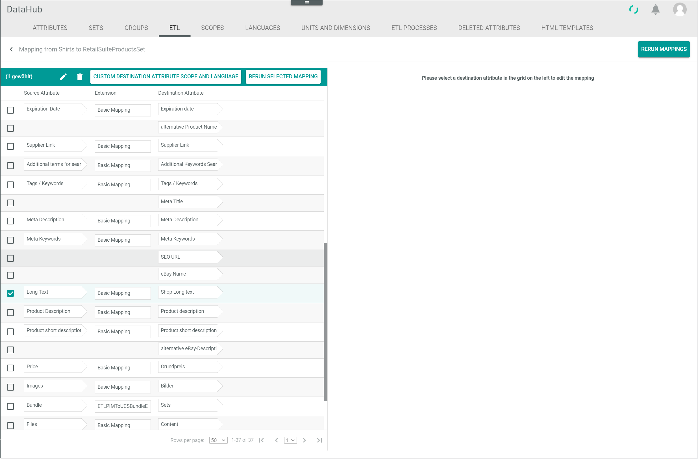
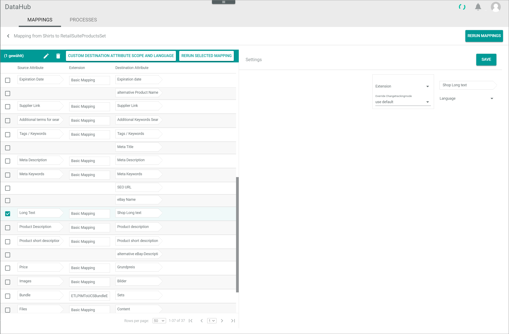

[!!Omni-Channel](../../Channels/Overview/01_General.md)
[!!User interface ETL](../UserInterface/02d_ETL.md)
[!!Manage an attribute set](../Integration/02_ManageAttributeSets.md)
[!!Manage the ETL processes](./02_ManageETLProcesses.md)
[!!Data type list](../UserInterface/04_DataTypeList.md)
[!!ETL extensions list](../UserInterface/03_ETLExtensions.md)

# Manage the ETL mappings

An ETL attribute set mapping is used to extract the data from a source attribute set, transform it according to a specified method defined by the extension, and load it into a destination attribute set.

You can create mappings, edit existing mappings and rerun mappings.

## Create an ETL attribute set mapping

Create an ETL attribute set mapping to map the attributes of the source attribute set to the attributes of the destination attribute set.
The mapping allows to convert the attributes from the source set to fit the attributes required by the destination set.

#### Prerequisites

At least two attribute sets have been created, see [Create an attribute set](../Integration/02_ManageAttributeSets.md#create-an-attribute-set).

#### Procedure

*DataHub > Settings > Tab ETL*

1. Click the  (Add) button in the bottom right corner.   
    The *Create ETL attribute set mapping* window is displayed.

    

2. Select a source attribute set in the *Source attribute set* drop-down list. All active attribute sets are displayed in the drop-down list.

3. Select a destination attribute set in the *Destination attribute set* drop-down list. All active attribute sets are displayed in the drop-down list.   
    If any attribute set mapping with the selected destination attribute set already exists, the *Copy ETL attribute set mapping* drop-down list is unlocked.

4. Select a language in the *Language* drop-down list. All active languages are displayed in the drop-down list.

    > [Info] The selected language defines the language from which the value of a multi-language attribute is taken when mapping it to a single language attribute.

5. Select a channel in the *Channel* drop-down list. All active channels are displayed in the drop-down list.

    > [Info] The selected channel defines the channel from which the value of a multi-channel attribute is taken when mapping it to a single channel attribute.

6. If desired, select an existing ETL attribute set mapping in the *Copy ETL attribute set mapping* drop-down list. All attribute set mappings whose destination attribute set matches or has inheritance relations to the selected destination attribute set are displayed in the drop-down list.

    > [Info] If you select an ETL attribute set mapping in the drop-down list, all matching attribute mappings are applied to the new ETL attribute set mapping.

7. Click the [SAVE] button in the bottom right corner.   
    The new attribute set mapping has been saved and is displayed in the list of attribute set mappings. The *Create ETL attribute set mapping* window is closed.

## Edit an ETL attribute set mapping

After you have created an attribute set mapping, you can edit it.
You can edit the attribute mappings within an attribute set mapping, add a custom mapping for a certain destination attribute, delete an existing attribute mapping or rerun a single or all attribute mappings within an attribute set mapping.

### Edit the ETL attribute mappings

When editing an ETL attribute mapping, you can create a mapping to an unmapped destination attribute, change the source attribute or the change tracking mode of an existing mapping.  

#### Prerequisites

At least one ETL attribute set mapping has been created, see [Create an ETL attribute set mapping](#create-an-etl-attribute-set-mapping).

#### Procedure

*DataHub > Settings > Tab ETL*

1. Click the attribute set mapping you want to edit in the list of attribute set mappings.   
    The *Mapping from "Source attribute set name" to "Destination attribute set name"* view is displayed.

    

2. Click the row of the attribute you want to map on the left side.   
    The *Settings* section is displayed on the right side.

    

    > [Info] Depending on the selected row, the fields displayed in the *Settings* section differ:
    - If the selected row contains only a destination attribute, the destination attribute as well as the *Extension* and *Override change tracking mode* drop-down lists are displayed.
    - If the selected row contains an attribute mapping with source, destination attribute and the extension, the destination attribute as well as the *Source attribute*, *Extension* and *Override change tracking mode* drop-down lists are displayed. The *Source attribute*, *Extension* and *Override change tracking mode* drop-down lists are preset. If the selected extension requires further configuration settings, the *Configuration* section is displayed below the *Settings* section.  

3. Select the appropriate option in the *Extension* drop-down list in the *Settings* section. All extensions that are matching the data type of the destination attribute are displayed in the drop-down list.   
    If the selected extension requires further configuration settings, the *Configuration* section is displayed below the *Settings* section.

    > [Info] For detailed information about the data types, see [Data type list](../UserInterface/04_DataTypeList.md).    
    For detailed information about the ETL extensions, see [ETL extensions list](../UserInterface/03_ETLExtensions.md).

4. Select the appropriate tracking mode in the *Override change tracking mode* drop-down list. By default, the **Use default** option is preselected. The following options are available:
    - **Use default**   
        The mapping configured in the dependency of the specific entities is applied.
    - **Automatic**   
        The initial mapping is automatically applied. All value changes or reruns are applied automatically in the mapping.  
    - **Semi-automatic**   
        The initial mapping is automatically applied. Values changes or reruns are applied after confirmation.
    - **Semi-automatic, changes must be confirmed by another user**   
        The initial mapping as well as values changes or reruns are applied after confirmation by another user.
    - **Manual**   
        The initial mapping is automatically applied. Afterwards, the changes in the mapping must be triggered manually to be applied.

5. Select the appropriate attribute that you want to assign to the destination attribute in the *Source attribute* drop-down list. All attributes with a data type that matches the selected ETL extension are displayed in the drop-down list.

6. If required, select or enter the corresponding configuration settings in the *Configuration* section.   

7. Click the [SAVE] button in the upper right corner.   
    The changes have been saved. The *Settings* section is hidden.

    > [Info] Be aware that you have to rerun the mapping to apply the changes made to the attribute, see [Rerun an ETL mapping](#rerun-an-etl-mapping).

8. Repeat the steps **2** to **7** for all attributes you want to map.

### Add a custom mapping for a destination attribute

When creating an ETL attribute set mapping, you define the language and the channel from which the values are taken for multi-language and multi-channel source attributes.
Within an attribute set mapping, you can define custom channel and language attribute mappings for multi-language and multi-channel destination attributes.

#### Prerequisites

At least one ETL attribute set mapping has been created, see [Create an ETL attribute set mapping](#create-an-etl-attribute-set-mapping).
- The destination attribute is multi-language and/or multi-channel.

#### Procedure

*DataHub > Settings > Tab ETL*

1. Click the attribute set mapping to which you want to add a differing language or channel attribute mapping for a certain destination attribute.   
    The *Mapping from "Source attribute set name" to "Destination attribute set name"* view is displayed.

    

2. Select the checkbox of the attribute mapping to which you want to add a differing mapping for another language or channel.
    The editing toolbar is displayed above the attribute mappings.

    

3. Click the [CUSTOM DESTINATION ATTRIBUTE CHANNEL AND LANGUAGE] button in the editing toolbar. This button is only displayed if the destination attribute of the selected mapping is multi-language or multi-channel.
    The *Settings* section is displayed on the right side.

    

    > [Info] Depending on the destination attribute, the additional drop-down lists displayed in the *Settings* section differ:
      - If the destination attribute is multi-language, the *Language* drop-down list is displayed additionally below the destination attribute.
      - If the destination attribute is multi-channel, the *Channel* drop-down list is displayed additionally below the destination attribute.
      - If the destination attribute is multi-language and multi-channel, the *Language* and the *Channel* drop-down lists are additionally displayed below the destination attribute.

4. Select the appropriate language in the *Language* and/or the appropriate channel in the *Channel* drop-down list in the *Settings* section. In the *Language* drop-down list, all active languages are displayed. In the *Channel* drop-down list, all active channels are displayed.    

5. Select the appropriate option in the *Extension* drop-down list in the *Settings* section. All extensions that are matching the data type of the destination attribute are displayed in the drop-down list.   
    If the selected extension requires further configuration settings, the *Configuration* section is displayed below the *Settings* section.

    > [Info] For detailed information about the data types, see [Data type list](../UserInterface/04_DataTypeList.md).   
    For detailed information about the ETL extensions, see [ETL extensions list](../UserInterface/03_ETLExtensions.md).

6. Select the appropriate tracking mode in the drop-down list *Override change tracking mode*. By default, the **Use default** option is preselected. The following modes are available:
    - **Use default**   
        The mapping configured in the dependency of the specific entities is applied.
    - **Automatic**   
        The initial mapping is automatically applied. All value changes or reruns are applied automatically in the mapping.  
    - **Semi-automatic**   
        The initial mapping is automatically applied. Values changes or reruns are applied after confirmation.
    - **Semi-automatic, changes must be confirmed by another user**   
        The initial mapping as well as values changes or reruns are applied after confirmation by another user.
    - **Manual**   
        The initial mapping is automatically applied. Afterwards, the changes in the mapping must be triggered manually to be applied.

7. Select the appropriate attribute that you want to assign to the destination attribute in the *Source attribute* drop-down list. All attributes with a data type that matches the selected ETL extension are displayed in the drop-down list.

8. If required, select or enter the corresponding configuration settings in the *Configuration* section.   

9. Click the [SAVE] button in the upper right corner.   
    The mapping has been created and is added to the list of attribute mappings on the left side. The selected language and/or channel is indicated in brackets behind the destination attribute. The *Settings* section is hidden.

### Delete an ETL attribute mapping

Delete an attribute mapping to cancel the transfer of data to the destination attribute of the selected mapping.

#### Prerequisites

At least one ETL attribute set mapping has been created, see [Create an ETL attribute set mapping](#create-an-etl-attribute-set-mapping).

#### Procedure

*DataHub > Settings > Tab ETL*

1. Click the attribute set mapping in which you want to delete an attribute mapping.   
    The *Mapping from "Source attribute set name" to "Destination attribute set name"* view is displayed.

    

2. Select the checkbox of the attribute mapping you want to delete.   
    The editing toolbar is displayed above the attribute mappings.

    

3. Click the  (Delete) button in the editing toolbar.   
    The attribute mapping has been deleted from the list.

    > [Info] When deleting an attribute mapping, the mapping to the destination attribute, but not the destination attribute itself, is deleted from the attribute mapping list. The destination attribute is only deleted if the attribute mapping was a custom language or channel mapping. In this case, the original destination attribute without customized language or channel is still available in the list of attribute mappings.

4. Repeat the steps **2** and **3** for all attributes you want to delete.

    > [Info] Be aware that you have to rerun the mapping to apply the changes made to the attribute, see [Rerun an ETL mapping](#rerun-an-etl-mapping).

## Rerun an ETL mapping

After having created or changed an attribute mapping within an ETL attribute set mapping, the new mapping is not automatically applied.
The mapping is only applied when either a value in the source attribute changes or when you rerun the respective attribute mapping or all mappings within an ETL attribute set mapping.

### Rerun a single attribute mapping

To apply changes or a new attribute mapping within an attribute set mapping, you can trigger the rerun of a single attribute mapping.
It is recommended to use this function when only one or a few attribute mappings are affected.
If a higher number of changes or new attribute mappings within an attribute set mapping has been made, it is recommended to rerun all attribute mappings within the attribute set mapping, see [Rerun an attribute set mapping](#rerun-an-attribute-set-mapping).

#### Prerequisites

At least one ETL attribute set mapping has been created, see [Create an ETL attribute set mapping](#create-an-etl-attribute-set-mapping).

#### Procedure

*DataHub > Settings > Tab ETL*

1. Click the attribute set mapping to which you have made the changes or created new attribute mappings.   
    The *Mapping from "Source attribute set name" to "Destination attribute set name"* view is displayed.

    

2. Select the checkbox of the attribute mapping you want to rerun.   
    The editing toolbar is displayed above the attribute mappings.

    

3. Click the [RERUN SELECTED MAPPING] button in the editing toolbar.   
    The *Rerun single mapping* window is displayed.

    

4. If desired, enable the *Also rerun mapping for entities with manual change tracking (or if the change tracking override of this mapping is manual)?* toggle.

    > [Info] If you enable the *Also rerun mapping for entities with manual change tracking (or if the change-tracking override of this mapping is manual)?* toggle, the mapping will rerun regardless of the selected change tracking mode.     

5. Click the [SAVE] button in the *Rerun single mapping* window.   
    The mapping rerun has been started. A pop-up window is displayed to inform that the job has been triggered.

    

    The current status of the job is displayed in the *ETL PROCESSES* tab.   
    For detailed information, see [Check the ETL processes](./02_ManageETLProcesses.md#check-the-etl-processes).

### Rerun an attribute set mapping

To apply changes or a new attribute mapping within an attribute set mapping, you can trigger the rerun of all attribute mappings within an attribute set mapping.
It is recommended to use this function if a higher number of changes or new attribute mappings within an attribute set mapping has been made.
If only one or a few attribute mappings are affected, it is recommended to rerun the respective attribute mappings separately, see [Rerun a single attribute mapping](#rerun-a-single-attribute-mapping).

#### Prerequisites

At least one ETL attribute set mapping has been created, see [Create an ETL attribute set mapping](#create-an-etl-attribute-set-mapping).

#### Procedure

*DataHub > Settings > Tab ETL*

1. Click the attribute set mapping to which you have made the changes or created new attribute mappings.   
    The *Mapping from "Source attribute set name" to "Destination attribute set name"* view is displayed.

    

2. Click the [RERUN MAPPINGS] button in the upper right corner.   
    The *Rerun all mappings* window is displayed.

    

3. If desired, enable the *Also rerun mapping for entities with manual change tracking (or if the change tracking override of this mapping is manual)?* toggle.

    > [Info] If you enable the *Also rerun mapping for entities with manual change tracking (or if the change-tracking override of this mapping is manual)?* toggle, the mapping will rerun regardless of the selected change tracking mode.     

4. Click the [SAVE] button in the *Rerun single mapping* window.   
    The mapping rerun has been started. A pop-up window is displayed to inform that the job has been triggered.

    

    The current status of the job is displayed in the *ETL PROCESSES* tab.    
    For detailed information, see [Check the ETL processes](./02_ManageETLProcesses.md#check-the-etl-processes).
