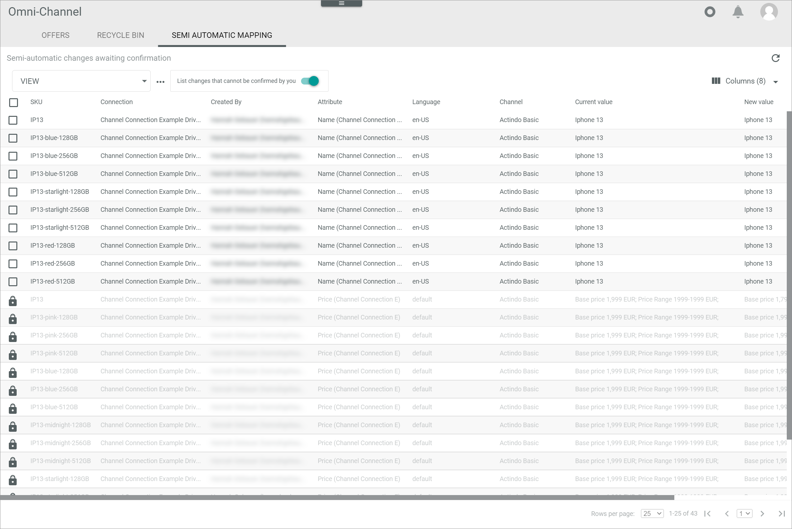

[!!Omni-Channel](../../Channels/Overview/01_General.md)
[!!User interface ETL processes](../UserInterface/02h_ETLProcesses.md)
[!!User interface ETL](../UserInterface/02d_ETL.md)
[!!Manage the ETL mappings](./01_ManageETLMappings.md)
[!!ETL extensions list](../UserInterface/03_ETLExtensions.md)

# Manage the ETL processes

When an ETL attribute mapping has been triggered, the corresponding ETL processes are displayed in the *ETL PROCESSES* tab.
You can check the status of a current ETL process, confirm a pending ETL process and restart a faulty ETL process.  

## Check the ETL process status

After an ETL process has been triggered, the current status is displayed in the *ETL PROCESSES* tab.
An ETL process can have the following statuses:
- **Todo**
- **Error**
- **Done**
- **Destination frozen**
- **Awaiting confirmation**
- **Synchronous**
- **Awaiting confirmation different user**
- **Semi-automatic accepted**   

You can check the current status of an ETL process to approve that any changes are applied or if any further actions are required.  

#### Prerequisites

An ETL process has been triggered, for instance by a rerun of mapping, see [Rerun an ETL mapping](./01_ManageETLMappings.md#rerun-an-etl-mapping).

#### Procedure

*DataHub > Settings > Tab ETL PROCESSES*

1. Check the list for the appropriate ETL process and note its status.

2. Click the *Status filter* drop-down list and select the status of the respective ETL process in the list. The following statuses are available:
    - **Todo**   
        All pending ETL processes are displayed.
    - **Error**  
        All faulty ETL processes are displayed.
    - **Done**   
        All completed ETL processes are displayed.
    - **Destination frozen**   
        All ETL processes whose destination attribute is blocked because the corresponding entity is opened by a user are displayed.
    - **Awaiting confirmation**   
        All ETL processes that must be confirmed are displayed.
    - **Synchronous**   
        All ETL processes that are executed synchronously are displayed for the duration of processing.
    - **Awaiting confirmation different user**   
        All ETL processes that must be confirmed by a user other than the creator are displayed.
    - **Semi-automatic accepted**   
        All ETL processes that have been confirmed are displayed.   

    All ETL processes of the selected status are displayed.

3. Depending on the status of the ETL process, continue with one of the following actions:
    - [Confirm an ETL process](#confirm-an-etl-process)
    - [Retry a faulty ETL process](#retry-a-faulty-etl-process)
    - [Return to the ETL Mapping](./01_ManageETLMappings.md)

## Confirm an ETL process

If the selected change tracking mode of an ETL mapping equals **Semi-automatic** or **Semi-automatic, changes must be confirmed by another user**, the ETL process has to be confirmed before the mapping can be rerun.

#### Prerequisites

- An ETL process has been triggered, for instance by a rerun of mapping, see [Rerun an ETL mapping](./01_ManageETLMappings.md#rerun-an-etl-mapping).
- At least one of the triggered ETL processes has the change tracking mode **Semi-automatic** or **Semi-automatic, changes must be confirmed by another user**.

#### Procedure

*DataHub > Settings > Tab ETL PROCESSES*

1. Check the list for the appropriate ETL process to make sure that the ETL process has been triggered.

    > [Info] ETL processes whose mappings have a **Semi-automatic** change tracking mode are listed with the *Awaiting confirmation* status, those having a **Semi-automatic, changes must be confirmed by another user** change tracking mode are listed with the *Awaiting confirmation different user* status.

2. Switch to the *Omni-Channel* module: *Omni-Channel > Offers > Tab SEMI AUTOMATIC MAPPING* .      
    The *SEMI AUTOMATIC MAPPING* tab is displayed.

3. Click the  (Refresh) button.   
    The list of pending mappings is updated and all pending mappings are displayed.

    

4. Select the checkboxes of the mappings you want to confirm.   
    The editing toolbar is displayed above the list.

5. Click the [CONFIRM] button in the editing toolbar.   
    The selected mappings have been removed from the list. The mappings have been applied. The confirmed mappings are displayed in the *ETL PROCESSES* tab of the *DataHub* module with the **Semi-automatic accepted** status. As soon as the confirmed mappings are executed, their status change to **Done**.

    > [Info] If the ETL mappings should not be applied, click the [REJECT] button in the editing toolbar instead. The selected mappings will be removed from the list without being rerun.
