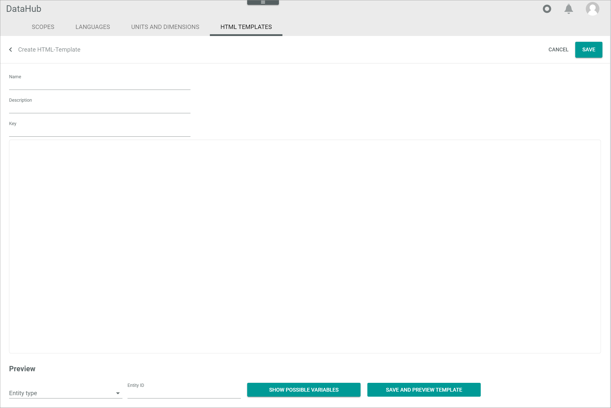
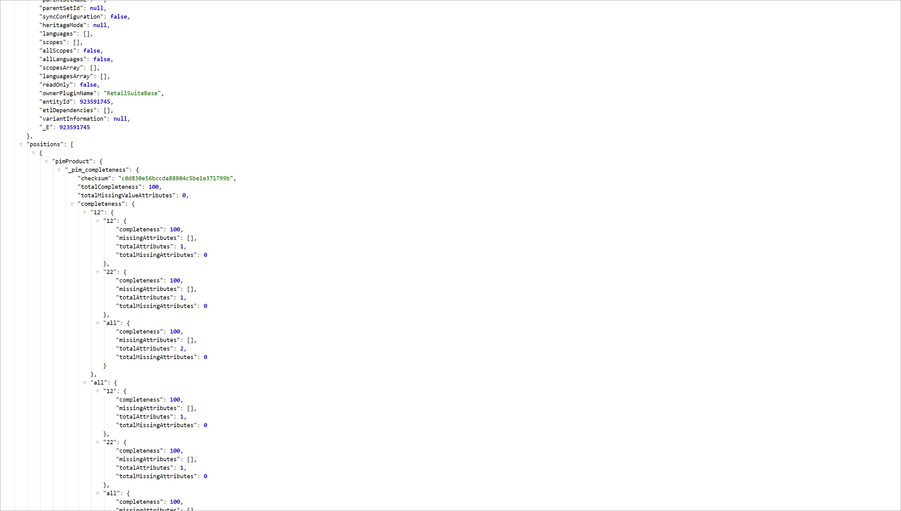

[!!User Interface HTML templates](../UserInterface/02j_HTMLTemplates.md)

# Manage the HTML templates

Define HTML templates that are used for the ETL mapping, especially for the receipt export. HTML templates allow you to include HTML text or Smarty templates and thus create complex queries with many logical inputs. Further, you are able to include certain data from all available entities using the HTML templates.

## Create an HTML template

Create an HTML template so that it is available for the ETL mapping.

#### Prerequisites

The *HTML Templates for ETL* plugin is installed.

#### Procedure
*DataHub > Settings > Tab HTML TEMPLATES*

1. Click the  (Add) button in the bottom right corner.   
  The *Create HTML template* window is displayed.

  

2. Enter an expressive name for the HTML template in the *Name* field and, if desired, add a description to the HTML template in the *Description* field.

3. Enter a key for the HTML template in the *Key* field. The key is required for API access and must be system wide unique.

4. Click the textarea and enter the appropriate content for the HTML template. You can either include HTML text or Smarty templates:
  - [Include HTML text](#include-html-text)
  - [Include Smarty templates](#include-smarty-templates)

5. Click the [SAVE] button in the upper right corner.   
  The new HTML template is saved. The *Create HTML template* view is closed.  

## Include HTML text

You can include HTML text in the HTML template.

#### Prerequisites

The *HTML Templates for ETL* plugin is installed.

#### Procedure

> [Info] If you want to include HTML text into a new HTML template, follow the steps described in the [Create an HTML template](#create-an-html-template) procedure before proceeding to the steps below.

*DataHub > Settings > Tab HTML TEMPLATES > Select HTML template*   

1. Click the textarea and enter the desired HTML text.

  > [Info] For detailed information about the HTML structure and elements, see https://html.spec.whatwg.org/.

2. If desired, [include Smarty templates](#include-smarty-templates) or display a [preview of the HTML template](#preview-an-html-template).

3. Click the [SAVE] button in the upper right corner.   
  The HTML template is saved. The *HTML template* view is closed.  

## Include Smarty templates

You can include Smarty templates into your HTML template. Always use the delimiters *{}* as separator for the Smarty templates.  

#### Prerequisites

The *HTML Templates for ETL* plugin is installed.

#### Procedure

> [Info] If you want to include Smarty templates into a new HTML template, follow the steps described in the [Create an HTML template](#create-an-html-template) procedure before proceeding to the steps below.

*DataHub > Settings > Tab HTML TEMPLATES > Select HTML template*   

1. Click the textarea and enter the desired Smarty template(s).

  > [Info] For detailed information about the Smarty template structure and elements, see https://www.smarty.net/.

2. If desired, [include HTML text](#include-html-text) or display a [preview of the HTML template](#preview-an-html-template).

3. Click the [SAVE] button in the upper right corner.   
  The HTML template is saved. The *HTML template* view is closed.  

### Include attribute variables

You can include variables for attributes via Smarty templates into your HTML template. Always use the *$* sign to introduce an attribute variable.

#### Prerequisites

The *HTML Templates for ETL* plugin is installed.

#### Procedure

> [Info] If you want to include variables into a new HTML template, follow the steps described in the [Create an HTML template](#create-an-html-template) procedure before proceeding to the steps below.

*DataHub > Settings > Tab HTML TEMPLATES > Select HTML template*   

1. Click the textarea and, if desired, edit or add the Smarty template(s) and/or HTML text for the template.

2. Include a variable in the textarea by entering the corresponding variable inside the delimiters *{}* and starting with the *$* sign. You can include one of the following variables:
  - **entity**: Use the entity variable to include a variable referring to an attribute of a certain entity within the system, for instance *{$entity.id}*.
  - **tenant**: Use the tenant variable to include a variable referring to an attribute of the platform tenant, for instance *{$tenant.shortName}*.  

3. If desired, include the destination language and/or the destination channel to the attribute variable value by adding the following suffixes at the end of the variable name:
  - *destination language*: Add **__LanguageKey** to include the destination language to the variable. Replace **LanguageKey** by the corresponding language key and note, that all signs must be replaced by a **_**, for instance, add **__de_DE** for the language key *de-DE*. Pay attention to upper and lower case as the variables are case sensitive.
  - *destination language*: Add **__ChannelKey** to include the destination channel to the variable. Replace **ChannelKey** by the corresponding channel key and note, that all signs must be replaced by a **_**, for instance, add **__actindo_basic** for the language key *actindo_basic*. Pay attention to upper and lower case as the variables are case sensitive.

  > [Info] You can display all possible variables of a certain entity. For detailed information, see [Display the possible variables](#display-the-possible-variables).

4. If desired, display a [preview of the HTML template](#preview-an-html-template).

5. Click the [SAVE] button in the upper right corner.   
  The HTML template is saved. The *HTML template* view is closed.  

### Include a tree node variable

A tree node variable is a special type of variables that can be included via Smarty templates into your HTML template. The special rules to be followed to correctly include a tree node variable are described below.

#### Prerequisites

The *HTML Templates for ETL* plugin is installed.

#### Procedure

> [Info] If you want to include a tree node variable into a new HTML template, follow the steps described in the [Create an HTML template](#create-an-html-template) procedure before proceeding to the steps below.

*DataHub > Settings > Tab HTML TEMPLATES > Select HTML template*   

1. Click the textarea and, if desired, edit or add the Smarty template(s) and/or HTML text for the template.

2. Include a tree node variable by doing the following:

[comment]: <> (brauche noch mehr infos zu dieser Procedure - die Regeln oder die Maßnahmen, die man beachten muss, verstehe ich selbst noch nicht)

3. If desired, display a [preview of the HTML template](#preview-an-html-template).

4. Click the [SAVE] button in the upper right corner.   
  The HTML template is saved. The *HTML template* view is closed.  

### Include language independent variables

It is possible to define a varible in such a way, that it is language independent. The special rules to be followed to correctly include a language independent variable via Smarty templates into your HTML template are described below.

#### Prerequisites

The *HTML Templates for ETL* plugin is installed.

#### Procedure

> [Info] If you want to include a tree node variable into a new HTML template, follow the steps described in the [Create an HTML template](#create-an-html-template) procedure before proceeding to the steps below.

*DataHub > Settings > Tab HTML TEMPLATES > Select HTML template*   

1. Click the textarea and, if desired, edit or add the Smarty template(s) and/or HTML text for the template.

2. Include a language independent variable by doing the following:

[comment]: <> (brauche noch mehr infos zu dieser Procedure - die Regeln oder die Maßnahmen, die man beachten muss, verstehe ich selbst noch nicht)

3. If desired, display a [preview of the HTML template](#preview-an-html-template).

4. Click the [SAVE] button in the upper right corner.   
  The HTML template is saved. The *HTML template* view is closed.  

## Edit an HTML template

After you have created an HTML template, you can edit it. You can edit the name, the description of the template or the template content.

#### Prerequisites

- The *HTML Templates for ETL* plugin is installed.
- At least one HTML template is created, see [Create an HTML template](#create-an-html-template).

#### Procedure
*DataHub > Settings > Tab HTML TEMPLATES*

1. Click the HTML template you want to edit in the list of HTML templates.   
  The *Edit HTML template* window is displayed.

  

2. Edit the desired data of the HTML template in the corresponding. The HTML template key is locked in the *Edit HTML template* view.

3. If desired, use the preview functionality in the *Preview* section to display the possible variables or a template preview for the selected entity. For detailed information, see [Preview an HTML template](#preview-an-html-template).

4. Click the [SAVE] button in the upper right corner.   
  The changes are saved. The *Edit HTML template* view is closed.  

## Display the possible variables

It is possible to display all available variables of a certain entity so that you can select the variables you want to use in the HTML template.

#### Prerequisites

The *HTML Templates for ETL* plugin is installed.

#### Procedure

> [Info] If you want to display the pssible variables within a new HTML template, follow the steps described in the [Create an HTML template](#create-an-html-template) procedure before proceeding to the steps below.

*DataHub > Settings > Tab HTML TEMPLATES > Select HTML template*   

1. In the *Preview* section at the bottom of the *HTML template* view, select an entity type in the drop-down list *Entity type*. All available entities are displayed in the list.

  > [Info] The available entities depend on the modules installed in your Core1 Platform.

2. Enter the corresponding entity identification number of the entity in the field *Entity ID*.

3. Click the [SHOW POSSIBLE VARIABLES] button.  
  A new browser window opens displaying a all possible variables for the selected entity.

  

4. Close the browser window and click the  (Back) button in the upper left corner to return to the HTML templates list or proceed to [edit the HTML template](#edit-an-html-template).

## Preview an HTML template

It is possible to display a preview of the HTML template to check its functionality.

#### Prerequisites

- The *HTML Templates for ETL* plugin is installed.
- At least one HTML template is created, see [Create an HTML template](#create-an-html-template).

#### Procedure

> [Info] If you want to preview a new HTML template, follow the steps described in the [Create an HTML template](#create-an-html-template) procedure before proceeding to the steps below.

*DataHub > Settings > Tab HTML TEMPLATES > Select HTML template*   

2. In the *Preview* section at the bottom of the *Edit HTML template* view, select an entity type in the drop-down list *Entity type*. All available entities are displayed in the list.

  > [Info] The available entities depend on the modules installed in your Core1 Platform.

3. Enter the corresponding entity identification number of the entity for which you want to preview the template in the field *Entity ID*.

4. Click the [SAVE AND PREVIEW TEMPLATE] button.  
  The template is saved and a new browser window opens displaying a preview of the template for the selected entity.

  

5. Close the browser window and click the  (Back) button in the upper left corner to return to the HTML templates list or proceed to [edit the HTML template](#edit-an-html-template).
