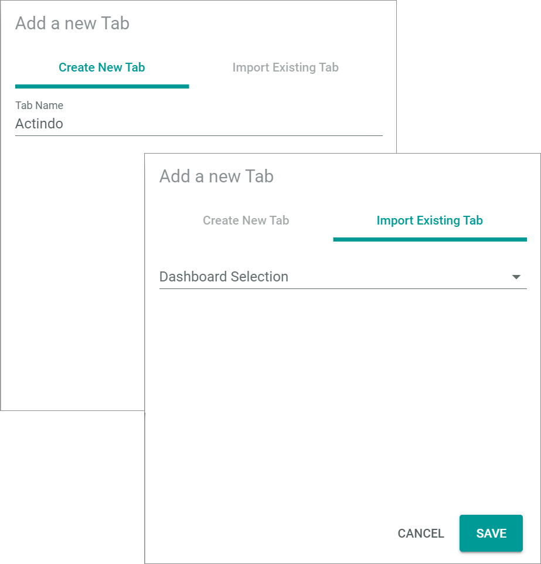

[!!User interface Dashboards](../UserInterface/01a_Dashboards.md)

# Manage the dashboards

A dashboard gives an overview over the module and its content.
While other modules have a predefined dashboard, you can configure multiple customized dashboards for the *DataHub* module that are adopted for different purposes.
The number of dashboards is unlimited.
A set of dashlets to be used is predefined for the *DataHub* module.

## Create a dashboard

Create a dashboard to be able to add the desired dashlets.

#### Prerequisites

No prerequisites to fulfill.

#### Procedure

*DataHub > Overview > Tab DASHBOARDS*

1. Click the  (Add) button in the header.   
  The *Add a new tab* window is displayed. By default, the *Create new tab* tab is preselected.

  

2. Enter a name for the dashboard tab in the *Tab name* field.

3. Click the [SAVE] button in the bottom right corner.   
  The *Add a new tab* window is closed. The new dashboard has been saved and is displayed.

  > [Info] You can create an unlimited number of dashboard tabs and customize them to the desired purpose.

## Customize a dashboard

Customize a dashboard to your special needs by adding the desired dashlets, deleting unnecessary dashlets, select the viewport and define the dashlets arrangement.

### Add a dashlet

Add the desired dashlets to your dashboard to get an overview over the processes and entities within the *DataHub* module.   
Depending on the purpose of the dashboard, you can add different sets of dashlets to different dashboards.

#### Prerequisites

A dashboard tab has been created, see [Create a dashboard](#create-a-dashboard).

#### Procedure

*DataHub > Overview > Tab DASHBOARDS*

1. Select the tab of the dashboard to which you want to add a dashlet.    
  The selected dashboard tab is displayed.

2. Click the  (Settings) button in the upper right corner.    
  The *Edit tab* view is displayed.

  

3. Click the [ADD ELEMENT] button in the upper right corner.    
  The *Dashlet picker* window is displayed.

  

4. Select the checkboxes of the dashlets you want to add to your dashboard. If you click the checkbox in the header, all dashlets in the list are selected.

  > [Info] For detailed information about the available dashlets, see [Dashlet picker](../UserInterface/01a_Dashboards.md#dashlet-picker).

5. Click the [ACCEPT] button in the bottom right corner of the window.   
  The selected dashlets have been added to the dashboard. The *Dashlet picker* window is closed.

6. Click the [SAVE] button.   
  The dashboard has been saved. The *Edit tab* view is closed.

  > [Info] If you want to change the dashlet positioning, see [Change the dashlets arrangement](#change-the-dashlets-arrangement).

### Change the viewport

Change the viewport to adjust the view of the dashboard to the currently used device.
The viewport is saved for a single dashboard, so you can create dashboards with different viewports.

#### Prerequisites

A dashboard tab has been created, see [Create a dashboard](#create-a-dashboard).

#### Procedure
*DataHub > Overview > Tab DASHBOARDS*

1. Select the tab of the dashboard to which you want to change the viewport.   
  The selected dashboard tab is displayed.

2. Click the  (Settings) button in the upper right corner.    
  The *Edit tab* view is displayed.

  

3. Click the *Select viewport* drop-down list in the upper left corner and select the desired view format. The following views are available:
  - **Automatic**   
    The system automatically detects the appropriate view and applies it to the tab.
  - **Mobile**   
    The mobile view is applied to the tab.  
  - **Tablet**   
    The tablet view is applied to the tab.  
  - **Laptop**   
    The laptop view is applied to the tab.  
  - **Desktop**   
    The desktop view is applied to the tab.   

  The tab layout has been adapted to the selected view. The *Viewport loaded* notice is displayed in the footer.

4. Click the [SAVE] button.   
  Any changes to the dashboard have been saved. The *Edit tab* view is closed.

[comment]: <> (Wenn ich den Mobile viewport wählen, verschwinden alle Dashlets -> Bug?!)

### Change the dashlets arrangement

Change the arrangement of the dashlets on a dashboard to optimize the view for your purposes or another viewport.

#### Prerequisites

- A dashboard tab has been created, see [Create a dashboard](#create-a-dashboard).
- At least one dashlet has been added to the dashboard, see [Add a dashlet](#add-a-dashlet).

#### Procedure

*DataHub > Overview > Tab DASHBOARDS*

1. Select the tab of the dashboard to which you want to change the positioning of dashlets.   
  The selected dashboard tab is displayed.

2. Click the  (Settings) button in the upper right corner.   
  The *Edit tab* view is displayed.

  

3. Hover over a dashlet until the cursor icon changes to the cross arrows cursor.

4. Click the dashlet and move it on the desired position on the dashboard using drag and drop. When moving the dashlet across the dashboard, the possible positions on the predefined grid are highlighted.

  

5. Click the [SAVE] button.   
  Any changes to the dashboard have been saved. The *Edit tab* view is closed.

### Remove a dashlet

Remove a dashlet from a dashboard if it is not needed for the purposes or has been added accidentally to the dashboard.

#### Prerequisites

- A dashboard tab has been created, see [Create a dashboard](#create-a-dashboard).
- At least one dashlet has been added to the dashboard, see [Add a dashlet](#add-a-dashlet).

#### Procedure

*DataHub > Overview > Tab DASHBOARDS*

1. Select the tab of the dashboard from which you want to remove a dashlet.   
  The selected dashboard tab is displayed.

2. Click the  (Settings) button in the upper right corner.    
  The *Edit tab* view is displayed.

  

3. Click the  (Remove) button in the upper right corner of the dashlet you want to delete.    
  The dashlet has been removed from the dashboard.

  > [Info] The removal cannot be undone. To recover a dashlet, you have to add it again, see [Add a dashlet](#add-a-dashlet).

4. Click the [SAVE] button.   
  Any changes to the dashboard have been saved. The *Edit tab* view is closed.

## Delete a dashboard

Delete a dashboard that is no longer needed to keep track of the other dashboards.

#### Prerequisites

A dashboard has been created, see [Create a dashboard](#create-a-dashboard).

#### Procedure

*DataHub > Overview > Tab DASHBOARDS*

1. Click the  (Delete) button on the dashboard you want to delete.   
  The *Confirm tab deletion* window is displayed.

  

2. Click the [ACCEPT] button in the bottom right corner.   
  The *Confirm tab deletion* window is closed. The dashboard has been deleted.

  > [Info] Be aware that the dashboard cannot be recovered as the deletion process cannot be undone.
